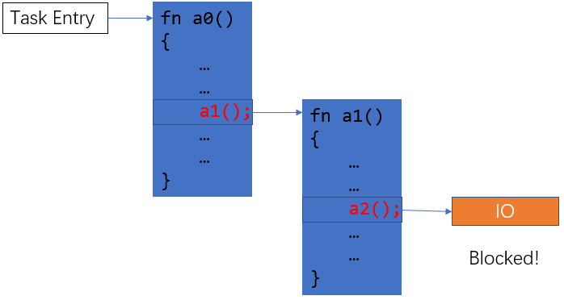

# Rust async 简介

## 吴一凡
2020/09/27
shinbokuow@163.com

---

## 并发
* 给定一组任务，**资源受限**
* 如何合理利用资源获得高性能
* I/O 未准备好时，CPU 将作何选择？
* 由于资源受限，单个任务**不可能从头执行到尾**
  因而需要支持**暂停**并**切换**到其他任务
  通过**保存/恢复执行现场**来实现
* 关键点：何时暂停/继续？如何切换？

---

## 题外话：并行与并发
* 相比并发，并行通常指的是**只有一项任务**
  并堆砌资源（多核）加速该任务
* 而并发模型中，每项任务消耗的资源**固定**，运行时间也**固定**
  需要合理调度资源最小化**完成所有任务**的用时

---

## 抢占式/协作式多任务
* 抢占式：每个任务可以在**执行任一条指令**的时候被暂停
  如 OS 时间片轮转、高优先级抢占，**安全、实时性**
* 协作式：每个任务除非自己**交出 CPU 使用权**，否则不会被暂停
  由于安全性不用在 OS 中，而是用于编程语言中的协程提高性能

---

## 同步并发
* 每个任务占用一个独立线程，拥有独立的栈
* 可以在执行**任意一条指令**的时候被暂停
  对应**抢占式多任务**
* I/O：忙等待或是阻塞+唤醒
  着重考虑**低速设备**，后者 CPU 利用率更高
  
---

## 同步并发的保存/恢复
* 执行现场包括栈、寄存器
* 只需保存/恢复一些寄存器即可
  包括：难以证明**在暂停期间不被使用**的寄存器
  通常需要包括**所有通用寄存器**
* 独立的栈无需保存
  回来**原地继续**执行

---

## 性能分析
### 内存占用
* 每个任务需要一个独立栈
  其大小为 $\max_{task}\text{stack\_usage}(task)$
  通常严重浪费内存并**限制并发任务数量**
### 开销
* 需要保存/恢复所有通用寄存器
  存在**冗余**

---

## 异步并发(async 风格)与同步并发
* 同步并发：每个同步任务占用一个线程
  异步并发：每个**异步任务**占用一个**协程**
* 相同点：**并发**$\rightarrow$CPU 资源的精打细算
  遇到 I/O 未准备好时同样要**切换任务**
* 不同点：线程有独立的栈，而所有协程**公用一个栈**

---

## 保存/恢复现场

* 问题还原：一个任务发现 I/O 未准备好，需要切换到其他任务
* 异步：栈马上就要给其他任务用，不能**全部保存**，那如何保存/恢复现场呢