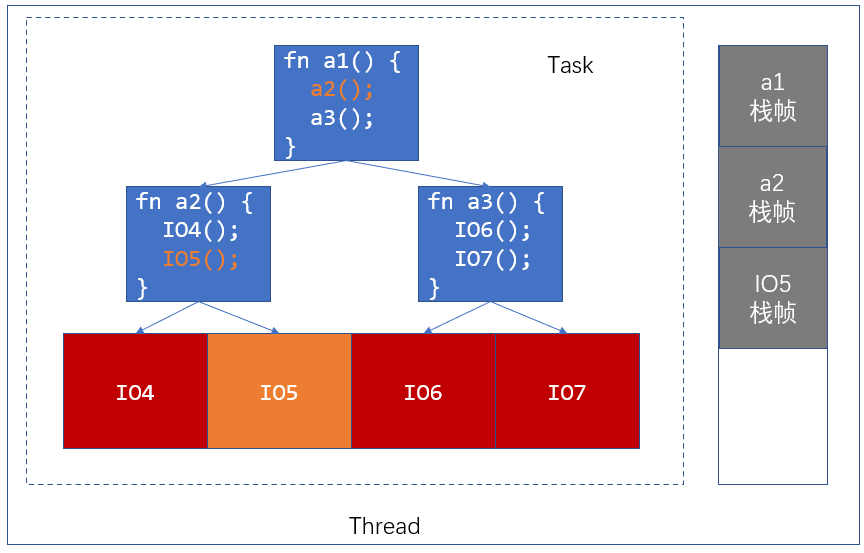
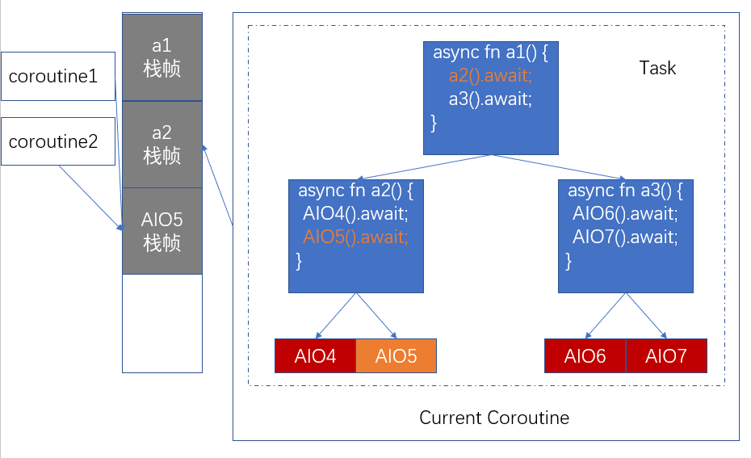

# Rust async 简介

## 吴一凡
2020/09/20
shinbokuow@163.com

---

## 并发
* 给定一组任务，**资源受限**
* 如何合理利用资源获得高性能
* 一般情况下，指在 I/O 参与的情况下尽可能利用 CPU
* 由于资源受限，任务**不可能从头执行到尾**，因而需要支持**暂停**，**上下文保存/恢复**
* 关键点：何时暂停/继续？

---

## 题外话：并行与并发
* 相比并发，并行通常指的是**只有一项任务**
  并堆砌资源（多核）加速该任务
* 而并发模型中，每项任务消耗的资源**固定**，运行时间也**固定**
  需要合理调度资源最小化**完成所有任务**的用时

---

## 抢占式/协作式多任务
* 抢占式：每个任务可以在**执行任一条指令**的时候被暂停
  如 OS 时间片轮转、高优先级抢占，**安全、实时性**
* 协作式：每个任务除非自己**交出 CPU 使用权**，否则不会被暂停
  由于安全性不用在 OS 中，而是用于编程语言中的协程提高性能

---


## 同步并发
* 每个 Task 放在一个线程中执行
  由 OS 管理，对应**抢占式多任务**
* I/O：视 OS 支持不同**忙等待**/**阻塞**当前所在线程
* 后者减少了 CPU 资源的浪费

---

### 同步并发资源消耗
* 上下文切换开销：至少所有通用寄存器，可能存在**冗余**
* 内存消耗：每个 Task 需要一个栈
  栈的容量为**所有 Task 需要栈空间的最大值**

---


## 异步并发
* 除了 **async/await** 之外和同步并发基本一致
* 每个 Task 放在一个无栈协程中，PL 管理
  后面会讲到所有 Task 共用一个栈
  对应**非抢占式多任务**
* I/O：**切换**到下一个 Task（yield），并在准备好之后**唤醒**该 Task

---

### 异步并发资源消耗
* 上下文切换开销：不见得优于同步并发，**取决于编译器优化**
* 内存消耗：所有 Task **共用一个栈**
  每个 Task 需要（通常在**堆**上）**保存一些中间状态**
  但总内存消耗毫无疑问优于同步并发

---

## 保存与恢复
* 有一点是相同的，遇到 I/O 阻塞的时候当前 Task 需要被**暂停**！
* 于是，如何保存/恢复？

---


### 同步并发
* 每个线程有一个**独立**的栈
* 栈上的调用信息自然保留
* 额外保存寄存器即可

---


### 异步并发
* 区别：栈需要交给其他协程使用
* 如何利用栈的内容保存/恢复现场

---

### 异步并发
* 将 await 和同步一样看成一种“调用”
* 在发现 I/O 未准备好之前和同步基本一样
* 问题在于，所有的 Coroutine **共用一个栈**
* 在切换到其他的 Task 之前，我们要如何处理栈中的内容？

---

* 在同步并发中，每个线程要从被阻塞的地方**继续执行**，所以栈内的信息必须全部保留，因而每个线程都要有独立的栈。
* 异步并发中，关键的一点在于我们知道“调用”链上的每个 async fn 都**一定**处于“调用”它的子 async fn 的状态。
* 因此，我们可以根据每个 async fn 所正在“调用”的 async fn 给它划分状态。并将每个“调用”链上的 async fn 的栈帧根据其当前状态进行**分类保存**。

---

* 编译器会将每个 async fn 转化为一个**状态机**，来根据底层 I/O 不可用的时候它正“调用”的是哪一个子 async fn 来将当前栈上**局部变量**有选择的保存下来。
  事实上，确实可以直观的基于 await 将一个 async fn 的执行划分成不同阶段。每一个 await，都对应着生成出来的状态机的一个不同的状态。状态机还会有起始态和终态。终态则代表子树内所有的 I/O 等待都已经完成，对应着 async fn 的返回。
* 状态转移？自然与 await 的具体内容有关：
  当 await 的子状态机到达了终态，就可转移到下一个状态去 await 另一个东西。

---

* 由此可以引入 `Future` trait
  ```rust
  pub trait Future {
      type Output;
      fn poll(self: Pin<&mut Self>, cx: &mut Context<'_>) -> Poll<Self::Output>;
  }
  ```
* 编译器会为每个 async fn 转化成的状态机实现 `Future` trait。
* 核心方法 `poll` 也就是我们所说的“调用”，它的实际作用是**试图把状态机从当前状态转移到另一个状态**。
* 我们知道，要想能够转移的话，需要当前状态所 await 的子状态机达到终态。