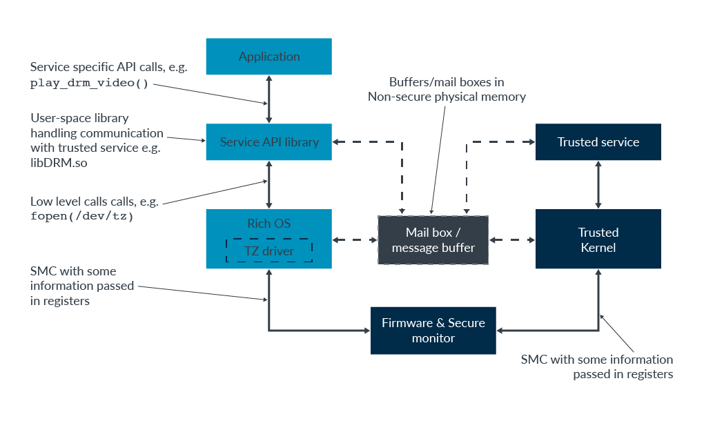
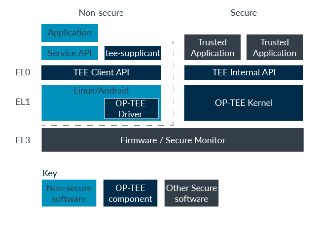
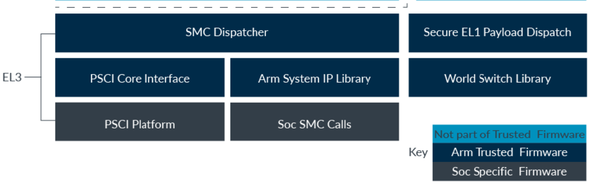

## what is TrustZone

normal world: rich SW stack(aka REE, rich execution environment)->large and complex->more attack surfaces

trusted world: smaller and simpler SW stack(TEE) which provide trusted services **with a higher degree of trust**

## TrustZone in the processor

EL0/1/2 can be in Secure/Non-secure state, we can use `SCR_EL3.NS` to control it; EL3 is always in Secure state

Secure state and exception levels:

Normal/Trusted world: EL3->firmware/secure monitor

Normal world(`SCR_EL3.NS`=1): EL2->Hypervisor,EL1->Rich OS,EL0->applications

Trusted world(`SCR_EL3.NS`=0): EL2->secure partition manager,EL1->Trusted OS,EL0->Trusted services

> secure EL2 was introduced in armv8.4-a and it is remained optional in armv8.0-a

### Switch between security states

how to switch from NS.EL1 to S.EL1, there are 3 steps:

1. enter EL3 by taking an exception(FIQ or an `SMC`, secure monitor call)
2. secure monitor(the trusted firmware, example implementation provided by an open-source project) changes `SCR_EL3.NS` from 1 to 0
3. back to EL1, enter trusted OS

there are more thing to do: secure monitor is responsible for saving/restoring GP/system/vector registers, therefore the secure monitor should also save non-secure register states and restore secure register states

a small number of per-security-state registers, they are switched automatically by the processor, for example, `ICC_BPR1_EL1`,

### Virtual address spaces

mention that `NS.EL1:0x8000` and `S.EL1:0x8000` are different virtual addresses and they are translated using different regimes

### Physical address spaces

secure/non-secure physical address space

processor in NS state->VA can only be translated to NS PA(non-secure physical address), which means that secure resources are hidden

processor in S state->SW can see both secure and non-secure resources, and `NS` bit in the translation table entries controls a VA is translated to a S or NS PA

`NP:0x8000` and `SP:0x8000` represents PA `0x8000` in a non-secure/secure physical address space respectively, **they are treated as different memory locations by the processor**. In other words, there is an extra address bit on the bus.

### Data, instruction, and unified caches

data caches are **physically tagged**, `NP:0x800000` and `SP:0x800000` are different tags, this affects the behavior of the cache maintenance operations

when the processor is in NS state, such operations can only affect the cachelines with NS tags, whereas all the cachelines can be cleared when the processor is in S state

### TLB

the structure of TLB: translation regime(EL0/1/2); NS(0 or 1); VMID and ASID; Tag(virtually, 0x800000); Descriptor(physically, NP:0x900000)

when would happen is an `TLBI` instruction is executed- ignored now...

### SMC exceptions

Normal world(for example, triggered by a rich OS) request services from Trusted world(SMC Dispatcher at EL3, 2 possible handlers->firmware services at EL3 or trusted services hosted by the TEE including a trusted OS)

Spec: SMC Calling Convention(DEN0028) and Power State Coordination Interface Platform Design Document(DEN0022)

SMC from EL1 can be handled by EL2, an emulated firmware by the hypervisor

### Secure Virtualization

before armv8.4-A, trust world only contains: firmware/secure monitor at EL3, trusted OS and services(which are called TEE) at EL1/0, which means that only 1 secure kernel is allowed

multiple trusted services thus multiple secure kernels are needed->in armv8.4-A, S.EL2 is called a SPM(Secure Partition Manager) which can manager multiple partitions, each of which contains a secure kernel and related trusted services

enabling S.EL2: set `SCR_EL3.EEL2`

now, stage1 translation: secure EL1 VA->{TTBR_EL0, TTBR_EL1(with NS bit)}->{Secure IPA, Non-secure IPA}

stage2 translation: Secure IPA->VSTTBR_EL2->Secure PA; Non-secure IPA->VTTBR_EL2->Non-secure PA

## System architecture

execution starting point: trusted ROM, on-chip; trusted RAM, a couple of hundreds of kilobytes, also on-chip

## Software architecture

### top-level

common trusted services: key management, DRM(Digital Rights Management)

scheduling: TEE as a task in Rich OS, when it is scheduler, using `SMC` to switch to TEE, this design provide only confidentiality but not availability, 

trusted kernels: [OP-TEE](https://optee.readthedocs.io/en/latest/)(based on trusted firmware [provided by ARM officially](https://github.com/ARM-software/arm-trusted-firmware) and [another website](https://www.trustedfirmware.org/)), fully featured, open-source, 

OP-TEE kernel runs on S.EL1, trusted applications run on S.EL0, TEE Internal APIs are maintained by GP(Global Platform), OP-TEE driver in Rich OS space(NS.EL1), TEE Client API is between libraries and Rich OS, also maintained by GP, tee-supplicant(handle TEE-related services such as secure storage)

### interact with non-secure virtualization

EL0/1->SMC instruction->trap into EL2(how can we do that?)->SMC trap handler of hypervisor->{firmware emulator of hypervisor at EL2|SMC dispatcher at EL3}

### boot and the chain of trust

chain of trust: every stage verifies the code of the next stage it is going to load, if fails:

* the first stage code in the ROM maybe on-chip: cannot fail

* second-stage boot image: cannot boot
* TEE: can boot, but only the normal world is active
* Non-secure state firmware or Rich OS image: can boot, but limited

### trusted firmware

## Example use cases

### Encrypted filesystem

Encrypted filesystem with an encrypted key on a off-chip flash, device unique key stored on-chip

after passing the authentication, the filesystem key is provisioned and used for further accesses

keys are separated since we can destroy and regenerate the filesystem key if we want to format or reset the device

### Updating the boot firmware OTA(over the air)

signature is checkout using the provisioned public key(not a secret, only need to confirm that it cannot be substituted, thus store its hash on-chip), firmware version cannot be rolled back: non-volatile counter guarantees that the firmware version cannot be rolled back

