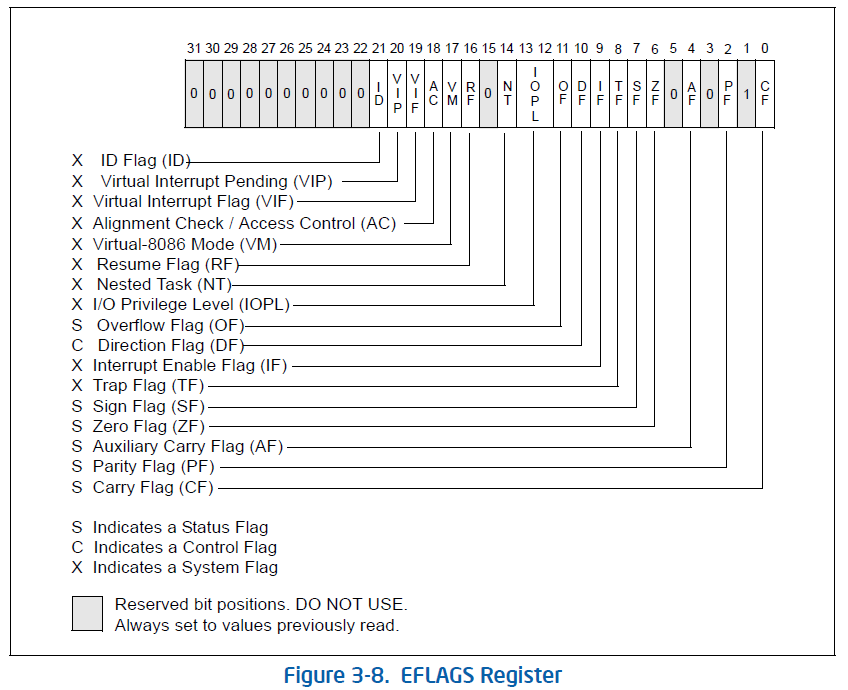

* 这里描述的处理器执行环境包括内存（地址空间）、通用寄存器、段寄存器、标志寄存器还有指令指针。
* Intel64架构为处理器新增了一个IA-32e的运行模式，使得一个64位的OS既可以通过兼容模式不加修改的运行32位的应用程序，又可以正常运行64位应用程序。在x86_64中我们只关心后一种64位模式。
* 64位模式将通用寄存器拓展到16个，每个位宽为64位。

## 基本执行环境总览

首先来看IA-32架构的基本执行环境。它包括32位线性地址和最多36位物理地址。8个通用寄存器，6个段寄存器，EFLAGS标志寄存器，指令指针寄存器EIP。指令则可以进行整数运算、控制流、操作比特和字符串、访存。8个x87 FPU浮点寄存器进行浮点运算。8个MMX寄存器（64bits packed），8个XMM寄存器和一个MXCSR寄存器（128bits packed），以及YMM寄存器（256bits packed）进行SIMD操作。BND0~BND3（每个位宽128位）以及BNDCFGU还有BNDSTATUS用于MPX相关指令。另外很重要的就是**栈**来支持函数调用。

在系统编程中还会用到一些其他资源。这里先列出一些比较感兴趣的。比如I/O端口，控制寄存器CR0~CR4，内存管理寄存器GDTR/IDTR/task register/LDTR。

在64位模式下与IA-32有一些不同。支持64位线性地址和最高52位物理地址。16个位宽为64位的通用寄存器，6个位宽为16位的段寄存器保持不变，指令指针位宽为64位，EFLAGS拓展为64位并可以通过RFLAGS来访问，但是*其高32位目前保留，低32位与EFLAGS相同*。栈指针位宽变为64位。全局描述符表寄存器GDTR和中断描述符表寄存器IDTR拓展到10字节从而可以保存完整的64位基址。局部描述符表寄存器LDTR和任务寄存器TR也同样进行了拓展。

## 内存管理

首先依然介绍IA-32的内存管理。IA-32有三种内存模型：第一种是flat模型，也就是一个32位的线性地址空间，使用被称为线性地址的32位字节地址来访问；第二种是分段内存管理，使用段选择子:段内偏移的逻辑地址来访问，在IA-32中最多有16383个不同的段，每个段大小为2^32字节；第三种是实模式，也是8086处理器的内存模型，用来兼容8086处理器上的应用。下面是实模式的图示：

在flat模式和分段管理模式下，如果启用页表机制，则线性地址通过页表映射为物理地址；否则直接将线性地址视为物理地址来访存。页表机制对应用程序是透明的，应用程序只能看到一个线性地址空间。

当CPU运行在不同模式下，能够使用的内存模型种类是不同的。目前我们只关注64位模式，在该模式下可以看成一个64位线性地址空间，CS/DS/ES/SS中的段基址均为0，同时分段内存管理和实模式内存模型不可用。

IA-32架构处理器在保护模式下可以设置为32位模式和16位模式，线性地址、逻辑地址和指令操作数的位宽均有所不同。在32位模式下，逻辑地址为一个16位的段选择子加上32位的段内偏移；在16位模式下，逻辑地址为一个16位的段选择子加上一个16位的段内偏移。指令前缀（Instruction prefixes）可以在一个程序中暂时重载默认的地址和操作数的位宽，这是由当前代码段的段描述符决定的。在实模式下，默认的地址和操作数的位宽均为16位，通过重载可以在实模式中启用32位寻址，但是32位线性地址空间中最大线性地址仍然为000FFFFFH。IA32的保护模式可以对物理地址位宽进行拓展，我们并不关心。

3.3.7小节提到了一些Intel64架构下64位模式下寻址的一些细节，过于琐碎先略过。

## 程序执行基本寄存器

在IA-32架构下有16个程序执行基本寄存器：8个通用寄存器，6个段寄存器（段选择子），EFLAGS（报告程序执行状态并能够在应用级别对处理器进行控制），指令指针EIP。其中段寄存器均16位，余下的均32位。

8个通用寄存器有EAX/EBX/ECX/EDX/ESI/EDI/ESP/EBP分别用于保存：

* 逻辑或算术指令的操作数
* 寻址的操作数
* 指针

注意ESP应该仅被用于栈指针。一些指令指定特定的寄存器保存操作数，如字符串指令中的ECX/ESI/EDI寄存器；另一些指令假定保存在某些寄存器中的指针与特定的段有关，如某些指令假定EBX寄存器中的指针指向DS段中的内存区域。

一些通用寄存器的特定用法总结如下：

* EAX累积操作数和结果数据
* EBX指向DS段中的数据
* ECX作为字符串和循环操作中的计数器
* EDX是I/O指针
* ESI指向DS段中的数据或作为字符串操作的源寄存器
* EDI指向ES段中的数据或作为字符串操作的目标寄存器
* ESP指向SS段中的栈指针
* EBP指向SS段中的数据

这些寄存器的低16位可以分别用AX/BX/CX/DX/SI/DI/SP/BP来访问。

AX/BX/CX/DX的高低8位可以单独访问，如AH访问AX的高8位，AL访问AX的低8位。

在64位模式下，有16个通用寄存器，默认的操作数位宽为32位（不过在MOV指令中疑似可以达到64位）。实际上通用寄存器既可以操作32位操作数，又可以操作64位操作数。在使用32位操作数的时候，相关的通用寄存器为EAX/EBX/ECX/EDX/ESI/EDI/ESP/EBP/R8D~R15D。在使用64位操作数的时候，相同通用寄存器位RAX/RBX/RCX/RDX/RSI/RDI/RSP/RBP/R8~R15。所有的寄存器都可以访问局部的byte(8bits)/word(16bits)/dword(32bits)/qword(64bits)，可能需要加上不同的REX前缀。

在访问byte registers有一些奇怪的限制，但是在64位模式下只使用带有REX前缀的通用寄存器应该就可以了。而且应该很少会遇到访问byte registers的情况。

暂时不考虑兼容模式。

在64位模式下，操作数的位宽会决定目标通用寄存器的结果中哪些位是有意义的。如果是64位，直接生成一个64位结果；如果是32位，生成一个32位结果并零拓展；如果是8或16位，会生成8/16位的结果，目标寄存器只有后8/16位会被覆盖。一个例外是，如果8/16位操作的结果用于64位地址计算，则会符号拓展到64位。

***

接下来是6个段寄存器，CS/DS/SS/ES/FS/GS每个里面保存一个16位的段选择子。需要将正确的段选择子放在适当的段寄存器中才能访问到内存中特定的段。当编写应用代码时，段选择子是通过汇编符号或指示创建的。当编写系统级代码的时候可能需要直接创建段选择子。

段寄存器的使用方法与OS使用的内存管理模型有关。在flat内存模型（未启用分段）下，每个段寄存器里面的段选择子都指向一个起始地址为0的线性地址空间。一般CS寄存器指向数据段，而剩下的段寄存器指向数据、栈等段。

如果启用分段内存管理，则6个段寄存器指向的段都被映射到一个相同的线性地址空间中。因此同一时间可以访问一个地址空间中的最多六个段。

一共有三种不同的存储类型：代码、数据和栈。每个段寄存器关联到其中一种。如CS中的段选择子指向一个可以取指的数据段，以及经典的CS:EIP组合；DS/ES/FS/GS指向四个数据段，它们的功能很可能是不同的；SS指向堆栈段（可能属于task或handler），所有与栈相关的操作都使用SS段寄存器。与CS寄存器不同，CS可以被显式加载。

在64位模式下，CS/DS/ES/SS无论指向的段描述符中如何设置，其段基址都会被视为0。这将代码、数据、堆栈段放入平坦的地址空间中。然而FS/GS是一个例外。（有些时候基于基址的线性地址计算可能用于寻址局部数据或者特定的OS数据结构）。同样在64位模式下，所有段寄存器的limit检查均被禁用。

***

接下来是EFLAGS寄存器。32位的EFLAGS包含一组状态位，一个控制位，以及一组系统位。在RESET之后，EFLAGS被初始化为00000002H。

EFLAGS中的某些位可以通过特定用途指令直接修改。但是没有能够整体修改或检查EFLAGS的指令。

这些指令可以用于将一组标志位从EAX寄存器或者调用栈上移动到EFLAGS，或者沿着反方向移动过去：LAHF/SAHF/PUSHF/PUSHFD/POPF/POPFD。复制到EAX寄存器或调用栈上的标志位可以通过位操作指令来读写，比如：BT/BTS/BTR/BTC等。

当暂停一个任务的时候，处理器自动将EFLAGS中保存的状态保存在被暂停的任务的TSS中。当切换到一个新任务的时候，处理器则会从它的TSS中加载EFLAGS。

当通过调用处理中断/异常的时候，处理器自动将EFLAGS的状态保存在调用栈上；当通过任务切换处理中断/异常的时候，EFLAGS则会被保存在被暂停任务的TSS中。

EFLAGS是后向兼容的。

状态位（0/2/4/6/7/11）表明了算术指令（ADD/SUB/MUL/DIV）的结果。具体来说，有Carry Flag(0)/Parity Flag(2)/Auxiliary Carry Flag(4)/Zero Flag(6)/Sign Flag(7)/Overflow Flag(11)。暂时不考虑它们的含义。只有CF可以通过STC/CLC/CMC等指令直接修改。通过BT/BTS/BTR/BTC等位操作指令也可以将一个位拷贝到CF中。

随着运算结果被视为有符号/无符号整数/BCD整数的不同，对于状态位的设置也是不同的。

条件指令Jcc/SETcc/LOOPcc/CMOVcc会基于一个或多个状态位的结果产生不同效果。

只有一个控制位Direction Flag(10)控制字符串指令MOVS/CMPS/SCAS/LODS/STOS，会影响字符串操作从低地址到高地址还是反过来。通过STD/CLD指令分别可以设置和清空DF。

EFLAGS中剩下的系统位和IOPL字段不应被应用程序修改。

* Trap Flag,TF(8)控制单步调试；
* Interrupt enable flag,IF(9)控制处理器对于可屏蔽中断的响应方式。置位则会响应，清空则会屏蔽它们。
* I/O privilege level field,IOPL(12/13)表示当前正在执行的程序或任务的I/O特权级。为了访问I/O地址空间，处理器的当前特权级CPL需要<=IOPL。仅当CPL=0的时候，POPF和IRET指令可以修改IOPL。
* Nested Task Flag,NT(14)控制被中断/被调用的任务链。NT=1则表示当前任务被链接到上一个任务。
* Resume Flag,RF(16)控制处理器是否响应调试异常
* Virtual-8086 mode Flag,VM(17)，VM=1使能virtual-8086模式，否则返回保护模式
* Alignment check(or access control) flag,AC(18)控制对齐检查和访问控制，与CR0/CR4有关。
* Virtual Interrupt Flag,VIF(19)这个是IF系统位的虚拟镜像，通常和VIP联合使用。为了使用VIF/VIP需要设置CR4的VME位来打开虚拟机模式。
* Virtual Interrupt Pending Flag,VIP(20)
* Identification Flag,ID(21)和CPUID指令有关？

在64位模式下，EFLAGS被拓展至64位的RFLAGS，它的高32位被保留，低32位与EFLAGS相同。

***

指令指针EIP保存着当前代码段中下一条将被执行的指令的段内偏移。相关跳转指令：JMP/Jcc/CALL/RET/IRET以及中断或异常。

如果想要读EIP的话，唯一一种方法是执行一条CALL指令然后从调用栈的return instruction pointer中读取。因此，如果修改这个return instruction pointer，再执行返回指令如RET/IRET也可以达到修改EIP的效果。

注意指令预取带来的影响。

在64位模式下，EIP变为64位的RIP，还增加了一种基于RIP的寻址模式。

## 挖坑