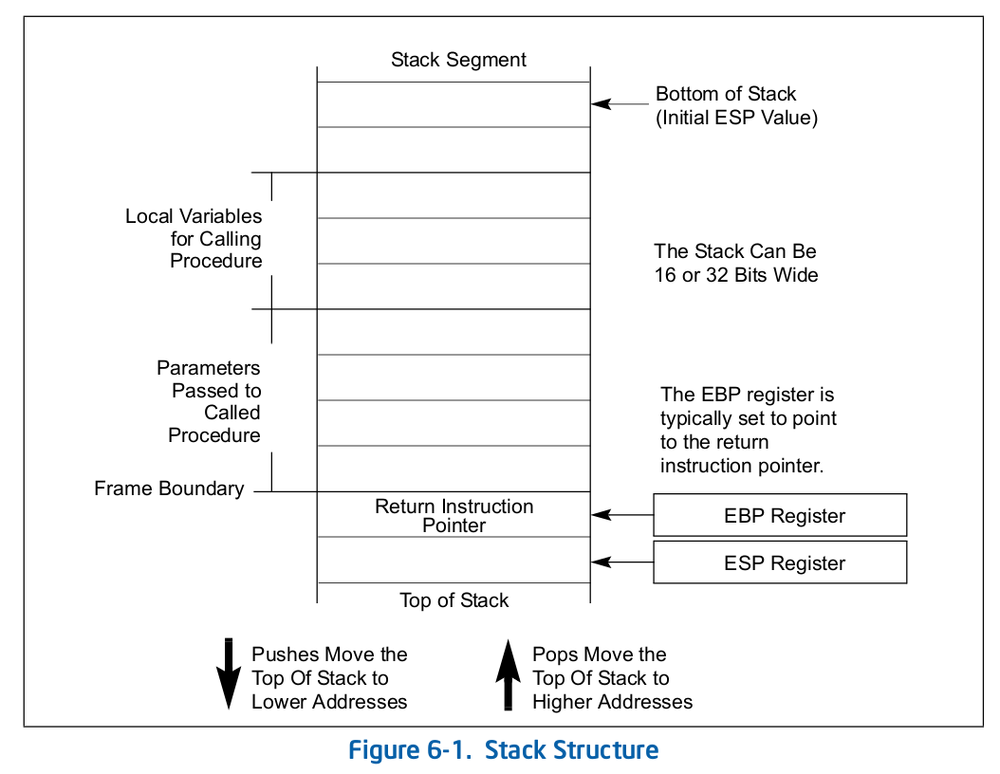

## 子过程调用

还是比较喜欢叫“函数调用”一点。x86一共以两种方式支持函数调用：

* 基于CALL+RET指令；
* 除CALL+RET指令之外，还有ENTER和LEAVE指令。

两种调用机制均使用调用栈来保存函数执行状态、传递参数和保存局部变量。

中断、异常的处理机制与CALL/RET类似。

有关shadow stack的机制省略。

## 栈

PUSH压栈，POP弹栈。压栈的时候，硬件减小ESP（也就是说这里的栈也是向低地址增长），并将内容写入新的栈顶。弹栈的时候相反。

多任务系统中每个任务都可以有自己的栈。系统中栈的总数取决于可用的段的数量以及物理内存的容量。不过同一时间只有一个栈是可用的，它被称为当前栈，它对应到当前的SS段寄存器。所有的栈操作都只与当前栈有关。

### 栈初始化

流程如下：

1. 创建一个stack segment；
2. 将这个stack segment的段选择子加载到SS段寄存器中（可以使用MOV/POP/LSS指令）；
3. 将栈指针加载到ESP寄存器中。如果使用LSS指令可以同时设置SS和ESP。

### 栈对齐

栈指针对齐到2字节或者4字节，取决于当前代码段的段描述符中的D标志位。其余略。

### 调用链

EBP和RIP（Return Instruction Pointer）是和调用链有关的寄存器。

在跳转到被调用者的第一条指令之前，CALL指令会将当前的EIP压栈。当被调用者通过RET返回的时候，则会将RIP弹栈并跳转回去。所以一个函数的prologue应该是`EBP:=ESP`，现在EBP正好指向RIP；而epilogue可能是`ESP:=EBP`来保证POP的是正确的内容。

在64位模式下，SS指向的段描述符的base/limit/attribute均被忽略，使得基地址为0而没有其他限制。DPL被修改使得它始终与CPL一致。PUSH/POP中栈的位宽为64位，对齐应该也是64位。

## shadow stacks

暂时略。

## 使用CALL/RET的调用机制

CALL指令允许将控制转移给当前代码段或是其他代码段中的函数，分别称为near call和far call。near call常用来访问当前程序或任务中的函数，而far call则用来进行系统调用或调用其他任务中的函数。RET指令同样支持near return和far return，与near/far call对应。另外，RET有一个可选参数n，表示返回的同时从当前栈中弹出n字节，可以用来释放stack frame。

near call操作流程如下（不考虑shadow stack）：

1. 将EIP当前的值压栈；
2. 将被调用函数的偏移量加载到EIP寄存器中；
3. 开始执行被调用函数。

near return操作流程：先弹出EIP，再RET n，然后继续执行调用者函数。

far call操作流程如下：将CS压栈；将EIP压栈；加载被调用函数所在的段的段选择子到CS段寄存器；加载EIP；开始执行。

far return操作流程略。

参数传递有三种方式：

1. 通用寄存器。除了ESP/EBP之外，剩下的6个均可用来在执行CALL指令之前传递参数；
2. 调用栈。
3. 将参数封装到一个数据结构（或称Argument List）中，使用前两种方法传递该数据结构的指针。

上下文保存与恢复：CPU不负责在调用函数的时候保存通用寄存器、段寄存器、EFLAGS。因此调用者需要负责将它们保存在栈上或者某个数据段上。PUSHA可以将所有通用寄存器压栈，按照如下顺序：EAX/ECX/EDX/EBX/ESP/EBP/ESI/EDI。POPA则相反。段寄存器看起来是被调用者保存的。EFLAGS应该是调用者保存的，使用PUSHF/PUSHFD可以将EFLAGS的部分/全部压栈，POPF/POPFD则相反。

### 调用其他特权级的函数

低特权级代码段若想访问高特权级代码段，只能通过一种被高度控制和保护的称为门的接口。如果不通过门，或者权限不足的话，将会触发#GP。

该流程与far call类似，区别在于：CALL指令提供的段选择子指向一个被称为调用门描述符的特殊数据结构。该调用门描述符额外包含如下信息：访问权限；被调用函数所在代码段的段选择子；被调用函数段内偏移。同时，CPU需要切换到另一个栈来执行被调用函数。每个特权级都有自己的栈。Ring3的栈的段选择子和段内偏移保存在SS和ESP寄存器中，这两个寄存器在调用高特权级代码的时候会被CPU自动保存。对于Ring0/1/2来说，这两个信息保存在任务状态段(TSS, Task State Segment)中。在换栈的时候，对于调用门和TSS的使用对调用者是透明的。

### 涉及特权级切换的CALL和RET

使用CALL指令调用高特权级代码的流程：

1. 进行特权级检查；
2. 内部暂时保存SS/ESP/CS/EIP；
3. 换栈：从TSS中加载目标栈（根据要切换到的特权级）的SS/ESP并覆盖到当前的SS/ESP，此时已经完成换栈；
4. 将之前保存的SS/ESP压入到新的栈上；
5. 将参数从原来的调用栈拷贝到新的栈上。调用门描述符中的一个值会决定拷贝参数的数量；
6. 将之前保存的CS/EIP压入到新的栈上；
7. 从调用门加载CS/EIP；
8. 开始在新的特权级执行被调用函数。

使用RET从高特权级函数返回大致是相反的流程。

### 64位模式下的跳转

暂时略过。

## 中断、异常

中断是一般由外设触发的异步（于CPU的指令执行）事件，而异常则是同步事件，当CPU在执行指令的时候发现某些条件满足之后生成。IA-32架构中有3种不同的异常：fault/trap/abort。

CPU对于中断和异常的处理方式差不多。服务例程是从中断描述符表（IDT, Interrupt Descriptor Table）的表项中找到的。

这些中断/异常服务例程通常独立于应用程序执行，然而应用程序可以通过汇编指令来访问这些服务例程。

IA-32架构定义了18种预定义的中断和异常以及224用户定义的中断，它们关联到中断描述符表的表项。IDT中的每一个中断和异常使用一个名为向量（vector）的整数区分。编号0-8，10-14，16-19是预定义的中断和异常，而32-255是软件中断或者**可屏蔽的**硬件中断。注意处理器还定义了一些额外的中断，它们并不对应到IDT表项，比如SMI中断。

### 调用和返回操作

vector指向IDT中的两种门（包括中断门和陷入门）的其中一种。中断门和陷入门和调用门的相似之处在于它们都包含：权限信息、被调用者所在的CS/EIP。不同之处在于：如果一个中断或异常handler是通过一个中断门调用的，那么CPU会将EFLAGS.IF清空来避免中断嵌套；而如果是通过陷入门调用的话，EFLAGS.IF保持不变。

如果handler的CS段的特权级与当前执行的程序或任务的特权级相同，则handle继续使用当前的栈；如果handler的特权级更高，则CPU需要切换到handler的特权级的栈。

如果不发生换栈，调用中断/异常handler的流程如下：

1. 按照EFLAGS/CS/EIP的顺序压栈；
2. 如果合适的话，将一个error code压栈；
3. 从中断门或陷入门中加载CS/EIP；
4. 如果调用走的是中断门，将EFLAGS.IF置0；
5. 开始执行handler。

如果发生换栈，调用中断/异常handler的流程如下：

1. 内部暂时保存SS/ESP/EFLAGS/CS/EIP；
2. 从TSS加载要切换到的栈的SS/ESP从而实现换栈；
3. 将之前保存的SS/ESP/EFLAGS/CS/EIP压入新的栈；
4. 如果合适的话，压入一个error code；
5. 从中断门或陷入门中加载CS/EIP；
6. 如果调用走的是中断门，将EFLAGS.IF置0；
7. 开始在新特权级执行handler。

当从中断/异常handler返回的时候，需要使用IRET指令。IRET与far RET类似，但是IRET还会恢复EFLAGS。

### 中断/异常handler任务

中断/异常服务例程可以在在一个独立的任务中执行。中断和异常可以使当前任务切换到一个handler任务。handler任务拥有自己的地址空间并可以（可选地）在更高的特权级执行。

要切换到handler任务，还需要进行隐式的任务调用，这与任务门描述符（Task Gate Descriptor）有关。

### 实模式下的中断/异常处理

略

### 显式调用中断/异常handler的指令

INT n，INTO，INT3和BOUND指令允许一段程序或任务显式调用中断/异常handler。

INT n使用vector作为参数，允许一个程序调用任何中断handler。

剩下的可能不太常用？

### 处理附点异常

略

### 64位模式下的中断/异常处理

变更包括：

* 所有IDT指向中断handler均为64位代码；
* 中断栈压入固定为64位；
* 中断时无条件压入SS/RSP；
* 如果CPL发生变更，新的SS会被设置为NULL；
* IRET的行为变更；
* 一种新的中断栈切换机制；
* 中断栈帧的对齐不同。
