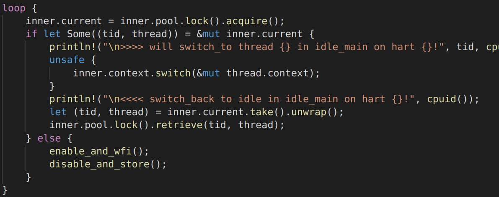

## 构建 K210 上的 OpenSBI 镜像

1. 下载 [0.8 版本 OpenSBI](https://github.com/riscv/opensbi/archive/v0.8.tar.gz) 项目源代码

2. 配置命令行

   ```bash
   export CROSS_COMPILE=riscv64-unknown-elf-
   export PLATFORM_RISCV_XLEN=64
   ```

3. 构建 ``make PLATFORM=kendryte/k210``

4. 编译后的镜像文件可在 ``build/platform/kendryte/k210/firmware/fw_payload.bin`` 处找到

需要说明的是，可以构建[三种不同的固件](https://github.com/riscv/opensbi/blob/master/docs/firmware/fw.md)根据平台不同从中选择比较合适的：

* *FW\_DYNAMIC*：从运行时的上一阶段获取下一阶段的代码位置

* *FW\_JUMP*：从一个固定的位置获取启动下一阶段的代码（Qemu 一般使用这种方法）

* *FW\_PAYLOAD*：将启动后下一阶段的代码（通常是 bootloader 或 OS kernel ）也打包在该固件中

  相关的配置选项参见[这里](https://github.com/riscv/opensbi/blob/master/docs/firmware/fw_payload.md)

  还需要研究一下如何将得到的 rCore 打包进去

目前将得到的镜像烧写到 MaixDock，从串口看到了 OpenSBI 的输出如下：

```
[13:42:20:533] ␍␊
[13:42:20:533] OpenSBI v0.8␍␊
[13:42:20:533]    ____                    _____ ____ _____␍␊
[13:42:20:536]   / __ \                  / ____|  _ \_   _|␍␊
[13:42:20:549]  | |  | |_ __   ___ _ __ | (___ | |_) || |␍␊
[13:42:20:549]  | |  | | '_ \ / _ \ '_ \ \___ \|  _ < | |␍␊
[13:42:20:549]  | |__| | |_) |  __/ | | |____) | |_) || |_␍␊
[13:42:20:563]   \____/| .__/ \___|_| |_|_____/|____/_____|␍␊
[13:42:20:563]         | |␍␊
[13:42:20:563]         |_|␍␊
[13:42:20:563] ␍␊
[13:42:20:563] Platform Name       : Kendryte K210␍␊
[13:42:20:563] Platform Features   : timer␍␊
[13:42:20:577] Platform HART Count : 2␍␊
[13:42:20:577] Boot HART ID        : 0␍␊
[13:42:20:577] Boot HART ISA       : rv64imafdcsu␍␊
[13:42:20:577] BOOT HART Features  : none␍␊
[13:42:20:577] BOOT HART PMP Count : 0␍␊
[13:42:20:595] Firmware Base       : 0x80000000␍␊
[13:42:20:595] Firmware Size       : 72 KB␍␊
[13:42:20:595] Runtime SBI Version : 0.2␍␊
[13:42:20:595] ␍␊
[13:42:20:595] MIDELEG : 0x0000000000000222␍␊
[13:42:20:595] MEDELEG : 0x0000000000000109␍␊
```

## rCore_tutorial 第二版的 multicore 支持

### 多核启动

* 在 `entry64.asm` 中，分配一块更大的启动栈空间，并根据 hartid 设置 sp
* 对于模块初始化，首先在阻塞其他 hart 的同时由 hart0 完成绝大多数模块的初始化，随后其他 hart 完成部分模块的初始化，最后所有 hart 一起进入调度函数

### 多核调度

* 

  多个核共享底层的线程池，因此不是将任务分配到每个核上再进行调度，而是先在底层进行调度，然后多个核抢占这些任务

### 同步互斥

* 为串口输出 `Stdout` 加上了互斥锁防止多个线程同时输出。

## 多核影响

### 中断

* 如何对 PLIC 进行配置来调整外部中断的分发策略
* 必要的时候通过 IPI 来进行核间通信

### 缓存

* 数据缓存与内存的一致性应该由硬件保证，软件则需要在合适的时机插入内存屏障
* 当页表发生变化后，需要及时通知其他核刷新 TLB

### 同步互斥

* 很好的观点：对于数据结构，我们使用锁其实保护的是它的某种一致性

  在一次操作中间，它处于不一致的中间状态

  此时如果暂停这次操作，再对他进行别的操作，在某一时刻再继续，就有可能对数据产生破坏

  暂停的原因有中断、以及其他核在同一时间进行的操作

* 锁的实现方面，大概只靠关闭中断是不行的，通过原子指令依然可以？

### 多核调度

* 每个核有自己的调度队列
* 要尽可能做到负载均衡、缓存亲和性，其他指标同单处理机调度