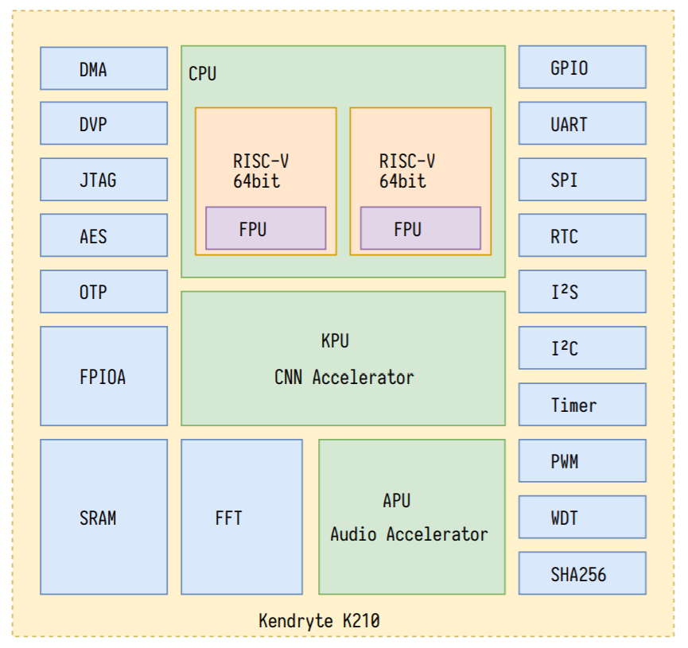
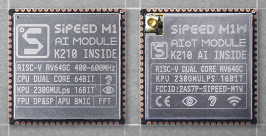
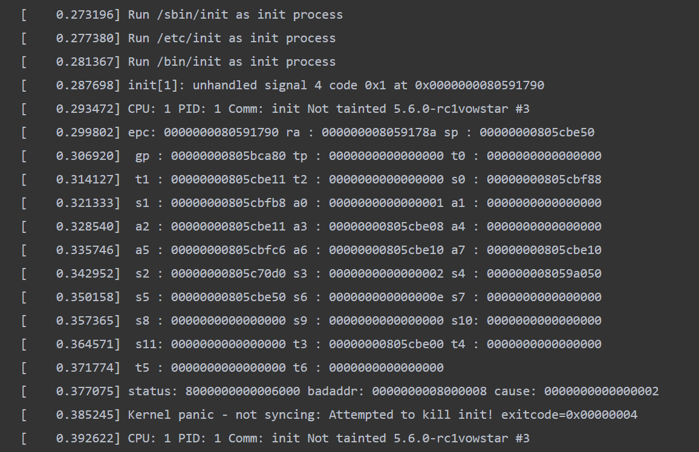
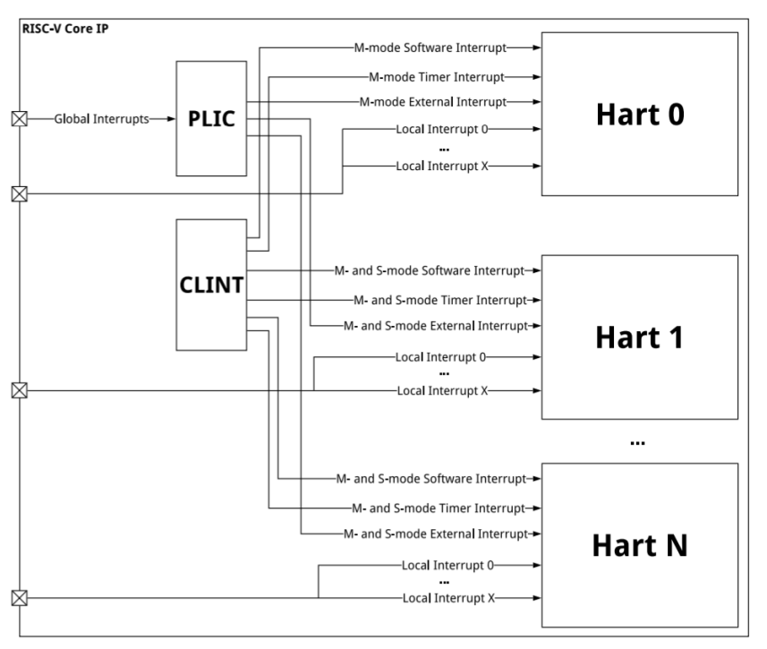

# K210 移植进展

## 吴一凡
2020/8/5, 鹏城实验室
shinbokuow@163.com

---

# Outline
## K210 相关介绍
## 已有的移植尝试
## 当前移植进展
## 进一步工作

---

# Outline
## **K210 相关介绍**
## 已有的移植尝试
## 当前移植进展
## 进一步工作

---

## Kendryte K210 (ref [Official Datasheet](https://s3.cn-north-1.amazonaws.com.cn/dl.kendryte.com/documents/kendryte_datasheet_20181011163248_en.pdf))
### Processor
* RV64GC Core $\times$ 2 @ 400MHZ
* KPU(Neural Network Processor)
  support convolution/pooling/batch normalization etc.
* APU(Audio Processor)
### Memory
* $8\text{MiB}$ On-Chip SRAM, $6\text{MiB}$ MEM0 + $2\text{MiB}$ MEM1
  MEM1 is used by KPU when it's enabled
  $\mathtt{[0x8000\_0000,0x8080\_0000)}\rightarrow\text{CPU-Cached}$
  $\mathtt{[0x4000\_0000,0x4080\_0000)}\rightarrow\text{not CPU-Cached}$
  will extend to $32/64\text{MiB}$
* I-Cache/D-Cache:$32\text{KiB}\times 2$

---


### Peripherals
* UART
* GPIO
* SPI
* DMA
* ...

---

## AIot platform by Sipeed
* AIot Module
(From [sipeed official website](https://www.sipeed.com/))
* Maix series board: MaixDock/MaixBit/MaixGo
* [MaixPy](https://github.com/sipeed/MaixPy): Micropython ported to K210
* support Deep Learning Framework: Tensorflow/PyTorch/Caffe...
* application
  

---

## Playground for RISC-V fans
* RV64GC, 2 Cores, M/S/U previlege support in 2018!
* available for personal developers but powerful
* run an OS on K210?
## Problems
1. documentation
2. incomplete implementation of S Mode Trap
3. based on [spec 1.9.1](https://people.eecs.berkeley.edu/~krste/papers/riscv-privileged-v1.9.1.pdf) published 4 years ago

---

# Outline
## K210 相关介绍
## **已有的移植尝试**
## 当前移植进展
## 进一步工作

---

## [K210-Linux0.11](https://github.com/lizhirui/K210-Linux0.11)
* ported Linux 0.11(Linus, December 1991) to K210
* run on M mode
* a terminal that (only?) supports 'ls' command
  serial interrupt, file system...
* built image can be found [here](https://en.bbs.sipeed.com/uploads/short-url/iLY5gAU1WaY7kurWenQIPBRzR8w.zip)

---

## [rCore on K210](https://github.com/rcore-os/rCore/commit/45c2ec0b17256d6bcbb28f49ac5dd65f04fd6da4)
* ported by @wangrunji0408, April 2019
* build failed now because of some dependencies
* modified OpenSBI 0.3 to fit K210
* exploited MMU on K210 for the first time
  we didn't even know K210 have MMU in it before

---

## [k210-linux-nommu](https://github.com/vowstar/k210-linux-nommu)
* linux-5.6-rc1 applied Damien Le Moal's k210 patch
* Tiny C Compiler porting
  edit Hello world C program, compile and run
* have a try: kernel panicked on MaixDock
  

---

# Outline
## K210 相关介绍
## 已有的移植尝试
## **当前移植进展**
## 进一步工作

---

## SEE: OpenSBI

---

## SEE: OpenSBI
作为一套 M 态软件：
### 实现功能
1. 初始化各寄存器，输出 CPU 的指令集扩展支持、内存等信息，并最终**跳转到内核**
2. 为 S 态软件（内核）提供 SBI 规范约定的各种功能
  如在串口终端中输入/输出字符等
3. 负责处理 M 态中断/异常

---

## SEE: OpenSBI
### 跳转方式
bootloader $\rightarrow$ OpenSBI $\rightarrow$ kernel
而 OpenSBI 支持三种不同的跳转到内核的方式：
1. ``FW_DYNAMIC``: 在 bootloader 阶段结束后才知道 kernel 所在位置；
2. ``FW_JUMP``: 跳转到一个可以设定的固定位置；
3. ``FW_PAYLOAD``: 编译 OpenSBI 时传入 kernel 镜像将二者合为一个一并载入内存

---

## SEE: OpenSBI
### OpenSBI on Qemu
> Qemu 自带的 OpenSBI 以 `FW_JUMP` 方式固定跳转到 $\mathtt{0x8020\_0000}$，因此在 Qemu 配置中需要将内核镜像载入到内存的该位置
### OpenSBI on K210
> 理论上应该和 Qemu 同样道理，只需要把内核镜像放到内存的同样位置就可以跑了

然而，貌似 OpenSBI 0.4 修复了 OpenSBI 0.3 中:"能在 K210 上正常跑"的 bug
> 幸运的是，OpenSBI 0.3 于 2019.2 发布，OpenSBI 0.4 于 2019.7 发布，在 rjgg 做 rCore K210 porting 的时候，OpenSBI 0.3 为最新版本，且可以工作

因此，目前只能基于 OpenSBI 0.3 的 `FW_PAYLOAD` 方式才能正确跳转到内核，后续版本都存在问题

---

## lab0 complete


---

## S 态中断探索
### 动机
承接原版 Tutorial，尽可能不修改之前的代码；
由于 M 态直接操作物理内存，在 M 态处理中断时无法使用 S 态的数据结构

### 有那么顺利吗？

---

## 中断总体架构 on RISC-V

---

## 中断总体架构 on RISC-V
RISC-V 中的中断分为四种：
1. 软件中断（Software Interrupt）
2. 时钟中断（Timer Interrupt）
3. 外部中断（External Interrupt）
4. Local Interrupt（略）

另有两个中断控制器：

1. PLIC(Platform-Level Interrupt Controller)，负责转发外部中断；
2. CLINT(Core-Local Interruptor)，负责生成并转发软件、时钟中断

---

## 中断总体架构 on RISC-V


---
## 时钟中断背后的故事

---

### tutorial 中的时钟中断
* 初始化
  ```rust
  sie::set_timer();
  sstatus::set_sie();
  ```
* 中断处理
  ```rust
  TICKS += 1;
  sbi::set_timer(time::read() + INTERVAL);
  ```

看上去似乎非常简单...

---

### K210 上的时钟中断
* 直接套用，出现非法指令异常
* 反汇编一下，相关指令为 `rdtime a0`，显然出现在 `time::read` 过程中
* 查看 `riscv` crate 中的实现，它是要读一个 $\text{id}=\mathtt{0xC01}$ 的 CSR `time`
  但是 Rust 编译器并不是用 `csrr` 来实现，而是直接用 `rdtime` 来实现
* 问题在于，基于 1.9.1 版 spec 的 K210 并不支持这条指令！

---

### K210 上的时钟中断
* 事实上，我们能从另外一个地方读到这个 CSR——CLINT 的 MMIO 中
  
* 因此，只要将 `time::read` 替换成对应 MMIO 的读取，即可跑 `100 ticks`
* 从 CLINT 提供的设备寄存器也可以看出它用于产生并分发软件中断（对应 `msip`）以及时钟中断（对应 `mtime/mtimecmp`）
---

### M 态发生了什么
* 看起来在 S 态做的事情十分简单直接
* 但是在 M 态发生的事情会更加有趣
* 为此，我们需要首先介绍中断代理的相关知识

---

### 中断代理
* RISC-V 存在 M 态中断代理寄存器 `mideleg`（m-i-deleg 表示 M 态的中断代理），同理还有 M 态异常代理寄存器 `medeleg`
* 所有的中断/异常默认均在 M 态处理，除非设置 `mideleg/medeleg` 寄存器
* 中断与异常不同的地方在于各类中断均分成 M/S/U Mode，而异常与特权级无关
* **逐级代理**
  * 通过设置 `mideleg` 可以将 S/U Mode 中断处理代理到 S Mode 处理
  * 通过设置 `sideleg` 可以将 U Mode 中断处理代理到 U Mode 处理

  因此，理论上设置两个中断代理寄存器即可实现用户态中断（前提是硬件支持）

---

### 中断代理与特权级
* 从 `mideleg/sideleg` 标志位的设置可以发现：
  一个 X Mode 中断不会被代理到特权级**低**于 X 的 Mode 上处理。 
* 因此，结合中断与特权级，中断处理的完整过程如下：
  1. 假设在处于 X Mode 的 hart 上接收到 Y Mode 中断，首先决定是否处理，包含以下情况：
    * 若 Y 优先级高于 X，则发生**抢占**，必定处理；
    * 若 Y 优先级低于 X，则此中断被**屏蔽**，不进行处理；
    * 若 Y 优先级与 X 相同，需要 `xstatus, xie` 相关使能打开，才进行处理，否则也会被**屏蔽**，不处理。
  2. 如果要进行处理，则依次查看中断代理寄存器 `mideleg/sideleg`，决定到哪个特权级处理该中断。
* 从以上规则也可发现：
  Trap 进入的特权级不会**低**于原先所在的特权级。
---

### 软件代理
* 刚才所提到的通过设置 `mideleg/sideleg`，在中断到来时**硬件**自动将中断代理到相应的特权级处理，称为**硬件代理**
* 与之对应，在中断到来时，不经过硬件代理，而在中断处理函数中以**软件**的手段将中断转发到其他特权级处理，则可称为**软件代理**
* 事实上，OpenSBI 中的时钟中断处理是一个比较典型的例子

---

### 基于 OpenSBI 的时钟中断处理流程
1. hart 处于 S 态收到 M 态时钟中断，被抢占，进入 OpenSBI 中的 M 态时钟中断处理函数；
2. OpenSBI 中的 M 态时钟中断处理做了如下工作：
  ```c
  csr_clear(CSR_MIE, MIE_MTIE);
  csr_set(CSR_MIP, MIP_STIP);
  ```
3. 由于设置了 STIP，中断结束回到 S 态将收到 S 态时钟中断，因为提前设置了 `mideleg`，该中断将在 S 态处理，在其中断处理函数中：
  ```c
  sbi::set_timer(time::read() + INTERVAL)
  ```
4. 该 ecall 将回到 M 态的 OpenSBI 进行处理：
   具体内容为修改 `mtimecmp` 寄存器并打开 MTIE。   
5. 处理结束后，回到 S 态，整个流程结束。
---

### 基于 OpenSBI 的时钟中断处理流程
思考：为什么一定要到 M 态折腾一下，直接在 S 态接受并处理不行吗？
原因在于：只能收到 M 态时钟中断，因此 M 态是绕不开的。

---
## 串口中断

---

## 串口中断
* 串口中断属于外部中断
* 那么，尝试沿用之前做法，将 M 态外部中断软件代理到 S 态外部中断处理
* 问题：K210 上 S 态外部中断不存在 
* 幸运的是，S 态软中断可以收到，只需设置 SSIP 标志位即可

---

## 串口中断
* 遇到问题：在 Core 0 上启动，M 态外部中断却在 Core 1 上收到
* 由于 SSIP 所在的 `sip` 寄存器是 Core-Local 的，因此一个 Core 只能向自身分发软中断
* 而我们暂时不考虑多核，希望将一切限制在 Core 0 上
* 能否将中断限制在 Core 0 上收到？

---

### Limit on Core 0
* 尝试禁用 Core 1 的 `mstatus/mie.meie`
* 然而这样就整体收不到中断了
* 说明有什么 CSR 之外的东西限制了中断只能在 Core 1 上收到
* 那么问题很可能出在 PLIC 上面

---

### PLIC


---

### PLIC
* 将 $N$ 个外部中断源分发给 $M$ 个外部中断目标(hart0-S, hart0-M, hart1-S,...)
* 每个中断源有一个从 $0\sim7$ 可以设置的优先级（Priority）
* 每个中断目标有一个可以设置的优先级阈值（Threshold）
* 每对(中断源，中断目标)有一个可以设置的中断使能（Interrupt Enable）
* 若中断源 $i$ 能够通过 PLIC 分发给中断目标 $j$，至少需满足以下条件：
  1. $\text{priority}_i>\text{threshold}_j$
  2. $\text{IE}_{(i,j)}=1$
* 若同一时间某个中断目标有多个中断源满足条件，则以某种**仲裁**机制选出其中一个中断源交给中断目标
* 更多内容参考 PLIC 规范

---

### Limit on Core 0
* 打印 PLIC 寄存器，发现串口中断的优先级被（硬件/软件？）设置为 $1$，而 Core 0/1 M 态外部中断的优先级阈值分别被设置为 $1/0$。
* 优先级阈值的条件在 Core 1 上满足，在 Core 0 上不满足
* 因此只能在 Core 1 上收到
* 解决方案：
  交换两个 Core 的优先级阈值，并使能 (Core0, uart) 的 Interrupt Enable 
* 成功在 Core 0 上收到中断！

---

### 暗
* 照理说一切关节都打通了，但是最后在中断处理里面读串口出了问题
* 换用两种串口，读输入数据寄存器都出现诡异问题
* 然后一周也没有解决
* 已经准备暂时弃坑，先把 lab 进度往下做

---

### 光
* 抱着沮丧的心情做完 lab2，发现之前的程序没有清 `.bss`，也有 `TICKS` 这种 unsafe 代码
* 一一修复之后，发现高速串口中断读出来的值正常了！
* 在 M 态中断把读到的字符打出来可以正常输入
* 然而，在 M 态中断把读（我们必须在 M 态读）到的字符存下来，再转发给 S 态软中断就转发不出去
* 后来发现问题是：一定要在 M 态中断处理中输出点东西，才能转发到 S 态
* 于是我在串口**输入**中断处理里面加了一行奇妙的**输出** ``sbi_putc(0)``
* 终于能正常干活了...

---

## S Mode Trap on K210
* 看似在 S 态搞定了所有中断/异常，但有很多问题
* 外部中断软件代理到 S 态软中断处理，过于强行，且会有很多潜在 bug
  串口就用了奇怪的科技，其他外设的中断很可能出问题
* 因此，最好的方案可能是外部中断直接在 M 态处理，其他中断/异常在 S 态处理
* 这需要：特殊的程序架构
* K210 在 S 态对于软中断/时钟中断/异常的支持较好，硬件代理辅以部分软件代理


---
# Outline
## K210 相关介绍
## 已有的移植尝试
## 当前移植进展
## **进一步工作**

---

## 进一步工作
* 继续将单核 rCore-Tutorial 移植到 K210
* 发掘 K210 的双核潜力：多核调度/缓存一致性/IPI 等问题
* 为外存开发驱动程序：Flash/SDCard
* 充分利用 KPU/APU 的硬件加速能力，实现有趣的多媒体/ ML 应用
* 完善 RustSBI，整合嵌入式社区若干零散的库，形成一个对标 OpenSBI 的有影响力的项目，并提供 K210 支持

---

# Thank you!