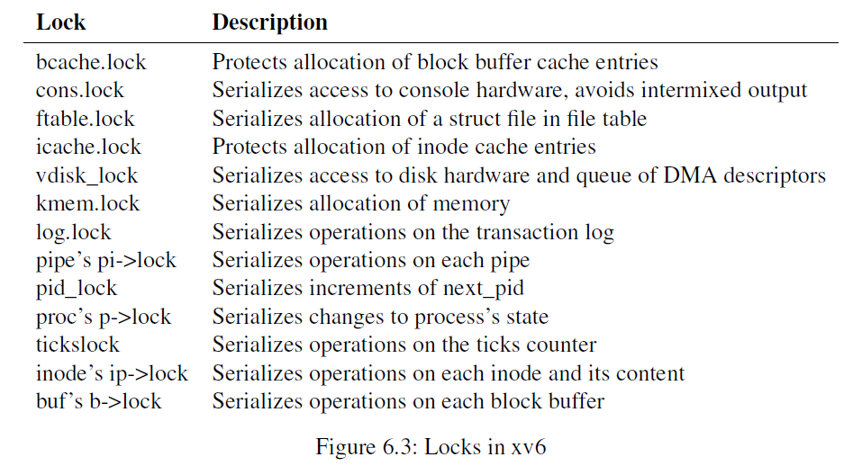

# lock

## 实验指导书阅读

### background

这次我们要阅读的是第 6 章 locking。

多条控制流可能同时在**并发**访问同一个数据结构导致出现冲突，常见于多核，单核由于有中断的存在也有可能出现，尤其是设备的中断服务例程或是时钟中断。

内核里面有很多并发访问的数据，比如两个核同时调用 `kalloc`。内核开发者需要花费很长时间来验证并发实现的正确性。研究并发的正确性或是提供并发原语常常被称为并发控制。xv6 里面的锁是并发控制的一种方法，用来制造一段临界区保护某段数据。锁在某种程度上将并行变成了串行（对于某些数据结构只能有一个 CPU 在临界区里面）因此会产生性能损失。

### spinlock

spinlock 基于 RISC-V 提供的原子指令 `amoswap reg, addr`，即实现寄存器和内存里面数据的原子互换。xv6 里面的 acquire 基于 C 库进一步封装成的 `__sync_lock_test_and_set(&lk->locked, 1)`，会原子的将 `lk->locked` 写成 1 并返回 `lk->locked` 写入之前的值。而 `lk->locked` 为 0 表示目前没有核持有该锁，为 1 的话相反。释放的时候则直接通过 `__sync_lock_release` 将指定变量原子的写入为 0。注意在适当的位置插入内存屏障（在 RISC-V 里面是 fence 系列指令）。此外，通过 `push_off` 和 `pop_off` 禁止持有锁（或者以类似的方式处于临界区）的时候打开中断，以防止死锁。

实现如下：

```c
// Acquire the lock.
// Loops (spins) until the lock is acquired.
void
acquire(struct spinlock *lk)
{
  push_off(); // disable interrupts to avoid deadlock.
  if(holding(lk))
    panic("acquire");

  // On RISC-V, sync_lock_test_and_set turns into an atomic swap:
  //   a5 = 1
  //   s1 = &lk->locked
  //   amoswap.w.aq a5, a5, (s1)
  while(__sync_lock_test_and_set(&lk->locked, 1) != 0)
    ;

  // Tell the C compiler and the processor to not move loads or stores
  // past this point, to ensure that the critical section's memory
  // references happen strictly after the lock is acquired.
  // On RISC-V, this emits a fence instruction.
  __sync_synchronize();

  // Record info about lock acquisition for holding() and debugging.
  lk->cpu = mycpu();
}

// Release the lock.
void
release(struct spinlock *lk)
{
  if(!holding(lk))
    panic("release");

  lk->cpu = 0;

  // Tell the C compiler and the CPU to not move loads or stores
  // past this point, to ensure that all the stores in the critical
  // section are visible to other CPUs before the lock is released,
  // and that loads in the critical section occur strictly before
  // the lock is released.
  // On RISC-V, this emits a fence instruction.
  __sync_synchronize();

  // Release the lock, equivalent to lk->locked = 0.
  // This code doesn't use a C assignment, since the C standard
  // implies that an assignment might be implemented with
  // multiple store instructions.
  // On RISC-V, sync_lock_release turns into an atomic swap:
  //   s1 = &lk->locked
  //   amoswap.w zero, zero, (s1)
  __sync_lock_release(&lk->locked);

  pop_off();
}
```

### 锁的使用

几条基本原则：

1. 如果一个变量在读写的同时可能有另一个核也在读写该变量，需要加锁防止覆盖；
2. 保证数据结构的某种不变性。

锁的粒度影响锁的性能，粒度越小，难度越高，性能也越高。最简单的情况是整个内核态都被一个大锁保护成临界区。但是很明显并发度非常低。spinlock 里面是忙等待的，会浪费大量 CPU 资源。在优化的时候应该是看哪个锁浪费 CPU 最严重的，也就是找到瓶颈，优先将其优化为细粒度即可。

### 死锁与锁顺序

下面是 xv6 里面的所有锁：



为了避免死锁，需要保证所有代码路径对于锁的获取顺序均符合一个全局顺序，或者说只要不存在“逆序对”即可。

xv6 里面有很多长度为 2 的锁获取链，与 `sleep` 机制有关。比如，串口中断服务例程 `consoleintr` 会在收到换行的时候再唤醒等待从串口读入 `consoleread` 的进程。`consoleintr` 在调用 `wakeup` 的时候持有着 `cons.lock`，在 `wakeup` 里面则会尝试获取待唤醒进程的锁并唤醒。所以至少 `cons.lock` 需要先于任何进程锁获取。文件系统拥有着 xv6 里面最长的锁获取链。比如，创建一个文件需要依次获取一个目录锁，一个新文件的 inode 锁，block buffer 的锁，块设备驱动的锁，以及当前进程的进程锁。

但实际上，想要通过构造锁的获取顺序来避免死锁是一种很困难的事情，这也是内核实现的很重要的一部分。

### 中断服务例程与锁

某些 spinlock 保护进程在内核态的执行和 interrupt handler 的共享数据。比如 clockintr 会增加 ticks,而在 sys_sleep 里面会读取 ticks，在访问之前都需要加锁。这有潜在的危险，比如在 sys_sleep 持有了锁的情况下进入时钟中断，明显导致了死锁。

因此，解决方案是，如果在 interrupt handler 里面会用到某个锁，那么在持有该锁的时候不能开中断。xv6 则更加保守，在持有任何锁的情况下都关闭中断。其做法是在 acquire spinlock 的时候 push_off，release 的时候 pop_off。

### memory consistency model

这个东西我现在还没有很理解...

### sleeplock

就是 spinlock 的简单封装，和 sleep/wakeup 是一个东西。注意它并没有关中断，从而不能用在 interrupt handler 中。主要用于那种可能会 spin 很长时间的 spinlock，而 spinlock 一般默认 spin 的时间比较短。interrupt handler 里面默认关闭中断，本来就应该很快返回，将耗时的内容放在外面去做。

## lab: memory allocator

内核里会统计每个 spinlock 尝试 acquire 了多少次，其中多少次失败。特别是在测试的场景：多次 `sbrk` ，要提高 kalloc 的并发性能。一种手段是每个核维护一个 kalloc 链表，各自持有独立的锁。需要考虑的是如果一个核 kalloc 链表为空，则需要从其他核上面 steal 一部分。这会让失败变得非常不频繁。

为了方便 check，必须将每个 kalloc 锁的名字命名为 kmem。

## lab: buffer cache

缩小锁的粒度使得获取 bcache 锁失败的次数尽可能少。有点复杂，但是有很多提示。