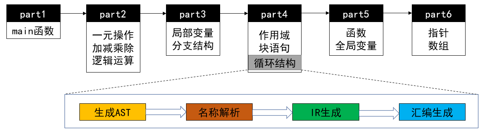
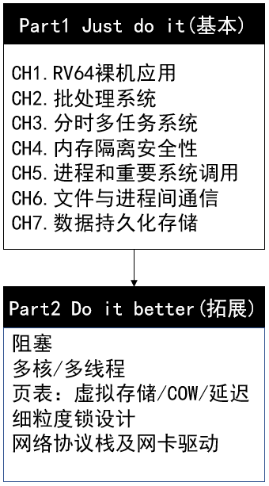
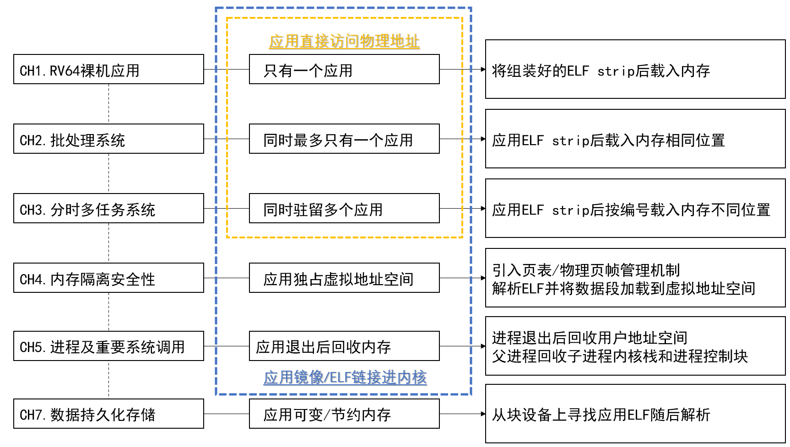
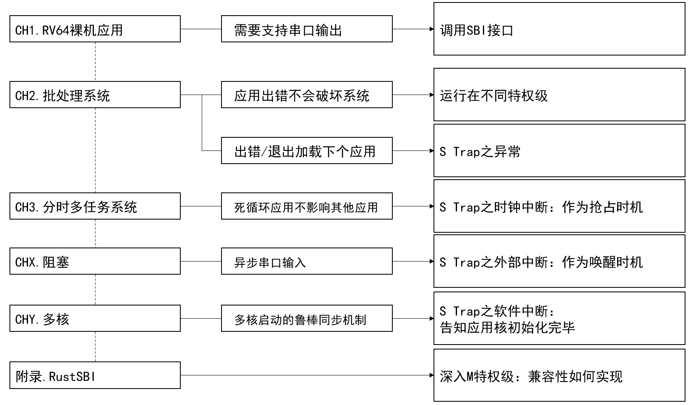
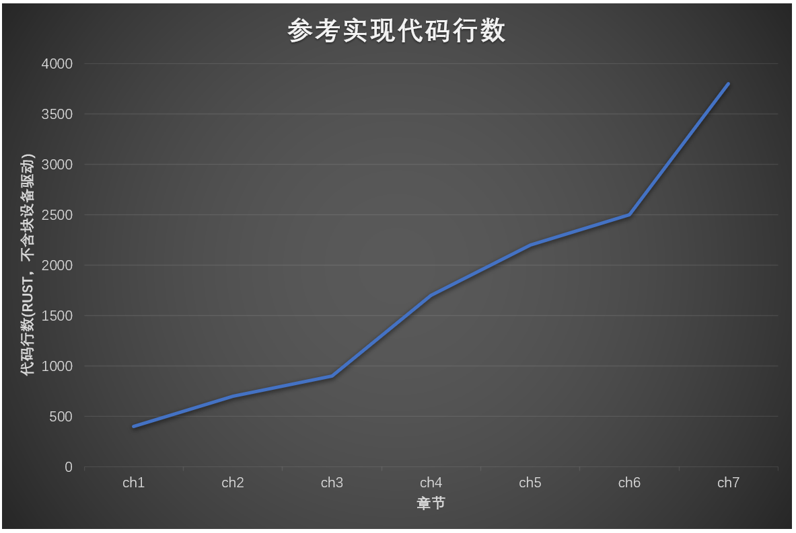

# rCore-Tutorial: 用 Rust 从零开始写 OS

## 吴一凡
shinbokuow@163.com
2020/12/26

---

# Outline
## 项目定位及发展史
## 新一轮重要迭代
## 框架设计与实现
## K210 移植
## 致谢

---

# Outline
## **项目定位及发展史**
## 新一轮重要迭代
## 框架设计与实现
## K210 移植
## 致谢

---

# 项目定位
## OS 实验改革：[$\mu\text{core}$](https://chyyuu.gitbooks.io/ucore_os_docs/content/) 学习曲线陡峭
* x86 历史包袱的额外学习开销
* 框架不能直接运行，需要学生**填空**才能获得*基本功能*
* **局部性**较强，不容易让学生产生系统的整体认知从而打通**理论**与**实践**
## 开源 OS 开发者的入门教程
作为 [rCore](https://github.com/rcore-os/rCore) 项目的衍生品，希望帮助感兴趣的开发者打好基础
并最终回馈 r/[z](https://github.com/rcore-os/zCore)/[a](https://github.com/rcore-os/aCore)Core 社区，建立更完善的开源生态

---

# 项目风格
## **从零开始**写 OS，不只是实验指导书！
### 框架设计
* **重框架轻算法**：重点是如何跑起来，而不是一个算法黑盒
* **循序渐进**：自底向上踏实的一步步完成系统搭建，不至于担心大厦随时倒塌
### 文档撰写
* **易于学习**：按照合理的顺序进行概念的引入/分类/比较
* **涵盖广泛**：全方位的文档支持，尤其是汇编代码/一些隐式机制/设计的解构

---

# 项目发展史
## [第一版](https://github.com/LearningOS/rcore_step_by_step)（2019春） 刘丰源/潘庆霖
* 能够在 qemu-rv32 上跑一个 shell 运行简单的用户程序
## [第二版](https://github.com/rcore-os/rCore_tutorial/tree/ch9-pa4)（2019秋） 吴一凡
* 将平台换成 qemu-rv64
* 新增了简单的模块功能验证，但本质功能并没有变化
* 大量的文档：知识的讲解/设计优劣的分析/所有代码都能在文档中找到
  > 只要照着文档一路复制粘贴就能跑起来。
* 在 OS2ATC 2019 上进行了[讨论](https://rcore-os.github.io/rCore_tutorial_doc/os2atc2019/os2atc.html)

---

## [第二版改进](https://github.com/rcore-os/rCore_tutorial)（2020春） OS 课程助教组
* 为每个章节设计练习题（**不再是填空**）
* 实际用于 $\mu\text{core}$ 之外的另一个备选实验，反响良好
## [第三版](https://github.com/rcore-os/rCore-Tutorial)（2020春/秋） 涂轶翔/赵成钢
* 首次支持了进程资源的回收/页表的完整实现/virtio块设备
* 更加 "Rust" 的项目：良好的模块化/丰富的代码内嵌文档
* 更加流程向的实验指导书，知识讲解和分析较少
* 配套练习在 [ossoc2020](https://github.com/rcore-os/zCore/wiki/zcore-summer-of-code) 活动中使用

---

## [第三版改进](https://github.com/wyfcyx/rCore-Tutorial/tree/multicore/)（2020秋） 吴一凡/徐文浩
* 首次支持真实硬件 K210，整合 SD 卡和串口驱动
* 首次在 qemu/K210 上支持 SMP
* 强化了进程概念，增加了一些相关 syscall，但仍不完整
## [第三版补充](https://simonkorl.gitbook.io/r-z-rustos-guide/)（2020秋） 马川/郑吉源
* 从前人的学习记录中提炼，为学习第三版实验的读者提供更多帮助

---

# Outline
## 项目定位及发展史
## **新一轮重要迭代**
## 框架设计与实现
## K210 移植
## 致谢

---

# 功能性改进
## 对标 $\mu\text{core}$/xv6 的准 Unix 接口
* 之前只支持 fork/exec/read/write，且语义不完全
* 这一版中完整实现了子进程机制及相关重要系统调用

---

# 功能性改进
## 对标 $\mu\text{core}$/xv6 的准 Unix 接口
* syscall ID 仍尽量与 linux-riscv 保持一致
* 详细的语义说明

---

# 章节分布
## "有力使不出"
$\mu\text{core}$ 的章节设计存在比较严重的**撕裂感**，比如两个著名的“门槛”：
> 打通任督二脉--lab1和lab2比较困难，有些同学由于畏难而止步与此，很可惜。通过lab1和lab2后，对计算机原理中的中断、段页表机制、特权级等的理解会更深入，等会有打通了任督二脉，后面的实验将一片坦途。

在 8 个 lab 的开头：
* lab1 要启用时钟中断，并看到间歇性的 `100 ticks` 输出；
* lab2 要实现物理内存管理和页表映射/解映射。

内核确实已经有了该**能力**，但是到底**有什么用**，那就要若干个 lab 之后了。

---

# 章节分布
## "失去才懂得珍惜"
$\mu\text{core}$ 的章节设计以**模块**为导向。
通常我们根据一些先验知识**预设**好了现代有教学意义的系统需要有哪些能力：
* 时钟中断 $\rightarrow$ 抢占式调度
* 虚拟存储 $\rightarrow$ 内存隔离安全性
* ...

将系统实现完并**固定**下来，然后依次介绍每个子模块。

如果**没有**这些功能又会怎样？如果不进行**对比**，很难有说服力...

Tutorial 框架仿照 $\mu\text{core}$，也存在这些问题。

---

# 章节分布
## 编译实验改革（2020夏）
2019 年及以前：
* 每个 lab 依序生成**中间结果**
  抽象语法树$\rightarrow$语义分析$\rightarrow$三地址码$\rightarrow$中间代码优化(可选)$\rightarrow$目标代码生成(可选)
* 统一目标：为已有语言规范（类 Java）添加几项**固定**的新特性

缺点：
* **可选**实验涉及到很多困难的**优化**，只有部分同学可构建**完整**的编译器
* 语言**特性**和**框架**较为复杂，增量练习只能覆盖到部分
  2019 年除 Java 之外还提供 Rust/Scala 框架，但仍有问题

*Tutorial 风格*：如何让**新手**也能全方位**掌控**系统？

---

# 章节分布
## 编译实验改革（2020夏）
新手：如何从零开始写一个编译器？
2020 年：每个 step 都是完整的编译器，不断拓展语法特性（类 C，简单！）

* 新手更加友好，语言不限
* 系统认知：每个 step 都会自上而下完整走一遍

---

# 章节分布
## 借鉴：以应用为导向的 oslab
* 每一章都是能运行应用的完整内核
  > $\mu\text{core}$ 和之前版本教程都在中后期才能做到
* 每一章都有明确的应用需求，数个子模块持续改进
  与历史上 OS 的发展历程相合
* 需要内核逐渐变复杂并使用更多硬件特性
* 新手也可以使用任何喜欢的语言完成基本实现
  目前有 10 位左右的同学在尝试，进展比较顺利

---

# Outline
## 项目定位及发展史
## 新一轮重要迭代
## **框架设计与实现**
## K210 移植
## 致谢

---

# 核心需求
**抽象**程度越高，实现越复杂，但好处也越多。
* 第一章：裸机打印 `Hello, world!`
* 第二章：应用出错、退出之后需要加载另一个应用
* 第三章
    * 协作：应用无法继续运行的时候需要主动切换到下一个应用
    * 抢占：如果一个应用有意/无意永远不交出 CPU
* 第四章：应用不允许访问其他应用/内核的内存空间
* 第五章：应用生命周期的更好掌控
* 第六章：应用之间的协作
* 第七章：如何在应用退出后仍保留一些数据

---

# 主线：异常控制流

---

# 主线：内存管理

---

# 主线：特权级架构

---

# 参考实现
* [截止到 Part1 代码](https://github.com/rcore-os/rCore-Tutorial-v3/tree/dev)
  
* [文档(更新到第二章)](https://rcore-os.github.io/rCore-Tutorial-Book-v3/index.html)

---

# Outline
## 项目定位及发展史
## 新一轮重要迭代
## 框架设计与实现
## **K210 移植**
## 致谢

---

# 平台兼容性
目前 QEMU 和 k210 平台的实现仅有以下：
1. 系统启动：在 QEMU 平台上只需以适当参数启动 QEMU，在 k210 平台上需要先烧写 SD 卡，再将内核镜像烧写到板子的 RAM 上，最后打开串口终端；
2. MMIO：QEMU 平台上只需映射串口和 Virtio0，而 k210 上需要映射一系列板载设备，如 uarths、sysctl、spi 等；
3. k210 平台不支持 S 态外部中断，需要将中断服务例程的地址传给 RustSBI 的拓展调用进行转发。

感谢洛佳的 [RustSBI](https://github.com/luojia65/rustsbi)，两个平台的指令集版本的巨大差异几乎被它完全屏蔽。

---

# 真实和虚拟
使用 QEMU 虚拟机的时候需要注意它相对真机的一些简化：
1. TLB 和 icache 不存在或需要特殊设置，使得无需刷新它们；
2. 内存被整体零初始化使得无需清空 .bss 段。

---

# Outline
## 项目定位及发展史
## 新一轮重要迭代
## 框架设计与实现
## K210 移植
## **致谢**

---

# 致谢
感谢陈渝、向勇两位老师的鼓励和教导；
感谢王润基学长引领的 rCore 浪潮；
感谢曾参与项目主要开发的刘丰源/潘庆霖/涂轶翔/赵成钢四位同学，我从你们那里学到了很多；
感谢洛佳在嵌入式 Rust 上带来的帮助，尤其是强大的 RustSBI；
感谢社区中对项目作出贡献或给出反馈的每一位开发者，你们的支持始终是项目发展的不竭动力；
特别感谢深圳鹏城实验室对项目的大力支持。

