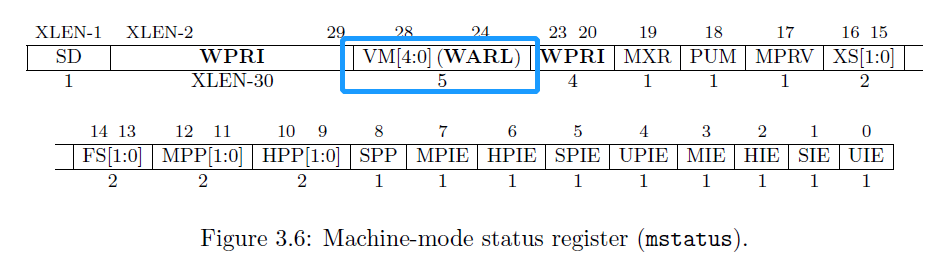
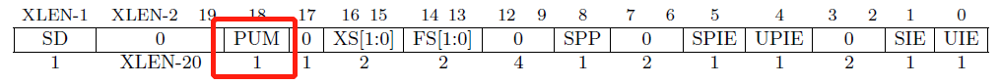
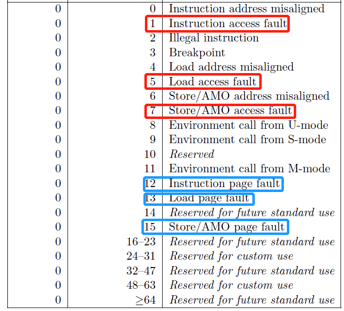

# K210 移植与多核支持

请使用 Typora 打开本文档。

## 1. 效果演示

基于 RustSBI 在 Qemu/K210 平台上跑多核 shell。

多核情况下的虚存支持还没做。

## 2. 坑

### 2.1 .bss section：全局变量的基石

* 忘记清

* 矫枉过正，[linker.ld](https://github.com/wyfcyx/rCore-Tutorial/blob/fbf172507a39f33d7ccafefbf6e6b31b727b5956/os/src/linker.ld#L38),[entry.asm](https://github.com/wyfcyx/rCore-Tutorial/blob/fbf172507a39f33d7ccafefbf6e6b31b727b5956/os/src/entry.asm#L8),[clear-bss](https://github.com/wyfcyx/rCore-Tutorial/blob/fbf172507a39f33d7ccafefbf6e6b31b727b5956/os/src/memory/mod.rs#L15)

  wsl 和 Ubuntu 虚拟机上编译出来的结果不同，误以为是平台问题

  怀疑硬件或编译器之前先怀疑自己（虽然这很难）

* 多核情况下又有何不同？[use-before-initialization](https://github.com/wyfcyx/rCore-Tutorial/blob/a7ddc30c22a0ca1d7404020c351f2ece81ce6b1e/os/src/main.rs#L104)

### 2.2 MMU：诡异的 1.9.1 版本与 RustSBI 兼容性

* 1.9.1(K210)

  

  

  

  1.10+(Qemu)

  

  

  为旧 CPU 实现新版本软件的兼容：当执行新版指令时，在 RustSBI 之内翻译成旧版指令。

  [页表初始映射](https://github.com/wyfcyx/rCore-Tutorial/blob/multicore/os/src/entry.asm#L19)，[RustSBI 如何实现兼容](https://github.com/luojia65/rustsbi/blob/master/platform/k210/src/main.rs#L406)

* S 特权级是否允许访问用户态内存

  1.9.1，Protect User Memory，默认情况下*允许*访问

  

  1.10+，Supervisor User Memory access，默认情况下*不允许*访问

  

  [solution](https://github.com/wyfcyx/rCore-Tutorial/blob/multicore/os/src/memory/mod.rs#L45)

* 异常定义不同

  1.9.1
  
  
  
  1.10+
  
  

### 2.3 与硬件缺陷的战争：S 特权级串口中断

* 核心问题：K210 上 S 特权级外部中断不存在。所以永远没法进入 `Interrupt::SupervisorExternal`。

  因此，它不能作为 PLIC 的 target，也不能软件代理。

* 经过尝试，已知可以在 M 特权级正确处理中断，且 S 特权级时钟中断、软中断工作。

* 思路：在 M 特权级完成中断的整体处理，并将结果转发给 S 特权级软中断。[ref](https://github.com/wyfcyx/osnotes/blob/master/book/k210%E7%A7%BB%E6%A4%8D/K210%20%E7%A7%BB%E6%A4%8D%E8%BF%9B%E5%B1%95.pdf)

* 大概用时一个月左右，学习中断代理/PLIC 机制/特权级中断的相关知识与大量尝试。

* 吐槽：花了很多时间配置硬件调试环境（后来其实并没用），最后发现板子坏了...（坏率<1/21）

### 2.4 icache

* [ref](https://github.com/wyfcyx/osnotes/blob/master/book/v3/K210%E7%A7%BB%E6%A4%8D%E4%B8%8E%E5%A4%9A%E6%A0%B8%E6%94%AF%E6%8C%81%E6%8A%A5%E5%91%8A.md#%E5%88%B7%E6%96%B0-icache)

## 3. NextStep

* 尝试一下实现简单的 pthread 系列调用
* 尝试重写极简文件系统
* 补充 I/O 相关的部分
* 重新思考文档布局和实验设计，并基于此完善框架