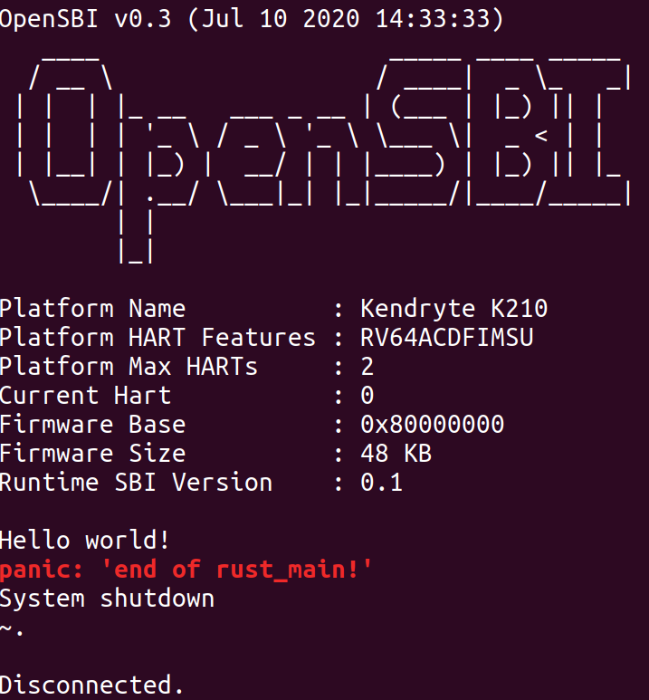
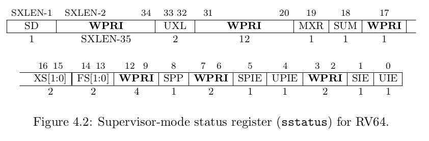

# rCore tutorial v3 阅读笔记

唉感觉学弟都很有想法，而且 Rust 都比我还熟练...真是太菜了，那我抱着初学者的心态来学习一下学弟的版本吧。

## logs

### 2020-07-14, Tuesday

今天能在 K210 上跑 lab0，而且实现了一条命令完成构建+烧写+终端连接。

明天继续搞下面的 lab，估计调试器也能到了，再搞一下硬件调试。

### 2020-07-15, Wednesday

@luojia65 提醒我在裸机环境下 Rust 并不依赖底层的 C 运行时，之前确实有些混淆了。

开始看接下来的章节。

### 2020-07-16, Thursday

昨天一直忙着搭博客还有测试 Sipeed RV Debugger，结果还都不怎么满意...

今天回归正轨赶紧把 v3 看完...

## 勘误

* lab-0/guide/part-5: GNU 工具链那里，多了一个 [info]

* lab-0/guide/part-6: Qemu 模拟的 RISC-V 那里，应该改成"Qemu 提供的 RISC-V 虚拟机"

* 希望能将地址改成这种字体，看起来比较美观

  $\mathtt{0x8000\_0000}$，$\mathtt{0xFFFF\_FFFF\_C020\_0000}$

* lab-0/guide/part-6: 多了一个 `.stack`

* lab-0/guide/part-9: `os/src/sbi.rs` 那里，是不是给 `ret` 一个初始值比较好～

* lab-1/guide/part-2: sepc 中提到 Rust 指令不定长，应该**仅限于启用 C 拓展**的时候才会这样

* lab-1/guide/part-2: 最后 CSR set 那里，应该是 `csrs` 使用通用寄存器作为 mask

fork 下来，准备看着文档从头来一遍


## lab0

* 之前有点忘了入口点相关的事情了。由于 Rust 是基于 C 的，在 Rust 程序启动之前首先要进入 C 运行时 crt0 进行相关初始化，然后 crt0 调用 Rust 运行时初始化函数 [lang_start](https://github.com/rust-lang/rust/blob/bb4d1491466d8239a7a5fd68bd605e3276e97afb/src/libstd/rt.rs#L32-L73)，Rust 运行环境初始化完毕后才能正式跳转到 `main` 函数。

  因此，在裸机环境下，我们只能通过重写 crt0 入口点来搞一套自己的运行时。

  事实上，我们将 crt0 的入口点 `_start` 函数覆盖掉。至于为啥要 `#[no_mangle]` 大家都清楚了。

* 通过 `rustc --version --verbose` 可以看到编译的默认目标平台是 ``x86_64-unknown-linux-gnu``，因此编译器在链接的时候一定会将引用它所依赖的那套 C 运行时，并产生链接错误如下：

  ```rust
    = note: /home/shinbokuow/rCoreTutorial/v3/me/rCore-Tutorial/os/target/debug/deps/os-ef03d122c249fc28.1mvlw0a96qxa6gs9.rcgu.o: In function `_start':
            /home/shinbokuow/rCoreTutorial/v3/me/rCore-Tutorial/os/src/main.rs:13: multiple definition of `_start'
            /usr/lib/gcc/x86_64-linux-gnu/7/../../../x86_64-linux-gnu/Scrt1.o:(.text+0x0): first defined here
            /usr/lib/gcc/x86_64-linux-gnu/7/../../../x86_64-linux-gnu/Scrt1.o: In function `_start':
            (.text+0x12): undefined reference to `__libc_csu_fini'
            (.text+0x19): undefined reference to `__libc_csu_init'
            (.text+0x20): undefined reference to `main'
            (.text+0x26): undefined reference to `__libc_start_main'
            collect2: error: ld returned 1 exit status
  ```

  事实上，我们看到编译器提示了 `_start` 的多重定义以及若干 C 运行时符号的缺失。因此，我们需要把目标平台替换成 RISC-V 裸机。

  > 这里可能有两个理由：
  >
  > 1. 我们需要让编译器移除掉默认依赖的 C 运行时，从而让编译通过；
  > 2. 我们本来就是要在 RISC-V 裸机上跑内核而不是默认的目标平台。

* 这里使用的裸机平台是 `riscv64imac-unknown-none-elf`，指令集拓展包括乘除指令、原子指令和指令压缩。随后使用 `cargo build --target ...` 得到裸机上的可执行文件。

  **看我** 这里要将配置保存在 `.cargo/config` 我也没啥印象了。

* 感谢 Rust 社区提供的 [cargo-binutils](https://github.com/rust-embedded/cargo-binutils) 工具，后端好象是 llvm 实现的，我们就只管用就行了，比如 `rust-objdump, rust-objcopy` 等等。

* 使用 `rust-objcopy` 工具去掉 elf 文件中的调试信息等变成镜像。参数 `--strip-all -O`。

* 使用链接脚本 `linker.ld` 配置内核的内存布局，**看我** 跟之前的不同在于将 `bss.stack` 合并到了 `bss` 段中。还去掉了 `.text.entry` 以及一些不必要的 4K 对齐。

  **看我** 注意`.text:` 是不对的，中间必须加一个空格，即 `.text :`。

  链接脚本的设置也是放在 `.cargo/config` 中的。

* 然后就要重写函数入口点（也就是自己的一套运行时）了。**感觉目前也仅仅是把整个流程说了一遍，而并没有去说为什么要这样干。现有的写法还有优化空间。**

* 注意 `entry.asm` 中的 `la sp, boot_stack_top` 伪指令，对于 RV32 来说，这是很经典的 LUI+ADDI 指令组合，但是不知道对于 RV64 而言，它是能将全部 64 位地址载入寄存器还是只能载入后 32 位，由于目前启动栈顶只有 32 位，所以这里是没有问题的。

  另一条伪指令 `call rust_main`，实际上是 AUIPC+JALR 的组合，它能跳转到内核入口点 `rust_main` 并将本来的下一条指令地址保存在 `x1(ra)` 中。当然，我们永远不会回来就是了。

  整段汇编代码的意义还是一样：设置启动栈并跳转到内核入口点。

* 尝试下自己写 Makefile，感觉还是没啥思路 QAQ

  自己写了下好像也不是很难...然后命令行可以输出 OK 了！

  等弄完格式化输出我就把它在 K210 上跑起来～

* 封装 sbi 接口，将 `sbi_call` 用 `#[inline(always)]` 强制性在调用每次出现的地方都把自己复制一份，感觉这个优化可有可无，又不是那种短小精悍又频繁被调用的函数。而且加不加都不影响正确性。**这里还是应该讲一下内联进去还是正常走函数调用的取舍，之前都没讲**。

* 到了实现格式化输出的地方了，看看相比之前自己能不能有点进步。

* `console.rs` 里面的要实现 `core::fmt::Write` 的 `Stdout` 类是一个 Zero-Sized Type，不过这好像并不是关键，**相比原版，学弟实现了将一个 UTF-8 编码字符串打印出来的功能，主要思路就是分解成字节依次调用 console_putchar 进行打印**。

* 看了一会宏相关的知识，感觉把脑子看关机了...先记录一下不错的学习资源吧

  [Rust 宏小册中文版](http://blog.luxlyu.com/tlborm-chinese/book/README.html)

  [Rust 过程宏教程](https://xr1s.me/2018/12/08/introduction-to-rust-proc-macro/)

  回过头来看 `print! println!` 的模式的实现，首先前面有一个作为字面量的 `fmt` 表示模式，然后后面套着两层重复，先看看外层的重复，其实就是 `$(inner)?`，也就是重复里层的模式 0 次或多次，中间没有分隔符；而里层的重复 `inner` 是 `, $($arg:tt)+`，可以理解为首先有一个逗号，然后后面有至少一个中间没有分隔符的标记树。

  这个宏的实现原理像是一个 Adapter，就是把输入直接接到下面的 `format_args!` 宏中，所以它至少能够解析输入并暂时将它存下来，因此需要能知道输入是啥格式的。**其实我感觉，如果不是一定要和 Rust 一致通过宏 print! 来输出，也许写一个函数 print 来输出会更简单些**。

  但不管怎么样，现在的逻辑是经过 print! 宏的中转，可以将输入通过 format_args! 宏变为 `fmt::Arguments` 类型。为了输出它，就得有一个实现了 `fmt::Write` 的类型 `Stdout` ，它再通过底层的 `console_putchar` 来实现 `fmt::Arguments` 作为输入的 `write_str` 函数。**原先的叙事逻辑似乎完全反了**。

* 在 `panic_handler` 中，用一些黑科技实现了带颜色输出，但是前提是终端要支持。**这提示我们，装一个优秀的终端作为前端，即使在 K210 上也能获得带颜色的输出，那就很爽了！**
  
  此外，可以通过启用 `panic_info_message` feature 来获得 `info.message()`。
  
* 按照学弟的方法实现格式化输出，结果经常出现什么都输出不出来的情况，只能换成我第二版的实现看看有什么不同了。目前还是这样，一旦使用宏就整个什么都输出不出来。
  
  解决掉了，我真是太蠢了，照抄链接脚本的时候忘了把 `.rodata` 段弄进去了，之前各模块都没有 `.rodata` 段的时候就能正常跑，加了宏之后编译器居然会把 `.rodata` 段弄到 `.text` 段前面去，自然就跑飞了...
  
  这里还需要注意一下**为什么链接脚本中需要将某些段进行 4K 对齐，大概是为了后续的内存分配？**
  
* 终于能在 K210 上跑 v3 的 lab0 啦！有图为证
  
  
  
  而这仅仅只需要一条 `make run-k210` 命令！算是做了一点微小的贡献。
  
  比较坑的地方也只有需要将各个段按照 4K 对齐。否则会报**内存读写不对齐**的错误。同时，需要注意的是 `. = ALIGN(4K)` 必须在花括号外面才有用，且修改完之后要 `clean` 之后再重新构建。（想想之前的对齐都是假的 QAQ，是运气好还是 Qemu 与 K210 的实现不一样？）
  
* 关于 `cu` 的使用方法的话，要输入 `~.` 才能退出，有时还要先按 `~<enter>` 才能进入输入模式~
  
## lab1

* 好家伙，上来就给我来了一个奇  妙  比  喻

* CSR 的所有相关操作有读写(或称交换 CSRRW)，只读(CSRR)，只写(CSRW)，指定某些位置0(CSRC[I])，指定某些位置1(CSRS[I])

  观察可以发现，相关寄存器在指令中出现的顺序是 rd1 先于 csr 先于 rs1

  据此推断所有指令的具体格式为

  ```
  CSRRW	rd1, csr, rs1
  CSRR	rd1, csr
  CSRW	csr, rs1
  CSRC	csr, rs1
  CSRS	csr, rs1
  CSRCI	csr, imm
  CSRSI	csr, imm
  ```
  
  在 CSRC[I]/CSRS[I] 中，输入的 `rs1/imm` 作为 mask 存在，意义是指定将哪些位置0/1。
  
  另外，这些指令都是**原子**的。

* 我们都知道，接下来就要保存/恢复中断现场了。
  
  *为了方便起见，以下关于中断的描述可能会有歧义，其中某些指的是一般意义上的 Trap，而另一些则特指外部中断。这个措辞之后再进行修改。*
  
* 当中断发生时，由于我们通过中断要进入 S 态，因此硬件会自动设置中断原因以及附加信息 `scause,stval`，进入中断之前正在执行的指令地址 `sepc`。当然，`pc` 也要按照 `stvec` 进行相应设置。
  
  然后就是 `sie/sip` 以及 `sstatus` 上面的 `sie/sip` 相关位，以及 PLIC/CLINT 如何处理它们。如果要说明的话，**感觉会非常复杂**。我们姑且不去解释背后的原理，只是从使用方法的角度去介绍一下。
  
  
  
  这里 SPP 会按照当前 hart 处于 U/S 态由硬件自动相应设置为 0/1 ，这是因为其他模式无法通过中断进入 S 态。后面还会提到，在通过 SRET 指令恢复到中断之前的特权级的时候也是根据这个标志位来恢复的。
  
  同时当 SIE 标志位 clear 的时候，处于 S 态时所有的中断都会被禁用，而 hart 处于 U 态时，即使 SIE clear，也依然能收到 S 级中断。**这里不是很懂，到底什么叫做 Supervisor Level Interrupt？ 而它又跟 hart 当前所处的特权级有什么关系？**
  
  > 好的我进入中断了，这里找到一篇[文档](https://sifive.cdn.prismic.io/sifive/0d163928-2128-42be-a75a-464df65e04e0_sifive-interrupt-cookbook.pdf)，来看一看。
  >
  > * 经典区分 exception/trap/interrupt
  >
  >   exception 是一条指令执行过程中发生的错误(unusual condition)
  >
  >   trap 指的是从原本的指令执行过程到 trap handler 过程中**同步的控制流转换过程**，感觉还是在特指 ECALL/EBREAK 吧...
  >
  >   interrupt 指的是对于一个 hart 而言**异步的外部事件**，使得它要在某条指令执行结束后进入 trap 继而进入 trap handler
  >
  > * PLIC/CLINT 整体结构图
  >
  >   
  >
  >   看起来，CLINT 负责产生时钟中断、收集其他 hart 传过来的软中断并交给自己的 hart 来进行处理；而 PLIC 负责收集全局中断，并将其按照一定的规则转发为某个或某些 hart。局部中断则是将中断源不经过 PLIC 直接连接到 hart 上。
  >
  >   那么至少有以下几个问题：
  >
  >   1. 什么是 global interrupt，什么又是 local interrupt?
  >   2. 是不是每个 hart 上都有一个自己的 clint，图示上仅仅是简化？
  >
  > * CLINT
  >
  >   * CLINT 对于软中断/时钟中断/外部中断设置了一套固定的优先级，通过一个不可修改 Interrupt ID 来表示
  >
  >   * 通过 CLINT 只能进行**跨特权级**的软件抢占(Software Preemption)。例如 M 态中断可以立即打断 S 态的代码执行。但是 S 态就做不到。（但是 S 态中断显然也可以打断 S 态的代码执行啊，可能实际的意思是 S 态中断之间不能抢占吧）
  >
  >   * 虽然位置不太对，但这里提到了很关键的一点，也就是说 `m[s]tvec` 在 Direct Mode 下必须 **4 字节对齐**；在 Vector Mode 下必须 64 字节对齐。
  >
  >     这个应该可以通过在汇编代码中 `.align` 来进行配置。
  >
  >   * 在 `mcause.exception_code` 中，0~3 表示 U/S/M 软中断；4~7 表示 U/S/M 时钟中断；8~11 表示 U/S/M 外部中断。其中 2/6/10 被保留。>=16 的被称为 local interrupt。
  >
  >     而在 `scause.exception_code` 中，0~1 表示 U/S 软中断；4~5 表示 U/S 时钟中断；8~9 表示 U/S 外部中断。同样，>=16 的被称为 local interrupt。
  >
  >     这应该还是因为中断服务例程所在的特权级不能比之前低，因此处于 S 态的中断服务例程看中断的原因的 `scause.exception_code` 的时候，当然就不必处理 M 态的中断。
  >
  >     那么，能否推断出究竟什么叫 S 态中断，而什么又叫 M 态中断呢？中断的代理又是怎么一回事呢？目前的理解，可以将 S 态中断定义为"**能在 S 态接收到并从 S 态进入中断处理的中断**"。究竟是否正确，接下来再继续看。
  >
  > * PLIC
  >
  >   * PLIC 一共可以分发 1024 种中断，它们的编号从 1～1024
  >   * 每个进入 PLIC 的中断有一个优先级，可以从 1~7 进行配置，7 代表最高优先级；而 0 的话表示禁用此中断
  >   * PLIC 中有一个全局的阈值寄存器，可以将优先级**不超过**该寄存器中设置的值的中断全部屏蔽
  >   * 如果两个有着相同优先级的全局中断**同时**进入 PLIC，则有着较小 Interrupt ID 的全局中断更优先
  >   * 当使用 PLIC+CLINT 组合的时候，外部中断直接从 PLIC 发布到 CPU ，中间不经过 CLINT。
  >   * 从定义上，当一个 hart 接受(claim)了一个中断但仍然处在中断处理过程中的时候(也即尚未 complete)，PLIC 不能向这个 hart 转发一个新的中断。因此，对于某一个确定的 hart，PLIC 不支持抢占式全局中断。
  
  总之，SIE 会被保存在 SPIE 中留待日后恢复，而 SIE 自己会被 clear 屏蔽所有中断。(所以原生不支持中断嵌套)
  
* 之前看了很多相关知识，但是最后还是没搞定 S 态串口终端，甚至换了电脑之后连 M 态中断都收不到了，而且之前的 `println!` 也不能正常工作了...

  所以，目前先在很有限的时间里把时钟中断、调试中断搞定吧
  
* 现在开始研究洛佳大佬自己定制的一套 SBI ，顺便学习一下开源社区里面的 Rust 都是怎么写的...

  然而他的 SBI 在 K210 上并不能跑，同时，我比较希望 SBI 不要调用太多的库，而最好是每一行代码都比较清晰，在教学意义上才更好...

  因此，我们暂时只能回到 OpenSBI 3.0+ 了

* 尝试通过读写 `mtime/mtimecmp` 寄存器（由于它们是 MMIO 的）来避免使用 `rdtime` 指令。然而，OpenSBI 对于 `set_timer` 的实现明显不仅是修改了 `mtime` 寄存器。因为我之前的尝试是收不到时钟中断的。就让我们来探索一下 OpenSBI 里面是怎么搞的。 

  首先在 `sbi_ecall.c` 中找到 `SBI_ECALL_SET_TIMER` 的分支中找到是调用了 `sbi_timer_event_start` 函数。这个函数可以在 `sbi_timer.c` 中找到，具体实现为：

  ```c
  void sbi_timer_event_start(struct sbi_scratch *scratch, u64 next_event)
  {
  	sbi_platform_timer_event_start(sbi_platform_ptr(scratch), next_event);
  	csr_clear(CSR_MIP, MIP_STIP);
  	csr_set(CSR_MIE, MIP_MTIP);
  }
  ```

  首先调用了平台的 `timer_event_start` 实现，随后：

  1. 在 `mip` 寄存器中手动清掉 STIP 标志位；
  2. 在 `mie` 寄存器中设置 MTIE 标志位，打开 M 态时钟中断使能。

  那么就得看看平台方都干了什么：

  找到 `platform/qemu/virt/platform.c` ，看到该平台的 `timer_event_start` 函数指针被设置为 `clint_timer_event_start`。而该函数又能够在 `platform/common/sys/clint.c` 中找到，可以发现在 64 位下也仅仅是将 `next_event` 调用 `writeq_relaxed` 函数写入 `mtimecmp` 所在的地址。该函数能在 `riscv_io.h` 中找到，貌似是原子的，但是应该也和 Rust 中的 `write_volatile` 没差～

  那么目前看来，问题就出在没有在修改 `mtimecmp` 之后设置标志位。没有收到时钟中断的关键就在于 `mie` 中的 M 态时钟中断使能没有打开。而这个也显然只能在 M 态去做(魔改 OpenSBI，或者是自己写的 M 态软件)。

  既然都看到这里，我们再来看一下基于 OpenSBI 的时钟中断的处理流程。暂且不管保存/恢复上下文以及 `mtvec` 初始化的这一步，实际的中断处理应该是在 `sbi_trap.c` 中的 `sbi_trap_handler` 函数中。原本的 OpenSBI 只负责处理 M 态时钟中断、IPI 以及若干种异常，所有的外部中断丢进去都会直接 panic，想想串口中断的处理就比较蛋痛，尤其是在知道 K210 上 `mideleg` 部分标志位被硬件连 0 没法进行代理的情况下......

  暂且不考虑 hart 为什么收到的是 M 态时钟中断而非 S 态，总之我们调用 `sbi_timer_process` 函数进行处理。这个函数当然也可在 `sbi_timer.c` 中找到，发现它作了一次很有趣的软件代理：

  ```c
  void sbi_timer_process(struct sbi_scratch *scratch)
  {
  	csr_clear(CSR_MIE, MIP_MTIP);
  	csr_set(CSR_MIP, MIP_STIP);
  }
  ```

  1. 将 `mie` 寄存器的 MTIE 标志位置 0，这里居然是把 M 态时钟中断使能关掉了；要在随后通过软件 `ecall` 来调用 `sbi_timer_event_start` 函数设置完新的 `mtimecmp` 之后才重新把这个使能打开。
  2. 之后，将 `mie` （实际上是 `sie`） 寄存器的 STIP 标志位置 1，这样，在 OpenSBI 中断处理回到 S 态之后，hart 惊奇的发现 STIP 标志位为 1，随后再检查一下 `sstatus/sie` 发现使能都已经打开，就可以进入 S 态时钟中断的处理了。这可谓是一次完全成功的“甩锅”。

  总结一下基于 OpenSBI 的时钟中断处理总流程：

  1. 初始化之前必须要把 `mie.mtie` 置 1，这样才能收到时钟中断；
  2. 内核运行在 S 态，但此时收到 M 态时钟中断，这个并没有被代理，只能在 M 态进行处理；
  3. M 态主要是在 `sbi_timer_process` 中处理时钟中断，关闭 M 态时钟中断使能，并软件代理到 S 态；
  4. M 态中断处理完毕通过 `mret` 回到 S 态，发现 STIP 位置 1，由于在 OpenSBI 初始化时设置了中断代理，因此可以在 S 态进行处理；
  5. S 态的处理主要就是通过 ECALL 调用 OpenSBI 提供的 `sbi_timer_event_start` 函数，回到 M 态修改 `mtimecmp` 并将 STIP 位清掉表示 S 态时钟中断处理结束；同时打开 M 态时钟中断使能。至此整个中断处理流程结束。转 2

  目前比较疑惑的是**MTIP 标志位用不用 clear，如果需要的话 OpenSBI 是在哪里 clear 的**。

  我们可以先魔改一下 OpenSBI，相比之前，仅仅在初始化的时候将 `mie.mtie` 打开。这样的话，总体上也就是 `mie.mtie` 常驻打开...后面先不分析了，等彻底跑通再说

* Rust nightly-2020-06-27 版本是有问题的...一开始发现 EBREAK 回来之后只要有非 panic 代码，在 K210 上都会卡死...那咋办嘛...现在改成 nightly-2020-06-04 之后至少后面的 hello world 能输出了...

  改了版本之后终于搞定了时钟中断了，说来滑稽，我所作的唯一一件事情就是在 OpenSBI 初始化的时候打开了 `mie.mtie`，然后在读 `mtime` 的时候不是通过 ECALL 而是通过 MMIO。
  
  我忽然觉得，也许串口中断也会比较顺利？
  
* 突发奇想把 PLIC 的寄存器都打印了一下，发现高速串口在 K210 上的 IRQID 是 33，而之前的设置仅仅设置到 0~31，于是实际上之前并没有通过修改 PLIC 的 IE 来正确禁止 hart1\_M 收到串口中断。了解了这个之后，我又尝试打印 hart0\_M 和 hart1\_M 的阈值以及高速串口中断的优先级，发现分别是 1,0,1。这样就能解释为啥只能在 hart1\_M 上收到外部中断了。猜测这个设置应该是在 OpenSBI 某个地方搞的。
  
  然而我们想解决的话非常简单，只需要将 hart0\_M 与 hart1\_M 在 PLIC 上的阈值交换一下就行了！现在终于能够在 hart0\_M 上收到串口中断了！接下来的问题就是怎么将它搞到 S 态上去。
  
* 题外话：C 语言在标签之后（包括 switch-case 的每个分支）之后第一条语句不能定义指针我是没想到的。目前解决方案是加一条空语句 `;` 过编译。

* 试试能不能在 M 态完成串口中断的正常处理...走了一个完整的 claim & complete 流程后很轻松搞定了这一切。

* 我试着沿用时钟中断的思路试图将 M 态外部中断软件代理到 S 态外部中断。但是发现设置了 `mip.seip` 之后 S 态也没有任何反应。那可能真的就是这样吧，S 态外部中断在 K210 就是不存在的，这也可以解释究竟为何相关的中断代理不工作。 

  好在我们大概可以通过软件中断来搞（之前尝试过 S 态软件中断可以正常收到），但是可能要对 OpenSBI 做更大的修改。

  我更期望是能够从这一章节开始，从零开始为 K210 自己实现一套特定的 SBI。由于并不是按照 SBI 标准提供接口可能也不能叫做 SBI 了，只是一段简单的 M 态软件，能够为上层的 K210 提供支持。
  
  这与洛佳大佬的看法一致，他也打算在自己的 SBI 实现中扔掉 K210 的支持。事实上还是单独为 K210 搞一套运行时会更好。如果我有时间的话会去尝试一下。
  
* 如果想走通过 S 态软件中断来代理这条路，为了日后对于 IPI 的支持，首先要解决的一点就是当进入 S 态软件中断之后应该如何区分这是其他 hart 发给它的中断，还是它自己上面产生的 M 态外部中断代理过来的。

  但还是应该把这条路跑通再去考虑之后的拓展...
  
* 目前算是走通了，但是无论在 M 态还是在 S 态软件中断中读 `uarths.rxdata` 都会发现其 `empty` 恒为 1，且一开始读数据会读出 7 个 0。后面的输入则分别有不同程度上的延迟...

  对于这个诡异的现象实属无能为力QAQ
  
  难道是 hart1 永远滴神，hart0 不行？
  
* 目前先不进行更多的尝试了，找到一个 [nommu Linux for K210](https://github.com/vowstar/k210-linux-nommu)，跑一下试试，看看人家是怎么搞串口中断的；此外，还找到了学长在 K210 M Mode 上跑 Linux0.11 的[记录](https://github.com/lizhirui/K210-Linux0.11)，都来试试看吧。rjgg 的 rCore on K210 在 Rust 的版本更新后好像编译不了了，万恶的 cargo-xbuild...事实上，硬改掉某些库的代码似乎可行...?
  
* 尝试了一下之后发现只有学长的 Linux0.11 能够复现，但是其功能过于简单，貌似对我目前参考价值不是很大...
  
* 这时，我又尝试跑了一下 K210 官方 SDK 基于 UART3 而非 UART0(也即 UARTHS) 的串口中断测试程序，发现它居然能够正常运转。于是接下来的任务也就是把 UART0 换成 UART1~3 了（它们三个之间除了 MMIO 地址不同之外没有任何不同）
  
  直接将 SDK 相关代码移植到 OpenSBI 中过于令人不爽，因此，我尝试直接跟踪官方 SDK 示例中初始化通用串口的全过程，这样之后在实现自己的 M 态软件的时候也可以稍微轻松一些。
  
  首先是常规的 `plic_init, sysctl_enable_irq` ，这两个功能比较简单我们之后再说...
  
  接下来调用了 `uart_init(UART_NUM)`，这个函数可以在 `uart.c` 中找到：
  
  ```c
  void uart_init(uart_device_number_t channel)
  {
      sysctl_clock_enable(SYSCTL_CLOCK_UART1 + channel);
      sysctl_reset(SYSCTL_RESET_UART1 + channel);
  }
  ```
  
  在 `sysctl.c` 中找到 `SYSCTL_CLOCK_UART1=25`。
  
  ```c
  int sysctl_clock_enable(sysctl_clock_t clock)
  {
      if(clock >= SYSCTL_CLOCK_MAX)
          return -1;
      sysctl_clock_bus_en(clock, 1);
      sysctl_clock_device_en(clock, 1);
      return 0;
  }
  ```
  
  观察 `sysctl_clock_bus_en` 函数，实际上根据传入的 `clock` 可知二者实际上分别做的就是
  
  ```c
  sysctl->clk_en_cent.apb0_clk_en = en;
  // 这里根据要启用的是 UART1/2/3 而不同
  sysctl->clk_en_peri.uart1_clk_en = en;
  ```
  
  再去找 `sysctl_reset` 函数：
  
  ```c
  void sysctl_reset(sysctl_reset_t reset)
  {
      sysctl_reset_ctl(reset, 1);
      usleep(10);
      sysctl_reset_ctl(reset, 0);
  }
  ```
  
  其中的 `sysctl_reset_ctl` 函数找到实际做的是下面的事情：
  
  ```c
  // 这里同样根据 UART1/2/3 而不同
  sysctl->peri_reset.uart1_reset = rst_value;
  ```
  
  而 `usleep` 函数则是能在 `sleep.c` 中找到：
  
  ```c
  int usleep(uint64_t usec)
  {
      uint64_t cycle = read_cycle();
      uint64_t nop_all = usec * sysctl_clock_get_freq(SYSCTL_CLOCK_CPU) / 1000000UL;
      while(1)
      {
          if(read_cycle() - cycle >= nop_all)
              break;
      }
      return 0;
  }
  ```
  
  功能很简单，就是休眠一段时间等待 sysctl 状态趋于稳定。
  
  

