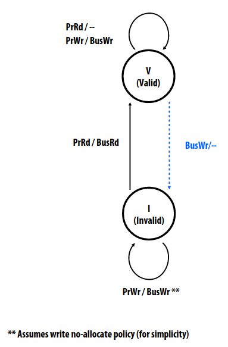
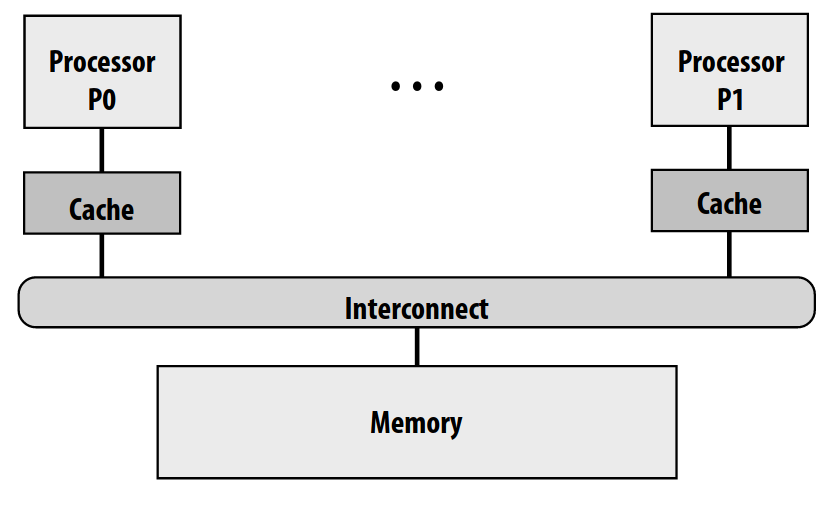
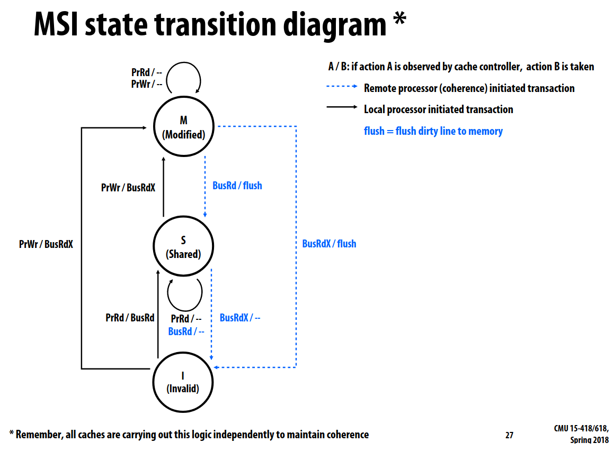

如果多核共享内存，那么对于内存合理的期待是：读一个内存位置的返回值总是最后一次被某个核写入该内存位置的值。

这将会引入**缓存一致性（cache coherence）**问题，因为现代处理器会将内存的内容复制到局部缓存中，因此如果局部缓存更新不及时的话，不同的核就有可能看到同一内存位置上的值不同（对于 write-back 的缓存更容易看出问题）

这是一个硬件实现的细节问题，无法通过软件上加锁来解决。设想即使对于同一内存位置的访问是互斥的，之前的写入可能仍保留在局部缓存上没法被其他核读到。

缓存一致性存在的本质原因是全局共享的内存和每个核独占的局部缓存（比如每个核独占L1/2缓存，而所有核共享L3缓存）分别实现了单地址空间的抽象，因此需要一些同步机制来使得它们看到的内容尽可能一致。

单核情况下对内存的访问不会产生任何缓存一致性问题，因为所有的写入都来自单核本身，它也能够看到全部的信息。然而即便在单核情况下，使用DMA也会出现缓存一致性问题。第一种情况是，CPU写入的数据驻留在缓存中而不是实际流动到缓冲区中，那么设备无法从中读到正确且完整的数据；第二种情况是，设备更新了缓冲区中的数据，但是缓存中原有的数据并未被invalidate，于是CPU就会通过缓存看到过期的数据。一些常见的解决方法是：将缓冲区放到不缓存的内存区域中（可以通过硬件或OS的页表设置做到），又或者是在适当的时机手动刷新缓存。事实上DMA的问题比起内存读写而言远远不足以引起重视，因此这些简单的软件解决方案就足够了。

之前的直觉说：读到的总是最后一次写入的值。但是如何定义“最后一次”呢？比如两个core同时写入同一内存位置会发生什么？又或者在一个核issue写入请求后一段极短时间内另一个核issue读取请求，由于时间太短读取核不可能看到写入核写入的数据，又会怎么样？在单线程下“最后一次”可以由**程序顺序（program order）**来决定，但是多线程情况下就需要更加精确的定义了。

一个coherent的存储系统有以下特征：对于每个存储位置，都存在一个各个core读或写该内存位置的串行顺序，该顺序与各核上的执行结果保持一致，也即一个核读到的值总是在该顺序中最后一次写入的值。这也被称为**顺序一致性（sequential consistency）**。

我们还可以用另一种方法定义coherence，这需要满足三条规则（这也是量化研究方法书中的定义）。第一，同一个核对某内存位置先写后读，如果两次操作中间不存在其他核的写入，那么能够读到写入的值；第二，核P写入内存位置X，过了一段足够长的时间后核Q读取X，且两次操作中间不存在其他核的写入，那么Q能够读到P写入的值。第三，任何两个核对同一内存位置X的写入在所有核看来均有着一致的先后顺序。第一点可以看作单核上的程序顺序；第二点是说在一个核写入的数据*最终*必定能够被另一个核看到，但是何时看到则不在coherence的约束之内；第三点可以被总结为**写入串行化（write serialization）**。关于写入串行化有一个反例，假设P1和P2先后向X写入值a和b，在同时间内P3和P4各自读取两次X，如果P3先读到a再读到b而P4先读到b再读到a，这就明显违背了coherence的定义。这是因为不存在一个X的全局操作顺序同时匹配P3/P4的执行结果。

> 一个核对写入的观测（observe）只能通过读取的形式吗？有没有可能通过某些副作用也能进行观测？

只讨论通过硬件来实现coherence。大致分为基于snooping还有基于目录两种。

后面都会基于局部缓存，因此可以简单思考一下所有core共享单级缓存的情形。由于每个cache block只有一个，不必维护它的状态。但是受到总线带宽限制，其可拓展性不足。共享缓存的优点还有：良好粒度的内存共享（工作集存在交集），一个核可以帮助另一个核预取缓存行。

接下来看基于snooping的coherence实现。其核心想法是：所有coherence相关的活动都广播到所有核。其中最为关键的是cache controller，它需要监听core的内存操作，并在适当的时机发送消息到总线。

当cache是write-through策略的时候，只需要在写入的时候广播消息到总线invalidate其他cache中相同的缓存行即可。这样其他核再次读取的时候就能从内存中取得最新的数据。

下面先阐明缓存控制器的职责。它不仅需要响应局部处理器提交的读写请求，还需要响应其他缓存发来的消息。当所有的缓存控制器遵循同一个**缓存一致性协议（cache coherence protocol）**进行合作的时候，才能实现总体的coherence。为了做到这一点，缓存控制器需要跟踪局部缓存内每个缓存行的状态。

回到write-through cache的一致性协议。每个缓存行只有合法V和非法I两种状态。处理器会提交给缓存控制器读写某缓存行操作，分别为PrRd和PrWr。此外缓存控制器还会收到总线上发来的其他核读写该缓存行的消息，分别为BusRd和BusWr。可以用一个状态机来概括在某种状态下接受到一条信息需要进行何种操作。如下图所示：

其中与总线相关的有：在V状态下收到PrWr操作，需要更新局部缓存，并向总线上发送BusWr从而invalidate其他局部缓存上的同一缓存行，状态保持V不变；在V状态下收到BusWr消息，即其他核修改了该缓存行，我们需要将其状态修改为I；如果某缓存行未被缓存，却又收到了PrWr操作，则直接写入内存并向总线上发送BusWr消息，状态仍为I因为这里是write no-allocate策略，并不会对写入进行缓存。

这对于总线有以下要求：所有的写入事务都要以一致的顺序对所有的缓存控制器可见。同时还需要以下假设成立：首先，总线和内存操作事务均是原子的；其次，处理器等到之前的内存操作完成之后才会发起下一次操作请求（即不会涉及到乱序执行）；最后，作为收到BusWr处理的一部分，invalidation立即进行。

> 这些都是与微架构的RTL级具体实现有关。目前还是不能真正理解，但是先挖坑吧。

write-through缓存的一致性容易实现，但是每次写入操作都要与内存交互，这带来了很高的带宽需求。

> 问题又来了，如何理解这里总线上的带宽需求？这涉及到前几页PPT给出的微架构设计：
>
> 
>
> 可以看到内存也是连接到总线上的。如果多个核同时写入的话，这些数据需要在同一时钟周期内发送到总线上，所以带宽需求较高。但是内存真的能够在同一拍之内就把这些操作处理完毕吗？目前不是很懂。

相比而言，write-back缓存当缓存命中的时候就可以直接在缓存中修改而不必涉及总线，能够明显降低总线的带宽需求。但是为了维护coherence也就需要更加复杂的一致性协议。

可以使用缓存行中的dirty标志位表明一个局部缓存独占该缓存行。这意味着该局部缓存可以安全的修改该缓存行，且作为该缓存行的拥有者，它需要承担将最新数据通过总线传输给想读取该缓存行的其他局部缓存的责任。处理器只能写入独占状态的缓存行，如果局部缓存中的缓存行不是独占状态，缓存控制器需要在总线上广播消息期望得到缓存行所有权。相对的，当缓存控制器监听到另一个局部缓存希望获取某个缓存行的所有权时，它需要在自己的缓存中invalidate该缓存行。

将其细化一下便得到MSI write-back缓存一致性协议。它主要做到两件事情：保证处理器在写入之前可以获取缓存行所有权；在缓存未命中的时候定位缓存行最新的数据的位置。缓存行一共有M/S/I三种状态，I仍然表示Invalid，S即Shared表示有多个缓存行合法，M即Modified表示该缓存行被某个局部缓存独占，它只会出现在这个局部缓存中且只有它自身是合法的。处理器操作仍然只有PrRd和PrWr，但总线上的消息变为3种：BusRd表示只读的获取其他局部缓存中的缓存行，BusRdX表示获取缓存行但以修改为目的，flush表示将局部缓存中已修改的缓存行内容刷新到内存。

下面是MSI协议的状态机：

我们分别从每个状态出发进行讨论：

对于M状态，PrRd和PrWr均在本地即可完成。当收到总线的BusRd消息时，将已修改数据通过总线flush到内存，同时自身变成共享的S状态。这个可以结合实际读该缓存行的状态变换来看：I状态收到处理器的PrRd命令后，向总线上广播BusRd消息，之后从总线上直接拿数据或者从内存中重新取数据，该缓存行则变为S状态。回过头来，M状态收到总线的BusRdX消息意味着所有权转移，它也需要将修改的数据flush到内存，随后自身转换为I状态。对于新的所有者而言，无论先前处于S还是I状态，在收到处理器的PrWr命令后，均向总线上发送BusRdX消息，随后修改自身的缓存行数据，将状态调整为M。

剩下只有4种状态转换了。当S收到PrRd或BusRd的时候，由于当前缓存行存在多份相同的副本，它无需任何变化；但是收到BusRdX的时候，它就需要被invalidate从而变成I状态。当I收到PrRd的时候，向总线上发送BusRd消息而变为S状态（无论此时是否已经存在同缓存行的副本，说明只有修改才能产生M态）。

MSI协议小结：M态缓存行无需通知其他局部缓存即可被修改，此时其他核不通过总线无法读取里面的数据。处理器只能修改M态缓存行。如果缓存行未处在M态的话（即使处在S态），需要向总线上发消息使得它变为M态。当M/S态收到BusRdX消息时，需要通过invalidate转换为I态并将当前的缓存行数据发送给总线。（看起来S态的时候似乎没有这样做）

分析一下MSI协议是否维持了coherence：

