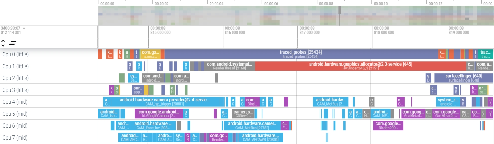

# 《基于Rust的OS内核跟踪组件》赛题解析
2024/3/21
吴一凡
wuyifan41@huawei.com

---

## 背景知识介绍
* **跟踪**(tracing)是一种简单的内核行为观测工具，可以看成一种特定格式的日志
```
    |    线程名-线程ID  | 进程ID |cpu|        时间        |          事件                                                                                                                   |
    kworker/4:1H-556   (  556) [004] .... 261193.377394: sched_switch: prev_comm=kworker/4:1H prev_pid=556 prev_prio=100 prev_state=S ==> next_comm=jbd2/sda45-8 next_pid=682 next_prio=120
    jbd2/sda45_8-682   (  682) [004] .... 261193.377407: sched_waking: comm=kworker/u16:9 pid=13730 prio=120 success=1 target_cpu=5
    jbd2/sda45_8-682   (  682) [004] .... 261193.377410: sched_wakeup: comm=kworker/u16:9 pid=13730 prio=120 target_cpu=005

```
* 收集一段时间的trace，使用[perfetto](https://www.ui.perfetto.dev/)等开源工具可以将内核行为可视化


---

## 项目价值
* 教学价值：图形化trace可以直观地观察内核行为，目前很少用于教学
* 社区中缺乏这类**面向OS**的、**容易复用到多个OS**的独立跟踪组件
* 有一定研究深度，可以转化为论文输出或毕业设计

---

## 基础功能
在某个OS中跟踪系统某段时间的执行过程，并可视化，要求展示以下信息：
* 每个 CPU 核上执行任务的变化情况
* 每个线程的状态变化情况
* 线程之间的唤醒关系
* 任何你感兴趣的其他事件

为了更容易上手，推荐基于教学OS [rCore-Tutorial](https://github.com/rcore-os/rCore-Tutorial-v3)、组件化OS [arceos](https://github.com/rcore-os/arceos) 或者往届内核实现赛道的优秀作品。


---

## 拓展功能
### 组件可移植性和接口易用性
* 合理设计组件提供的接口，使其可以被多个OS复用
* 基于Rust提供的元编程特性让接口更容易被使用
### 跟踪性能优化
* 提高并发性能
* 降低内存开销：二进制压缩
### 指导内核性能瓶颈定位
* 提供灵活的可定制事件，自动定位锁冲突等问题

---

# Thanks