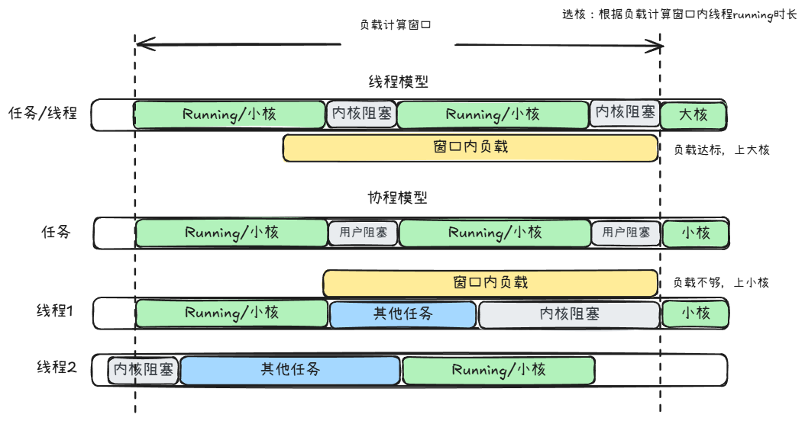

# 任务协程化调度策略迁移问题讨论

---

## 基本概念
* 任务：用户态连续的一段应用逻辑，开发者视角下的进程内多任务并发划分单元，最终要执行在物理cpu上
* 任务的调度参数：包括调度策略（如是否RT）、优先级、deadline，最终是描述任务要获得多少物理cpu计算资源
* 线程：进程眼中自己独占的一个vcpu，一直在此进程地址空间中执行
* 任务由线程承载：传统进程-线程并发模型，进程为每个任务创建一个vcpu，导致任务的调度参数也绑定到TCB中，任务调度参数决定vcpu如何时分复用物理cpu

---

## 任务协程化
* 任务由协程承载：任务M:N时分复用线程，线程再时分复用物理cpu，此时将承载任务、与任务一一对应的纯用户态上下文或控制块称为协程
* 实现带线程池的协程运行时，可对上提供两类接口：
  1. 新增一套spawn协程任务的接口
  2. 重新实现posix接口，将pthread_create改成创建协程
* 任务由线程承载时，任务在物理cpu上切换到另一个任务的原因有：
  * 时钟中断/内核特定抢占点，由于优先级/公平性导致的抢占
  * 主动yield让权
  * 由于等待同步（I/O外设、sleep或同步原语），当前任务阻塞无法继续执行

---

## 协程化优势
* 任务切换由跨特权级转化为用户态切换，降低上下文切换开销
* 场景1：当某个进程任务数量远超核数时（忽略其他进程），大量的任务切换都是进程内的，完全可以用户态切换
* 场景2：当很多进程任务数差不多时，可以让多个任务聚合到同一线程上，达成更好的缓存/CPU亲和性（但可能损害实时性等指标）
* 导致任务切换的原因可分成进程内部和跨进程两种：
  * 进程内部：内部让权或锁同步，可完全在用户态处理
  * 跨进程：等待跨进程锁同步或设备I/O，一般来说必须下内核，导致线程阻塞期间与当前任务绑死无法执行其他任务，同时阻塞/唤醒至少两次跨特权级切换
    可以使用io_uring/异步系统调用+用户态中断等机制转化或消除跨特权级切换

---

## 调度策略迁移问题的背景
* 终端（手机、平板或PC）场景有严苛的SLA，最关键的是丢帧数和整机功耗等
* 基于传统进程-线程模型，应用层和内核协同持续演进以保证SLA
  * 协作基础在于线程模型意义下的调度参数空间S，以及不兼容posix的拓展S'
  * 应用层不断调整线程调度参数(A1, A2, ...)∈S'
  * 内核层调整线程调度策略f
  * 双方的目标都是使 调度结果f(A1, A2, ...) 达成SLA
* 目前调度策略f非常复杂且持续面向当前场景特定SLA新增策略或调参，策略如：
  * 选核：算力需求高的任务会被放到大核上执行
  * 调频：需要调整CPU/内存频率刚好满足任务算力需求以降低功耗
* 研究目标：**如何在依然满足SLA前提下，实现任务协程化，从而转化或消除跨特权级切换**？

---

## 调度策略迁移问题的约束条件
* 应用生态无法控制，因此假设用户传入的参数(A1, A2, ...)我们无法修改
* 由于目前SLA的严苛性以及内核调度策略的复杂性，完全bypass内核策略自己重新搞一套能满足SLA的策略几乎是不可能的，因此必须与内核已有的策略相结合
* 可以仅对收益较大的若干进程使能，无需考虑全场景使能
* *需要构建稳定抽象层，使得即使应用层和内核层不断演进也不需要断层修改代码，只需要调整内部参数甚至不用调整参数，仅在调度参数空间扩展时需要额外适配
* *尽可能避免侵入式修改内核调度策略，使得有一定通用性

---

## 调度策略迁移问题的困难点
协程与线程负载统计不匹配，导致关键任务未及时上大核

---

## 调度策略迁移问题的困难点
引入协程化机制后：
* 不同任务复用同个线程时，怎样聚合历史执行信息并设置线程的调度参数
* 需要维护线程池支持动态伸缩，如何控制线程数量匹配任务数量
* 协程调度器如何处理线程模型下的调度参数并与已有内核调度策略协同
* 内核抢占点明显减少，如何补充抢占点并协同完成抢占

---

# Questions
