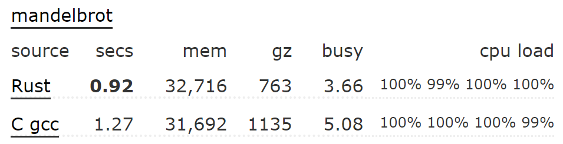
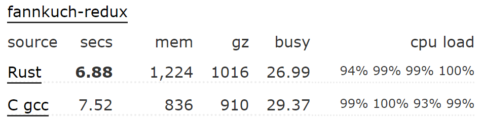
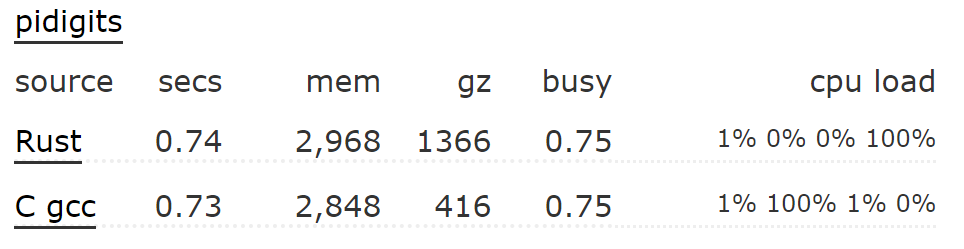
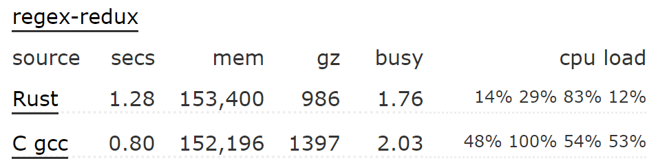

# Intro to System Programming in Rust

**吴一凡**

2020.11.17@PCL

---

# Outline
## Rust 的设计理念
## Rust 的可靠性/易用性/高性能
## Rust 的工具集与库生态

---

# Rust 的设计理念

---

## Rust 的诞生背景
* C/C++ 在硬件极为昂贵的时代诞生，追求**性能**
* C/C++ 过于灵活，很容易出现漏洞，而互联网环境对于**安全**的需求提高
* 随着硬件成本降低，Java 等语言用性能（GC）来换安全性

---

## Rust 的设计理念
Rust 由 Mozilla 员工 Graydon Hore 于 2006 年创造来开发 Mozilla 内核，理念是：
1. 既要**安全**，也要**高性能**
2. 学习被 C/C++ 掩盖而得不到广泛应用的语言的优秀特性，使它容**易使用**

这三个目标贯穿 Rust 设计的始终。

---

# Rust 的可靠性
## 所有权模型和借用规则
## 类型安全
## 并发安全
## 错误处理
## Unsafe

---

## 常见 bug
[Use After Free](https://cwe.mitre.org/data/definitions/416.html)
```c
char* ptr = (char*)malloc (SIZE);
if (err) {
    abrt = 1;
    free(ptr);
    // free ptr here
}
...
if (abrt) {
    logError("operation aborted before commit", ptr);
    // use ptr after free
}
```

---

## 常见 bug
[Memory Leak](https://cwe.mitre.org/data/definitions/401.html)
```c
// first allocated 16 bytes are not freed
int *data = (int*) malloc(16);
data = (int*) malloc(16);
free(data);
```
[Double Free](https://cwe.mitre.org/data/definitions/415.html)
```c
int *data = (int*) malloc(16);
free(data);
// free the data twice
free(data);
```
如果它们在实现内核中出现，极难发现/调试...

---

## 所有权（Ownership）模型
**变量**与存放在某个**位置**（指内存中的一块区域）上的**值**绑定。
1. 每个值只能被绑定到一个变量上，此时该变量拥有值的**所有权**；
2. 当变量离开作用域之后，它负责回收位置和销毁值。

在 Rust 中，我们使用**智能指针** `Box<T>` 来控制存放在堆内存中的类型为 `T` 的值。

> 智能指针（Smart Pointer）不同于 C 里面的指针只有一个指向的地址，它是一个包含更多信息的类型。但和 C 里面的指针一样都支持解引用（Dereference）得到值。
在 Rust 中有很多功能丰富且开箱即用的智能指针，如 `Box<T>,Rc<T>,RefCell<T>` 等等。

---

**解决 Use after free**
```rust
fn main() {
    let a = Box::new(10);
    std::mem::drop(a);
    println!("{}", *a);
}

error[E0382]: borrow of moved value: `a`
 --> src/main.rs:4:20
  |
2 |     let a = Box::new(10);
  |         - move occurs because `a` has type `std::boxed::Box<i32>`, which does not implement the `Copy` trait
3 |     std::mem::drop(a);
  |                    - value moved here
4 |     println!("{}", *a);
  |                    ^^ value borrowed here after move

error: aborting due to previous error
```

通过 `std::mem::drop` 立即让 `a` 离开作用域，于是它控制的堆内存被回收，值被销毁（该过程由 Rust 标准库实现）。
之后，编译器将 `a` 的状态修改为：值不合法状态，不允许访问里面的值。

---

**解决 Memory Leak**
当 `Box<T>` 离开作用域之后自动回收堆内存并销毁里面的值。因此已自动解决。

**解决 Double Free**
如果我们将 `Box<T>` 复制一份，它们会不会在离开作用域的时候两次回收堆内存？
```rust
fn main() {
    let a = Box::new(10);
    let b = a;
    std::mem::drop(b);
    std::mem::drop(a);
}
```

---

**解决 Double Free**
注意这一行赋值语句：
```rust
let b = a;
```
Rust 中的一个重要标签：`Copy`，决定使用**值语义**进行赋值或传参的时候，是否需要完成**所有权转移**（Ownership Transfer）。
* 当类型是 `Copy` （**复制也无关紧要**）的时候，`a` 的值**按位复制**给 `b`，而后两个变量 `a,b` 各自拥有对应值的所有权。这里，取的是所有权的**复制语义**。
* 否则，依然按位复制，但是 `a` 会被标记为值不合法状态，编译器不允许再对它进行访问。这里，取的是所有权的**移动语义**，值的所有权从 `a` 移动到 `b`。

事实上，`Box<T>` 并没有被标记为 `Copy`，因为我们不允许同时有两个 `Box<T>` 拥有堆上同一个值的所有权，如果这样的话就会 Double Free 了！

---

**解决 Double Free**
```rust
fn main() {
    let a = Box::new(10);
    let b = a;
    std::mem::drop(b);
    std::mem::drop(a);
}

error[E0382]: use of moved value: `a`
 --> src/main.rs:5:20
  |
2 |     let a = Box::new(10);
  |         - move occurs because `a` has type `std::boxed::Box<i32>`, which does not implement the `Copy` trait
3 |     let b = a;
  |             - value moved here
4 |     std::mem::drop(b);
5 |     std::mem::drop(a);
  |                    ^ value used here after move

error: aborting due to previous error
```
如上所说，在所有权转移的一瞬间，`a` 被标记为值不合法，编译器不允许访问。自然也不允许进行移出作用域的操作。

---

## 常见 bug
**Dangling Pointer**
```c
Vec* vec_new() {
  Vec vec;
  vec.data = NULL;
  vec.length = 0;
  vec.capacity = 0;
  return &vec;
}
```

---

**Iterator Invalidation**
```c
void vec_push(Vec* vec, int n) {
    int *new_data = (int*) malloc (...);
    memcpy(new_data, vec->data, ...);
    free(vec->data);
    vec->data = new_data;
    vec->capacity += 1;
    vec->data[vec->length += 1] = n;
}
void main() {
    int *n = &vec->data[0];
    vec_push(vec, 110);
    printf("%d\n", *n);
}
```

---

## 借用规则
可以**借用**变量控制的**值**得到引用类型 `&T, &mut T`，分别称为不可变引用和可变引用，区别是能否对值就行修改。
两条重要的借用规则：
1. 在一个引用存在的全程，被它借用的值不能被销毁；
2. 一个值同时只能有不可变引用和可变引用其中一种。如果是不可变引用，可以同时存在多个；如果是可变引用，则同时只能存在一个。

---

**解决 Dangling Pointer**
```rust
fn f() -> &i32 {
    let a = 10;
    &a
}

fn main() {
    let r = f();
    println!("{}", *r);
}

error[E0106]: missing lifetime specifier
 --> src/main.rs:1:11
  |
1 | fn f() -> &i32 {
  |           ^ expected named lifetime parameter
  |
  = help: this function's return type contains a borrowed value, but there is no value for it to be borrowed from
help: consider using the `'static` lifetime
  |
1 | fn f() -> &'static i32 {
  |           ^^^^^^^^

error: aborting due to previous error

```

道理上，是引用 `r` 仍然存在的时候，被它借用的值已经被销毁了。

---

**解决 Iterator Invalidation**
```rust
fn change(r: &mut Box<i32>) {
    *r = Box::new(20);
}

fn main() {
    let mut a = Box::new(10);
    let r1 = a.as_ref();
    change(&mut a);
    println!("{}", *r1);
}

error[E0502]: cannot borrow `a` as mutable because it is also borrowed as immutable
 --> src/main.rs:8:12
  |
7 |     let r1 = a.as_ref();
  |              - immutable borrow occurs here
8 |     change(&mut a);
  |            ^^^^^^ mutable borrow occurs here
9 |     println!("{}", *r1);
  |                    --- immutable borrow later used here

error: aborting due to previous error
```

---

## 所有权模型和借用规则小结
每个变量（以及它所控制的内存和值）都有着明确的生命周期，会在我们**可预期**的时间点进行释放。
任何违背相应规则导致内存不安全的漏洞在**编译期**就能被发现。


---

## 类型安全
相比 C 而言，Rust 对于一些基本类型的行为进行了限制，从而减少甚至消除它们语义不明确或是预期之外的行为。
下面就举几个例子。

---

## 类型安全
### 运行时运算溢出检查
```rust
#![allow(arithmetic_overflow)]

fn main() {
    println!("{}", u32::MAX + u32::MAX);    
}

thread 'main' panicked at 'attempt to add with overflow', src/main.rs:4:20
```
如果不加上第一行的话，甚至在编译期就会报错。

---

## 类型安全
### 几乎不会自动隐式类型转换
```rust
fn main() {
    println!("{}", u32::MAX + u16::MIN);    
}

error[E0308]: mismatched types
 --> src/main.rs:2:31
  |
2 |     println!("{}", u32::MAX + u16::MIN);    
  |                               ^^^^^^^^ expected `u32`, found `u16`

error[E0277]: cannot add `u16` to `u32`
 --> src/main.rs:2:29
  |
2 |     println!("{}", u32::MAX + u16::MIN);    
  |                             ^ no implementation for `u32 + u16`
  |
  = help: the trait `std::ops::Add<u16>` is not implemented for `u32`

error: aborting due to 2 previous errors
```

---

## 类型安全
### 缓冲区溢出检查
```rust
fn main() {
    let a: [i32; 10] = [0; 10];
    (0..).for_each(|v| {
        println!("{}", a[v]);
    });
}

thread 'main' panicked at 'index out of bounds: the len is 10 but the index is 10', src/main.rs:4:24
```

---

## 并发安全
和 `Copy` 一样，Rust 中有另外两个标签描述并发安全：
* `Send`：在多条执行流中同时存在同一个该种类型的**值**是否是安全的；
* `Sync`：在多条执行流中同时存在借用自同一个该种类型值的**不可变引用**是否是安全的。

这决定了某种类型的变量是否被编译器允许、以及以何种方式在多线程之间传递，或是出现在全局数据中。
比如：
* 同样是用于共享引用，智能指针 `Rc<T>` 不是 `Send` 的，而基于原子变量实现的 `Arc<T>` 则是 `Send`；
* 同样是用于内部可变性（运行期借用检查器），智能指针 `RefCell<T>` 不是 `Sync` 的，而基于原子变量实现的 `Mutex<T>` 则是 `Sync` 的。

这也是在**编译期**即可检查出潜在的竞争条件或数据竞争问题。

---

## 错误处理
### 空指针
### 不可恢复错误
### 可恢复错误

---

### 空指针
空指针 *Null Pointer* 被其发明者 Tony Hoare 认为在其诞生的四十年中带来了[数以十亿计](https://www.infoq.com/presentations/Null-References-The-Billion-Dollar-Mistake-Tony-Hoare/)美元的经济损失和痛苦。
* 当实现一个函数的时候总要考虑：传进来的参数会不会是一个空指针？
* 当调用一个函数的时候总要考虑：返回值会不会是一个空指针？

---

### 空指针
Rust 使用 `Option<T>`：
* `Option::None` 代表返回值为空；
* `Option::Some(T)` 代表正常的返回值。
> 类似于 C 里面的联合体（Union），也即只能取其中一种可能。

```rust
fn feeling_lucky() -> Option<String> {
    if get_random_num() > 10 {
        Some(String::from("I'm feeling lucky!"))
    } else {
        None
    }
}
```
* 通过 `Option::is_some/is_none` 可以判断里面有没有值。
* 通过 `Option::unwrap` 假定里面有值，并将值取出。

重点在于，我们不能像 C 里面那样什么都不做就开始使用它！

---

### 不可恢复错误
当 Rust 遇到不可恢复错误的时候，直接打印错误信息并退出应用：
```rust
panic!("An irrecovrrable error encountered!");
```
我们之前也看到：当运算溢出/缓冲区溢出的时候，程序会自动 panic。

---

### 可恢复错误
**C 风格**
通过返回值来确定是否发生错误，如果发生错误要到全局变量 `errno` 中去获取错误原因。
* 编程繁琐、复杂；
* `errno` 可能带来的并发冲突。

**C++/Java 风格**
基于 `try-catch` 块进行异常处理。
* 函数接口需要带上可能会抛出哪些异常，代码难以维护和复用；
* *任何*函数可能在*任何*时间抛出*任何*异常，难以确定可能的出错模式；
* 使用一条程序员不可见的软件异常控制流，难以预知某些操作会对它造成什么影响，也会带来一些额外运行时开销。

---

### 可恢复错误
Rust 使用 `Result<T, E>` 作为一个可能发生错误的函数的返回值，同时包含可能的返回值或是错误。它就是一个简单的函数调用控制流。
* `Result::Ok<T>` 表示正常的返回值；
* `Result::Err<E>` 则表示一个错误。
```rust
fn poke_toddler() -> Result<&'static str, &'static str> {
    if get_random_num() > 10 {
        Ok("Hahahaha!")
    } else {
        Err("Waaaaahhh!")
    }
}

fn main() {
    match poke_toddler() {
        Ok(message) => println!("Toddler said: {}", message),
        Err(cry) => println!("Toddler cried: {}", cry),
    }
}
```

---

### 可恢复错误
在一个函数可能在多个地方遇到错误的时候，可以通过 `try!` 宏在遇到错误的时候直接返回，而不必每次都判断是否发生错误。它可以简写为 `?` 。
```rust
use std::num::ParseIntError;

fn multiply(first_number_str: &str, second_number_str: &str) -> Result<i32, ParseIntError> {
    let first_number = first_number_str.parse::<i32>()?;
    let second_number = second_number_str.parse::<i32>()?;

    Ok(first_number * second_number)
}
```

---

## Unsafe
有些操作即使程序员明确的知道没有问题，但是 Rust 没有判定其是否有安全隐患的能力。比如：
* 直接通过地址访问设备寄存器（即：解引用裸指针）；
* 调用其他语言提供的外部接口。

程序员需要将这些操作包裹到 `unsafe` 块中，则编译器不会对块内的这些操作进行检查（但依然会对块内的其他部分进行检查），而是由程序员负责其安全、正确性。

当程序出了问题的时候，往往也是 `unsafe` 块内的部分出了问题，它们应当被更优先检查。

---

# Rust 可靠性小结
借助 unsafe 我们可以获得和 C 相同的底层表达能力。
而在 safe Rust 中，借助所有权模型和借用规则，再加上完备的类型系统，我们可以在编译期/运行时找出许多在 C 中难以发现的漏洞，错误处理也更加方便、可靠。

---

# Rust 的易用性
## 面向对象编程
## 模块可见性管理
## 函数式编程
## 宏

---

## 面向对象编程
* 可以为自己定义的类型实现方法
* 可以自己定义抽象接口 `Trait`，并为自己定义的类型实现对应的抽象方法
* 可以使用泛型，一次编写，在编译期为不同类型生成多份代码（静态分发）
* 可以使用 Trait Object，在运行期根据实现了 Trait 的实际类型调用其对应的实现（动态分发）

这里就不展开说明了。

---

## 模块可见性管理
可以将项目划分为多个模块，每个子模块决定哪些类型和方法向其他的子模块公开并屏蔽其具体实现。
可以基于局部/全局路径进行灵活管理。

---

## 函数式编程
可以使用迭代器和闭包极大提升代码可读性和编程效率。
它们的本质是基于底层的所有权和借用机制以及类型系统实现的语法糖。

```rust
fn main() {
    let ans: usize = (1..=10)
        .filter(|v| {*v >= 5}) // 5 6 7 8 9 10
        .map(|v| {v + 1}) // 6 7 8 9 10 11
        .sum(); // 6 + 7 + 8 + 9 + 10 + 11 = 51
    println!("{}", ans);
}

51
```

---

## 宏
Rust 的宏相比 C 也非常强大，它并非简单的字符串替换，而是会被直接解析成语法树节点，这使得基于 Rust 的宏可以做很多神奇的事情（比如写一个编译器）。

---

# Rust 的易用性小结
Rust 引入了很多现代编程语言的特征：
* 面向对象和模块（来自 C++/Java）让项目的布局和接口变得更容易维护和复用；
* 函数式编程（来自 Haskell/Scala 等）则增加了代码的可读性和开发效率。

这都使得 Rust 更加容易用来开发庞大的项目。

---

# Rust 的高性能
## 没有 GC
## 零成本抽象
## 性能比较1：IXY
## 性能比较2：Benchmarks Game
## 性能比较3：TechEmpower Web Framework Benchmark
---

## 没有 GC
### GC 带来的问题
* 运行时开销大，且需要管理所有对象
* 会带来时长和发生时间难以预测的延迟，在某些应用场景不可接受

[Image Source](https://reberhardt.com/cs110l/spring-2020/slides/lecture-01.pdf)

而 Rust 不依赖 GC，而是基于所有权模型和借用规则实现了内存安全！

---

## 零成本抽象
这个概念源自 C++，Rust 在近期的版本基本做到了，[基于 Rust Trait](https://blog.rust-lang.org/2015/05/11/traits.html)
* 只有当我们需要语言提供的某种特性的时候，才会为此付出相应的开销；
* 我们自己通过低层次接口手动实现该特性不会做得更好。

这使得 Rust 的运行时非常小。

例1：既可以通过泛型实现编译期多态，也可以使用 Trait Object 实现运行期多态。前者在运行时等同于普通的函数调用，后者则和 C++ 一样需要查虚表。

例2：既可以完全在编译期完成借用检查（仅使用借用 `&/&mut`），也可以在将一部分检查移动到运行时并带来相应开销（使用 `RefCell` 在运行时维护当前借用情况）。

例3：某项功能基于/不基于迭代器实现，编译出的汇编代码相同。

---

## 性能比较1：IXY
[IXY](https://www.net.in.tum.de/fileadmin/bibtex/publications/papers/ixy-writing-user-space-network-drivers.pdf) 使用多种不同语言实现了用户态的网卡驱动，并进行了性能比较。

可见 Rust 拥有和 C 相近且领先于其他语言的性能，当并发程度提高之后差距缩小。

---

## 性能比较2：Benchmarks Game
[Benchmarks Game](https://benchmarksgame-team.pages.debian.net/benchmarksgame/index.html)使用不同语言实现了一些比较经典的问题并比较了性能。
这是 [Rust 和 C 比较的结果](https://benchmarksgame-team.pages.debian.net/benchmarksgame/fastest/rust.html)。


---

## 性能比较2：Benchmarks Game
### Rust 优于 C






---

## 性能比较2：Benchmarks Game
### C 优于 Rust





---

## 性能比较2：Benchmarks Game
结论：在这个比较场景下，C 和 Rust 互有胜负，Rust 的内存占用略大。

---

## 性能比较3：[TechEmpower Web Framework](https://www.techempower.com/benchmarks/#section=data-r19&hw=ph&test=fortune)

从中可以看出 C++/Rust 在高性能 Web 框架中的领先地位，且二者性能相近。

---

# Rust 的工具集与库生态
## 集成化工具链和包管理器
## 嵌入式 Rust 生态
## 其他工具
## IDE 支持

---

## 集成化工具链和包管理器
* 工具链管理器 `rustup` 可以随时一键切换 Rust 整套工具链的版本（如 2020-11-17）、发行分支（stable/nightly/beta）以及目标平台（如 riscv64gc-unknown-none-elf）。
* 包管理器 `cargo` 对所有的 Rust 库进行语义化版本管理（Semantic Versioning），只要在项目配置文件中加入直接依赖的包，`cargo` 会自动确定所有会用到的包的合适版本，并下载/更新到本地。

它们均由 Rust 官方提供。这使得我们不必在多个地方各维护一套工具链，也不必考虑繁琐的库依赖问题。

---

## 嵌入式 Rust 生态
Rust 内部的核心库 `libcore` 不需要任何操作系统支持，另外一些三方库基于 `libcore`，也可以直接在嵌入式平台上使用。

在 Github 上的 [Rust Embedded Organization](https://github.com/rust-embedded) 可以找到很多用于嵌入式开发的 Rust 库。其中包含嵌入式设备的硬件抽象层，还有很多基于它的具体设备的外设驱动和中断处理的实现。在它们上面，我们很容易搭建嵌入式应用，夏令营活动期间的 [RustSBI](https://github.com/luojia65/rustsbi) 就是其中的一个例子。

---

## 嵌入式 Rust 生态

此外，[rcore-os Organization](https://github.com/rcore-os) 里面也有很多在开发 rCore/zCore 过程中抽象出来的库：
* [trapframe-rs](https://github.com/rcore-os/trapframe-rs)：多种不同架构的中断帧实现；
* [rBoot](https://github.com/rcore-os/rboot)：基于 UEFI 的 x86_64 bootloader
* 各种驱动：[pci-rs](https://github.com/rcore-os/pci-rs), [device_tree-rs](https://github.com/rcore-os/device_tree-rs), [virtio-drivers](https://github.com/rcore-os/virtio-drivers)

---

## 其他工具

Rust 官方提供的各种有用的小工具：
* rustfmt：自动格式化 Rust 项目；
* clippy：自动检测 Rust 代码中的异味；
* cargo doc：自动将整个项目生成一个文档主页，可以按照项目内的类型/方法进行索引，并能够提取代码中特殊格式的注释作为文档中的文本。
* cargo test：一键自动测试
* cargo-binutils：基于 LLVM 的二进制工具

---

## IDE 支持

下面是官方提供支持的 IDE：

常用的是：
* CLion + 内置插件
* VSCode + rust-analysis

---

# Thank you!
## Ref
Some contents come from:
* [Rust 内存模型分析](https://zhuanlan.zhihu.com/p/201220495)
* [cs110L](https://reberhardt.com/cs110l/spring-2020/)
* [cs242](https://cs242.stanford.edu/f19/)
* [Rust official Blog](https://blog.rust-lang.org/)
