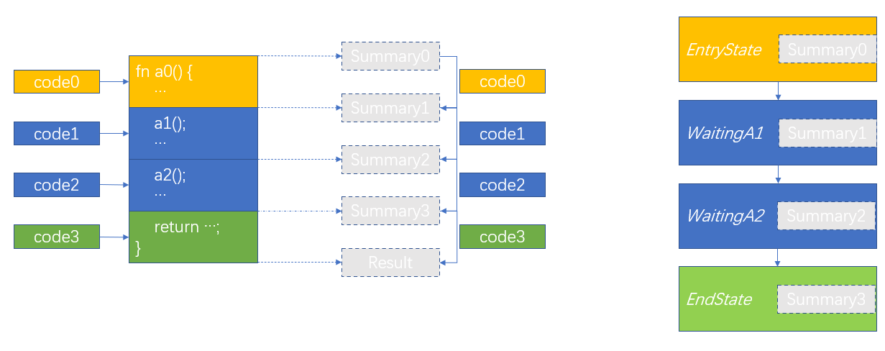
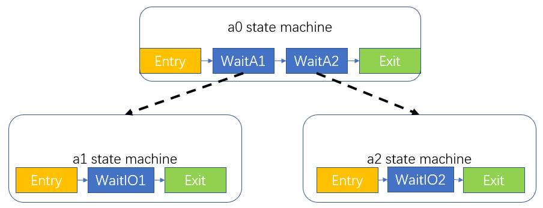
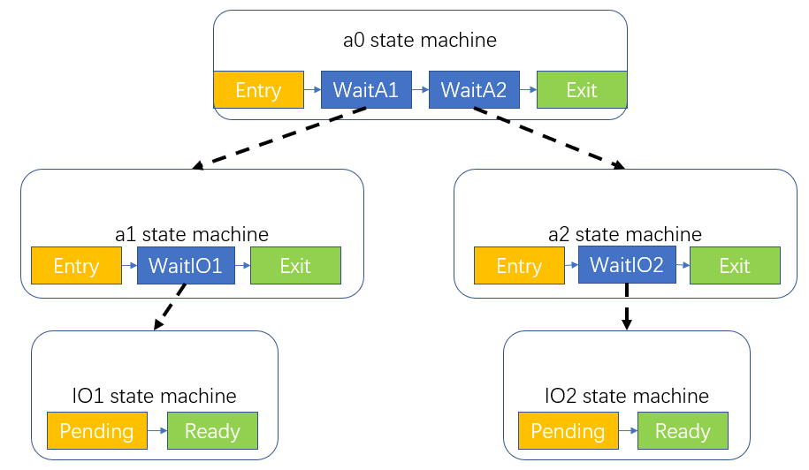
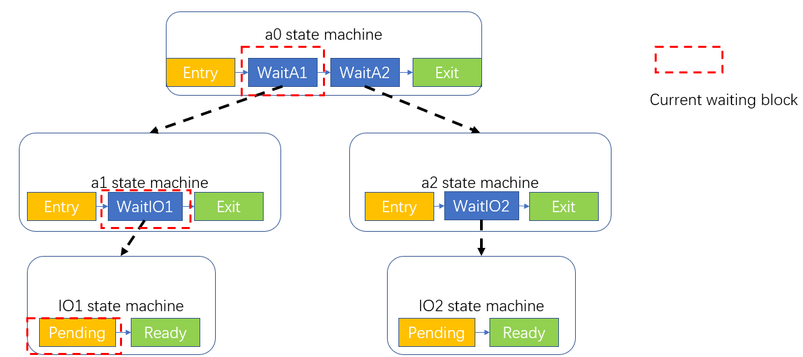
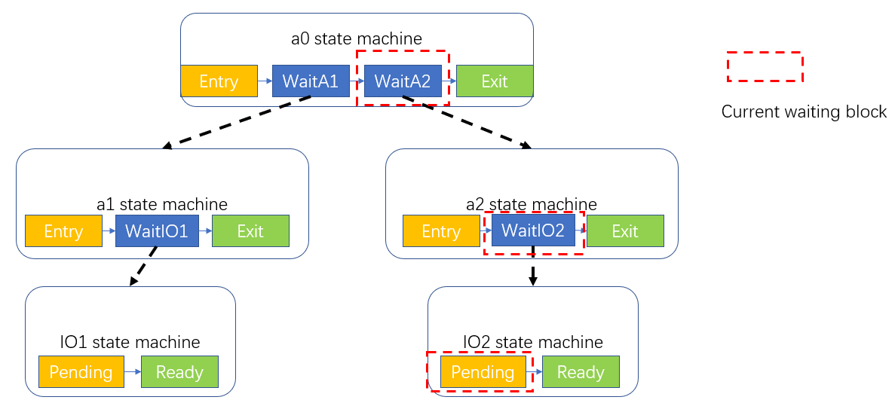
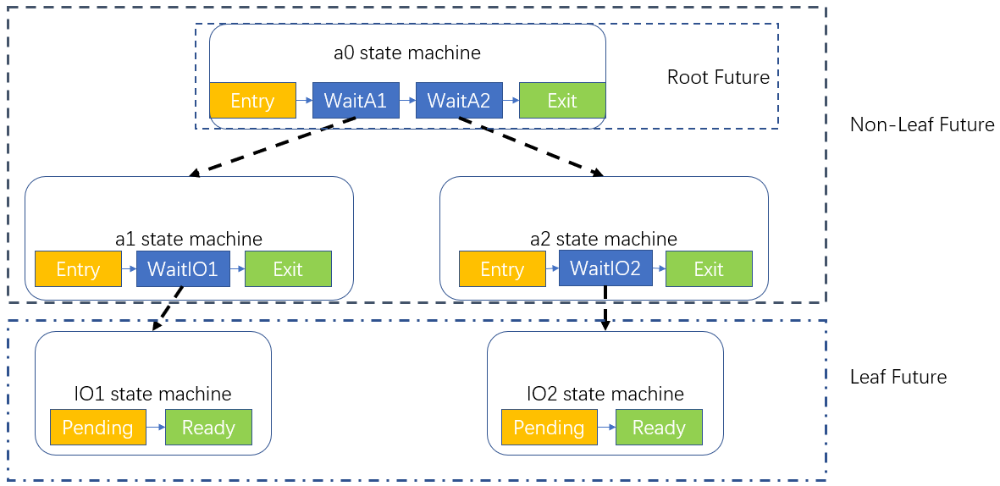
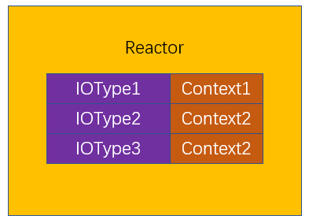
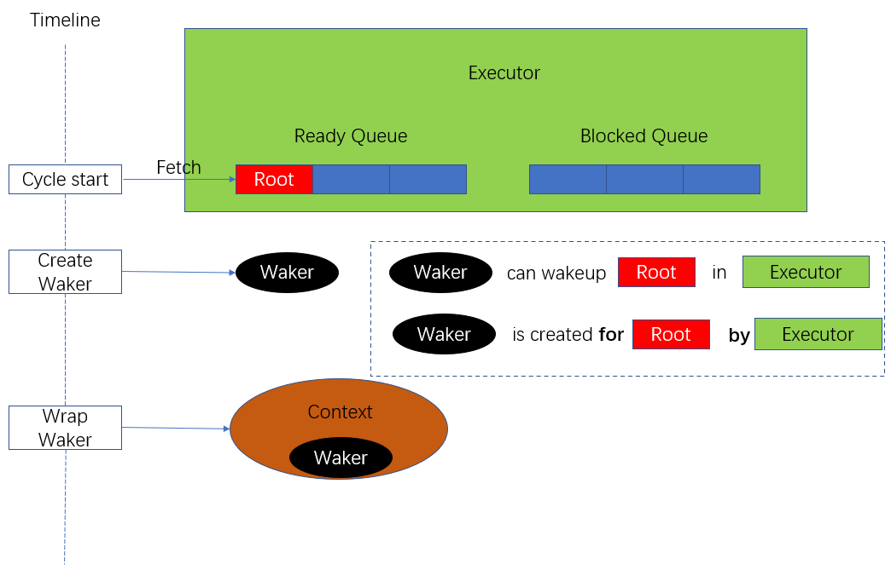
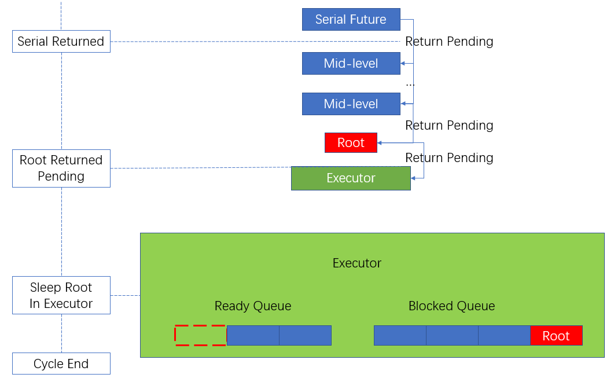
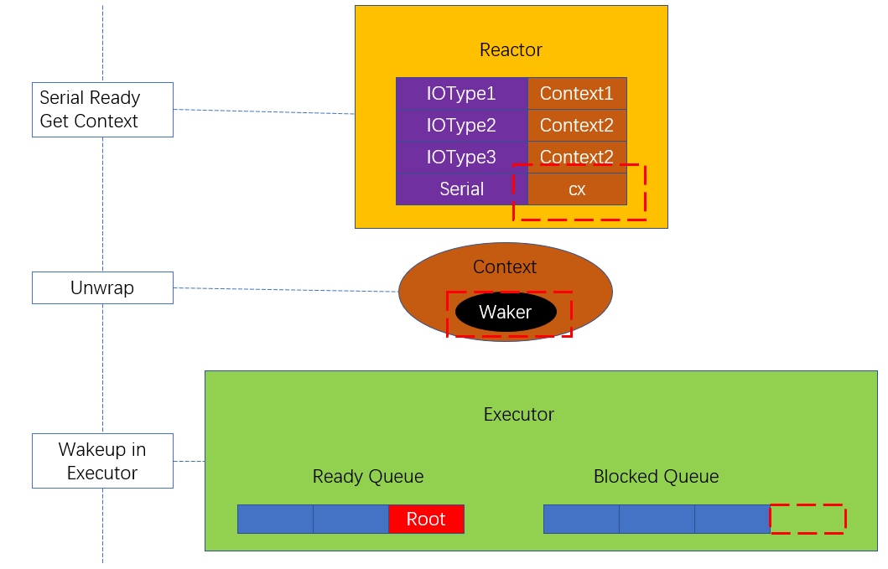

# Rust async 简介

## 吴一凡
2020/09/27
shinbokuow@163.com

---

## 并发
* 给定一组任务，**资源受限**
* 如何合理利用资源获得高性能
* I/O 未准备好时，CPU 将作何选择？
* 由于资源受限，单个任务**不可能从头执行到尾**
  因而需要支持**暂停**并**切换**到其他任务
  通过**保存/恢复执行现场**来实现
* 关键点：何时暂停/继续？如何切换？

---

### 题外话：并行与并发
* 相比并发，并行通常指的是**只有一项任务**
  并堆砌资源（多核）加速该任务
* 而并发模型中，每项任务消耗的资源**固定**，运行时间也**固定**
  需要合理调度资源最小化**完成所有任务**的用时

---

## 抢占式/协作式多任务
* 抢占式：每个任务可以在**执行任一条指令**的时候被暂停
  如 OS 时间片轮转、高优先级抢占，**安全、实时性**
* 协作式：每个任务除非自己**交出 CPU 使用权**，否则不会被暂停
  由于安全性不用在 OS 中，而是用于编程语言中的协程提高性能

---

## 同步并发
* 每个任务占用一个独立线程，拥有独立的栈
* 可以在执行**任意一条指令**的时候被暂停
  对应**抢占式多任务**
* I/O：忙等待或是阻塞+唤醒
  着重考虑**低速设备**，后者 CPU 利用率更高
  
---

## 同步并发的保存/恢复
* 执行现场包括栈、寄存器
* 只需保存/恢复一些寄存器即可
  包括：难以证明**在暂停期间不被使用**的寄存器
  通常需要包括**所有通用寄存器**
* 独立的栈无需保存
  回来**原地继续**执行

---

## 同步并发性能分析
### 内存占用
* 每个任务需要一个独立栈
  其大小为 $\max_{task}\text{stack\_usage}(task)$
  通常严重浪费内存并**限制并发任务数量**
### 切换开销
* 需要保存/恢复所有通用寄存器
  存在**冗余**

---

## 同步并发的暂停与唤醒
* 为每种 I/O 设置一个线程等待队列
* 发现 I/O 未准备好，就绪队列$\rightarrow$对应的等待队列
* I/O 准备好之后，I/O 对应的等待队列$\rightarrow$就绪队列


---

## 异步并发(async 风格)与同步并发
* 同步并发：每个同步任务占用一个线程
  异步并发：每个**异步任务**占用一个**协程**
* 相同点：**并发**$\rightarrow$CPU 资源的精打细算
  遇到 I/O 未准备好时同样要**切换任务**
* 不同点：线程有独立的栈，而所有协程**公用一个栈**

---

## 异步如何保存/恢复现场

* 问题还原：一个任务发现 I/O 未准备好，需要切换到其他任务
* 异步：栈马上就要给其他任务用，应该如何利用**栈上的信息**保存/恢复现场呢

---

### 栈上的内容
1. 每个函数目前卡在哪个调用（调用链）
2. 每个函数在**进入调用之前**的工作现场
    * 通用寄存器（调用者保存/被调用者保存）
    * 临时变量
* 从调用的角度来看同步和异步任务**没有区别**
* 因此异步任务也需要在**栈之外的地方**保存这些内容

---

### 栈上内容的精简
* 我们需要**最小化**在其他地方保存内容的大小
  如果高达一个栈，那和线程就没有区别了
* 目前栈上对于函数工作现场的保存有所**冗余**：
  * 某些局部变量，后续不会再用到；
  * 某些寄存器，并没有保存后续会用到的结果。
  
  在编译器帮助下，我们可以找出并保存其中**后续真正会用到**的临时变量和寄存器
  姑且称其为一个阶段性总结（Summary）
* 理论上，我们只需从栈中获取：
  1. 每个函数各被卡在哪个调用；
  2. 每个函数在进入该调用之前的 Summary

  就可以完全记录之前的工作。

---

### 恢复现场
* 虽然之前的工作没有丢失，但如何继续工作呢？
* 对于异步而言，我们并非继续执行**某条指令**
  而是尝试**从头执行**一个被**剪切**的子任务

---

### "调用"不再是调用


* 可以看到，对于 a1 的"调用"不再是从 a1 的开头开始执行
* 而是从 a1 被卡在的"调用"继续执行
* 以下的讨论中，调用均是指异步“调用”而非同步调用
---

### 状态机
* 要能够做到这一点，对于每个函数，在切换任务一瞬间我们必须记录它的状态：
  1. 卡在哪个调用；
  2. 该调用之前的 Summary

---

### 状态机

* 根据调用划分状态，每个状态都需要保存进入开头调用之前的 Summary
* 每个状态都是执行对应的代码段，试图将对应调用之前的 Summary 转化为下一次调用之前的 Summary，同时转移到下一个状态

---

### 状态机树
* 对于含有调用的状态，若想状态转移，需要当前状态的代码段执行完毕
  其关键在于拿到子函数调用返回值，才能跑代码段剩下的部分
  从状态机的角度，也就是子函数到达终态 *EndState* 得到 Result
* 因此每个含有调用的状态需要知道它调用的子函数处于什么状态
* 由此可得到一颗状态机树


---

### 函数类型划分
* 这里需要说明的是，任务的切换一定与 I/O 有关
* 所以我们可以将函数按照**是否间接/直接与 I/O 交互**分为两类
* 我们只会为与 I/O 有关的函数建立状态机
  在划分状态时只有调用与 I/O 有关的函数才会出现新状态
* 因此，状态机树的叶子一定直接对应 I/O
  我们也可将其写成一个状态机的形式

---

### I/O 状态机树
* 每颗状态机树对应于一个异步任务。


---

### 执行现场
* 现场：即 I/O 状态机树的一条链上
  每个状态机各自处于什么状态


---

### 保存现场与继续执行
* 对于一个状态机，定义 `poll` 表示将状态尽可能向前推进，直到停在某一状态
* 若停在 `Exit` 态，则返回 `Poll::Ready(Result)`；否则返回 `Poll::Pending`。
* 不难发现，若一个状态机正停在一个调用相关的状态，它能不能向前走取决于子函数能否到达 `Exit` 态，所以我们需要**先 `poll` 子函数的状态机，根据其返回值进行判断**。
* 注意对于 I/O 状态机的 `poll` 无论该 I/O 目前是否准备好都应**立即返回**，其他状态机与 I/O 无直接关联，也应该立即返回
* 执行现场在 `poll` 进行状态转移的同时以函数为单位进行保存

---

### 继续执行
* 假设 IO1 已准备好，IO2 未准备好，`poll` a0 状态机虽然仍然会返回 Pending，但是能看到执行现场的变化
* 尝试模拟一下总体的执行流程？


---

## 状态机树的内存布局
* 在 Rust 中，每个状态机都是将多个 Summary 以枚举类型（enum）的形式结合在一起
  因此每个状态机消耗的内存是它包含的不同 Summary 容量的最大值
* 若一个状态包含子函数调用，那么子函数的状态机会被**包含**在该状态的 Summary 部分中
* 所以，整颗状态机树的内存布局是一个**多层嵌套**的大 Enum
  且状态机树中的每个状态机都位于这个大 Enum 的一个**编译期就固定下来**的位置

---

## 异步并发性能分析
### 内存消耗
* 一个栈，同时每个异步任务需要保存一颗状态机树。
  每个异步任务状态机树的大小不超过同步版本**实际**所需栈大小（因为我们在 Summary 中只保留后续有用的变量）
  因此内存消耗优于同步，并发任务数更多
### 切换开销
* 切换开销被均摊在 `poll` 状态转移的过程中。
  即将一个 Summary 变成下一个状态的 Summary。
  有些部分可原地完成，有些部分需要先在栈上然后再复制过来...
### 编译器优化非常关键！


---

## Future in Rust
* 在 Rust 中，每个状态机都需要实现 `Future` trait，它只需要实现一个方法，即为我们之前所提到的 `poll` 方法：
  ```rust
  pub trait Future {
    type Output;
    fn poll(self: Pin<&mut Self>, cx: &mut Context<'_>) -> Poll<Self::Output>;
  }
  ```
* 因此，状态机树也是一颗 Future 树

---

## Future 树


---

### Non-Leaf Future
* 非叶 Future 由一些子 Future **组合**而成
  通常由编译器或者库负责生成状态机并实现 `Future` trait
* 比如 Rust 编译器原生支持的 `async/await` 关键字
  同步$\rightarrow$异步：`fn` 改为 `async fn`，调用加上 `await`
  编译器负责将调用的那些子 `Future` 包起来生成一个大 `Future`
* 又比如 `futures` crate 所提供的 `select!` 宏
  可以返回最先到达 `Exit` 状态的状态机的 result

---

## Future runtime
* Executor 管理一系列 Root Future（也就是异步任务），类似一个调度器，每次选出一个 Root Future 来 `poll`，推进任务的进度
* Reactor 收集 I/O 准备好的信息，并通知 Executor 相应的 Root Future 可以继续被 `poll` 了
* 双方通过 Rust 提供的 `Waker` 接口实现唤醒机制， Executor 负责实现该接口，Reactor 负责调用该接口


---

## Executor
* Executor 通常包含就绪和阻塞队列
* 队列中的元素是一颗 Future 树，也就是 Root Future


---

## Reactor
* Reactor 中包含一个表，根据 I/O 类型保存 Context

* 每个 Context 和一个 Root Future 相对应，并用来在 Executor 中唤醒它


---

## Block


---


---



---

## Wakeup


---

## 一些想法
* 多核：每个核跑一个 Executor::run，共享下面的调度队列
* 加强实时性：将所有优先级较低的任务以异步方式执行，打包到一起，开一个专门的内核线程处理它；优先级较高的任务仍是以同步的方式，每个占用一个线程。
  这样主框架还是同步调度，其中一个线程完成异步任务。

---

# Thank you for listening!