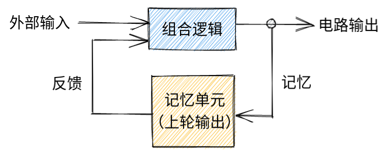

最近找到一个Verilog OJ，感觉超有意思，就开始狂刷。把一些不太直观的语法点稍微记录一下吧。

## 基础运算符

按位与`&`，逻辑与`&&`，按位或`|`，逻辑或`||`，按位取反`~`，逻辑取反`!`，按位异或`^`。

## 向量用法

声明向量的时候，如果是二维向量，在向量名之前是第二维，在向量名之后是第一维。如果声明一维向量的话则需要将`[a:b]`放在向量名之前，a指向MSB，b指向LSB，ab可以为负数且大小关系不限，代表不同的端序。将`[c:d]`放在向量名后面可以访问向量切片，但是端序必须与声明的一致。

`{ }`是向量拼接运算符，`{times{subslice}}`可以进行重复拼接。

向量位数不匹配的赋值将会进行高位补零（短值赋给长向量）或低位截断（长值赋给短向量）。

## 组合always块

`always @(*)`块可以和`assign`一样描述组合逻辑，但是不一样的是`=`的左边必须是`reg`而不能是`wire`，这不影响实际电路的生成但是会影响仿真。例子如下：

```verilog
always @(*) out_alwaysblock = a & b;
```

另外过程块中支持if/else等功能较强的语句，但是不能包含连续赋值语句，不然无法综合。

```verilog
always @(posedge clk)
```

会生成和`always @(*)`类似的组合逻辑，但是在输出部分会带有触发器，也就是说输出值的变化不是立即可见而是要等到`clk`的下一个正边沿。

在Verilog一共存在三种不同的赋值语句：

1. 连续赋值即`assign`，它不能被用在`always`block中。
2. 阻塞赋值即在`always`block中使用`=`。
3. 非阻塞赋值即在`always`block中使用`<=`。

在描述组合逻辑的`always`块中，**必须**使用阻塞赋值`=`；反之，在涉及到时钟触发的`always`中，**必须**使用非阻塞赋值`<=`。不然就会出现很多错误。

在`always @(*)`中使用if-else语句可以构造一个多路选择器，但是要注意确保每一个分支`out`均被赋值。这是一个组合逻辑，因此要使用阻塞赋值`=`。简单的两路选择的话，使用`assign out = (condition) ? a : b;`也能实现同样的功能。

在写Verilog代码之前首先要想好电路建模。比如你需要一个逻辑门，一段组合逻辑，还是需要有记忆功能的时序逻辑。组合逻辑要想好输入和输出的信号，确保每个输出都被赋值。关于时序逻辑则要想好你需要的是触发器（flip-flop）还是锁存器（latch）。当我们在`always @(*)`中使用`if (contidition) begin a = b`的时候，如果条件不满足，由于我们没有指定，Verilog将让`a`保持不变，也就是用到一个锁存器。

`always @(*)`使用case语句可以实现类似if语句的多路选择器功能，但代码更加简洁。开头和结尾是`case (variable)`和`endcase`。中间多个`value: statement`，最后一个`value`可以是`default`表示上面的值均不满足的情况。`statement`默认只能有单条语句，但可以使用`begin-end`块来包含多条语句。当使用casez而不是case的时候，`value`可以使用`z`作为通配符进行匹配，只有最先被匹配的`value`对应的`statement`才会成功赋值（从编译器的角度看它并不是依次尝试匹配而是利用优先级关系构建一个巨大的真值表）。

有时，在case语句存在多个输出的时候，不太容易仅使用case语句给所有的输出端口均绑定输出。在这个时候，可以在`always @(*)`块内先使用阻塞赋值给所有的输出端口均绑定一个默认输出，如果在case语句中又后续绑定了输出，输出才会被修改。这样就能保证每个输出端口均有输出而不是会产生锁存器或其他奇怪行为。

总的来说，`always @(*)`块描述一个组合逻辑。块内的语句先后顺序有影响，但是并不像传统编程语言那样，它仅仅意味着某个输出端口在块内最后一次被赋的值才有效。最终我们还是可以将其看成一个巨大的真值表，一组固定的输入对应一组固定的输出。别忘了在块内要使用阻塞赋值`=`。

## 时序always块

可以看成一堆组合逻辑后面接着若干能够存储状态的触发器/锁存器。

> 先来补一下时序电路的知识。
>
> 
>
> 组合逻辑的输出仅与输入有关。但时序逻辑的输出不仅与输入有关，还与上轮输出有关。我们可以看到有一些记忆单元负责将当前输出记录下来并反馈到下一轮输出。记忆单元在时序电路中必定存在，且起到重要的反馈作用。时序电路分为异步和同步时序电路，异步的话即输入变化输出立即变化，相比组合逻辑只是多了一个记忆功能；而同步时序电路即使输入改变，输出也不会立即发生变化，而是要等到同步时钟信号满足一定条件（基于电平触发的锁存器和基于边沿触发的触发器）输出才会变化。

最简单的正边沿触发的D触发器（D flip-flop, DFF）

```verilog
always @(posedge clk) begin
    q <= d;
end
```

> 在这里暂时不深入讨论D触发器的原理了（好像还有SR/JK触发器和锁存器？）。可以理解成两个非门串在一起构成的简单记忆功能。
>
> 后面我们都直接当黑盒来用吧。

同步复位（高电平）、正边沿触发D触发器：

```verilog
always @(posedge clk) begin
    if (reset) begin
        q <= 0;
    end
    else begin
        q <= d;
    end
end
```

异步复位（高电平）、正边沿触发D触发器：

```verilog
always @(posedge clk or posedge areset) begin
    if (areset) begin
        q <= 0;
    end
    else begin
        q <= d;
    end
end
```

锁存器。这个其实应该归类到组合always块中。这里ena为0的话，Verilog会让q保持原来的值，因此会隐式添加一个锁存器，编译器也会报警告。

```verilog
always @(*) begin
    if (ena) q <= d;
end
```

组合逻辑为一个异或门的时序电路：

```verilog
module top_module (
    input clk,
    input in, 
    output out);

    reg q;
    always @(posedge clk) begin
        q <= in ^ q;
    end
    assign out = q;
endmodule
```

