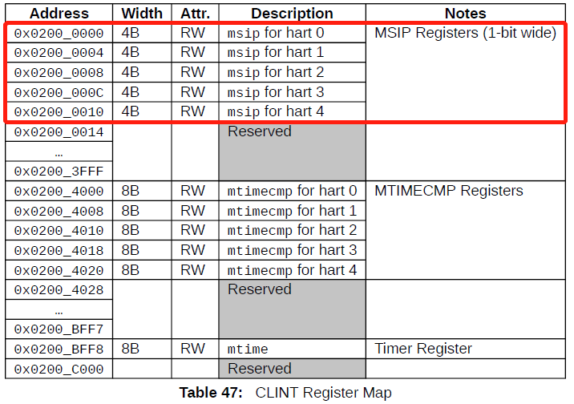

# OS Tutorial 实验及 K210 经验分享

## 张译仁
清华大学
计算机系博一
zyr_ms@outlook.com
## 吴一凡
清华大学
计算机系软件所 科研助理
shinbokuow@163.com

4/25/2021

---

# Outline

## **OS 实验相关**
## K210 实例演示
## RV 特权级架构回顾
## RustSBI 兼容性设计与实现
## Qemu vs K210 其他差异分析
## 项目展望与赛题分析

---
# OS 实验相关

## **OS 实验概况**
## 特色：“完备”
## 特色：“开放”
## 特色：“精简”
## 练习与其他

---
# OS 实验概况

rCore-Tutorial-v3 / uCore-Tutorial

* 2021 spring 本科 os 实验框架
* 共 8 个章节，7 个基础实验，1 个优化/拓展实验
* 实验内容覆盖 os 各个基础模块
* 特色：
  * “完备”：每个 chapter 都是一个可以支持用户程序的完整 os
  * “开放”：只有少数配置文件不可修改，不对实现做过多提示 / 约束
  * 精简：适量的封装，简单的逻辑，可控的代码行数

---

## 新旧实验对比

实验路径：

* ucore: 
  boot => 内存管理 => 线程与调度 => 同步互斥 => 文件系统  
* r/uCore-v3: 
  boot => write => yield => mmap => pipe => open/read/write

实验形式:

* ucore: 填空式补全一个 OS
* r/uCore-v3: 逼近 “从零开始写一个 OS”

实验框架与难度：

* ucore：完善但复杂的框架，难度较低
* r/uCore-v3: 精简且基础的框架，开发要求低

---
# Outline
## OS 实验概况
## **特色：“完备”**
## 特色：“开放”
## 特色：“精简”
## 练习与其他
---
# 特色：“完备”

* 除第一章外都可以支持用户程序

* 功能增强直观反映在 syscall 的渐增

* 一定程度上完成了对 OS 历史的还原

---

## lab1 - 3

lab1：应用程序与基本执行环境
* boot + 串口输出
* 无 syscall

lab2: 批处理系统

* 用户态支持
* sys_write\*，sys_exit

lab3: 多道程序与分时多任务

* 任务调度与时钟中断
* sys_gettime，sys_yield

---

## lab 4 - 6

lab4: 地址空间

* 支持页机制，完成虚实地址管理
* sys_mmap\*[练习], sys_munmap\*[练习]

lab5: 进程及进程管理

* 完整的进程管理机制，shell
* fork, exec, getpid, sys_read\*

lab6: 进程间通信

* 支持 pipe，文件系统初步
* sys_pipe, sys_write，sys_read，sys_close

---

## lab 7-8

lab7: 文件系统与 IO 重定向

* virtio 文件系统支持
* sys_open, sys_dup, sys_linkat[练习], sys_unlinkat[练习]

lab8: 综合优化与性能提升

* 半开放实验，更加逼近真实 os
* 极端 / 恶意的测例
---
# Outline
## OS 实验概况
## 特色：“完备”
## **特色：“开放”**
## 特色：“精简”
## 练习与其他
---

# 特色：“开放”

需要填空的 ucore:

* 约定好的接口和功能，可修改部分极度受限 => 管中窥豹，盲人摸象

初心：从零开始写一个 os

* 基础但全面的了解

* ~~本科必做实验~~

---

## 特色：“开放”

自由的 rCore-Tutorial-v3:

* 在 syscall 层级提出要求
* 不对实现做过多约束与提示

* 除了 Makefile 和基础配置文件外，可以随意改动框架

=>

* 需要结合指导书理解框架代码，自行总结解决方案。
* 五花八门的实现：
  * 修改高层接口 vs 重组底层接口
  * 严谨的高效实现 vs 取巧的"错误" 的实现

---
# Outline
## OS 实验概况
## 特色：“完备”
## 特色：“开放”
## **特色：“精简”**
## 练习与其他
---

# 特色：精简

开放带来的挑战：对框架代码的理解

* OS 理论知识
* 代码 / 文档阅读能力

课程结构的调整：课堂内容与实验内容基本同步并领先

精心编写的指导书 + 容易读懂的代码

---

## 可控的行数

uCore-Tutorial:


---

## 可控的行数

rCore-Tutorial-v3:


---

## 易读的代码

简单的算法与数据结构

* 进程调度：~~CFS + 红黑树~~ RR + 向量
* 内存管理：~~SLAB~~ 预分配 + 基于页的粗放管理，~~COW + pg~~ 直接的拷贝

实际效果：

* 能力较强的同学可以脱离指导书完成实验
* 大部分同学表示基本看懂框架代码

---
# Outline
## OS 实验概况
## 特色：“完备”
## 特色：“开放”
## 特色：“精简”
## **练习与其他**
---

# 练习题目

* 编程 + 思考题
* 编程要求较低，主要目的是促进同学对框架的整体把握。
  * sys_mmap: 物理内存管理和虚拟内存管理接口都已经提供
* 思考题目补充难度较高的知识
  * 缺页 / COW
  * 多 CPU 与锁
* 安全性与严谨性
  * 每一章都有错误处理有关测例
  * lab8 是对安全性的综合测试

---

# 不足

存在的问题：

* 章节难度差异明显
* 缺少同步互斥等内容
* 代码注释不足，依赖指导书
* 框架兼容性差，依赖工具链版本
* 指导书部分内容有待改进

---

## 展望

未来的改进：


---

# Outline

## OS 实验概况
## **K210 实例演示**
## RV 特权级架构回顾
## RustSBI 兼容性设计与实现
## Qemu vs K210 其他差异分析
## 项目展望与赛题分析

---

# K210 实例演示
目前我们提供两个能在 K210 上运行的 RustOS 示例：

| 代码仓库 | 多核支持 | 文档支持 | SD卡&文件系统支持 |
| :-: | :-: | :-: | :-: |
|[Advanced Tutorial v3](https://github.com/wyfcyx/rCore-Tutorial)| √ | [v3 文档，较为简略](https://rcore-os.github.io/rCore-Tutorial-deploy/) | √ |
|[Tutorial v3.5](https://github.com/rcore-os/rCore-Tutorial-v3)| × | [v3.5 文档，超过 30W 字](https://rcore-os.github.io/rCore-Tutorial-Book-v3/index.html) | √ |

另外，还有：
* [Advanced Tutorial v3 多核移植文档](https://github.com/wyfcyx/osnotes/blob/master/rCore-Tutorial-v3/K210%E7%A7%BB%E6%A4%8D%E4%B8%8E%E5%A4%9A%E6%A0%B8%E6%94%AF%E6%8C%81%E6%8A%A5%E5%91%8A.md)
* [2020 年 12 月 26 日 rCore-Tutorial 报告](https://github.com/wyfcyx/osnotes/blob/master/rCore-Tutorial-v3/v3-new/report/report.pdf)

欢迎大家在此基础上展开自己的开发工作！

---

# Outline

## OS 实验概况
## K210 实例演示
## **RV 特权级架构回顾**
## RustSBI 兼容性设计与实现
## Qemu vs K210 其他差异分析
## 项目展望与赛题分析

---

# RV 特权级架构回顾
## RV 特权级软件栈与 Trap

* App/OS/SEE 分别运行在 U/S/M 特权级
* 每层软件都基于下面的部分提供的抽象进行编程
  越到上面，控制 CPU/内存等外设资源的能力越弱
* CPU 同一时间只能运行在一个特权级
  主动/被动跨越特权级获得高特权级软件提供的服务（也可能维持同特权级）需要通过 Trap

---

# RV 特权级架构回顾
## Trap 的分类
* 同步 Trap：异常
  在指令执行过程中，由 CPU 的内部单元检测到需要 Trap
* 异步 Trap：中断
  可以理解为外设的一根输出信号连接到 CPU 的某个输入端，CPU 完全无法预知该信号何时拉高，也与指令执行无关
* 右图给出了特权规范 v1.12 中的 Trap 类型


---

# RV 特权级架构回顾
## Trap 的产生
* 异常大致可以分为两种：
    1. 为了触发特定的异常而*主动*执行特定的指令，如 `ecall` 或 `ebreak`
    2. 其他异常则通常对于触发之前的指令执行是透明的
* 若不考虑局部中断，中断可以分为三种：外部中断、软件中断和时钟中断
  注意每种中断还可按照特权级继续划分
  如外部中断可以继续划分为 M/H/S/U 外部中断
  不考虑相关指令集拓展，我们只关心 M/S 中断

---

# RV 特权级架构回顾
## Trap 的产生

* 时钟/软件中断由 CLINT 生成/转发
* 外部中断由 PLIC 生成/转发
* 转发结果会连接到每个 hart 的 `<p>ip` CSR 的字段上（`<p>` 指某特权级）
* 比如 CLINT 要转发到 hart0 的 M 时钟中断，就会有一根线连接到 hart0 上的 `mip.mtip`
* CPU 会根据这些字段来判断中断是否产生

---

# RV 特权级架构回顾
## Trap 的抢占/屏蔽
* 异常无法被屏蔽
* 对于中断来说：
    1. 如果中断特权级低于 CPU 当前特权级，该中断被屏蔽
    2. 如果中断特权级高于 CPU 当前特权级，该中断抢占 CPU 当前的执行
    3. 如果二者相同，当且仅当 `<p>status` 和 `<p>ie` 中使能均打开
    中断才不会被屏蔽

---

# RV 特权级架构回顾
## Trap 的代理
* 接下来需要确定 Trap 会在哪个特权级处理
* 默认情况下，所有中断/异常均会在 M 特权级处理
* 但是通过分别设置 `<p>ideleg/<p>edeleg` 可以将 Trap **逐级**代理到低特权级处理
* 注意中断无法被代理到低于它的特权级处理

---

# RV 特权级架构回顾
## Trap 的处理
* 假设 Trap 要到 `<p>` 特权级处理，我们称 Trap 到 `<p>`
* 此时硬件会自动相应设置 `<p>tval/<p>cause/<p>epc/<p>status` 并根据 `<p>tvec` 进行跳转
* 处理结束后需要通过执行 `<p>ret` 回到 Trap 前的指令执行

---

# Outline

## OS 实验概况
## RV 特权级架构回顾
## **RustSBI 兼容性设计与实现**
## Qemu vs K210 其他差异分析
## 项目展望与赛题分析

---

# 时钟中断
## 内核态使用方法
* 获取 `mtime` 计数器
    ```rust
    use riscv::register::time;
    pub fn get_time() -> usize {
        time::read()
    }
    ```
* 编写S时钟中断服务例程
    ```rust
    Trap::Interrupt(Interrupt::SupervisorTimer) => {
        // 设置下一次时钟中断时间
        set_next_trigger();
        // 当前任务时间片耗尽，切换到下一个任务
        suspend_current_and_run_next();
    }
    ```

---

# 时钟中断
## 内核态使用方法
* 利用标准 SBI 接口设置下一次时钟中断时间
    ```rust
    // sbi.rs
    const SBI_SET_TIMER: usize = 0;
    pub fn set_timer(timer: usize) {
        sbi_call(SBI_SET_TIMER, timer, 0, 0);
    }
    // timer.rs
    // 10ms触发一次时钟中断
    const TICKS_PER_SEC: usize = 100;
    pub fn set_next_trigger() {
        // 其中 CLOCK_FREQ 是当前平台的时钟频率
        set_timer(get_time() + CLOCK_FREQ / TICKS_PER_SEC);
    }
    ```
* 在内核初始化时**需要调用** `set_next_trigger` 启用时钟中断。

---

# 时钟中断
## 计时器与 CLINT

*来自 sifive U54MC，与 K210 相似但并不完全相同*
* 计时器 `mtime` 是 CLINT 的设备寄存器，通过 MMIO 访问
* 每个 hart 都有一个 `mtimecmp`，超过 `mtime` 后会在该 hart 上触发时钟中断

---

# 时钟中断
## RustSBI 的软件转发
* 在 Qemu/K210 平台上，CLINT 只能产生 M 时钟中断
  仅通过设置 `mideleg` 硬件代理无法在 S 态进行处理
* 解决方案：通过设置 CSR 进行软件代理

---

# 时钟中断
## RustSBI 的软件转发
1. 在 RustSBI 的 M 时钟中断服务例程中：
    ```rust
    Trap::Interrupt(Interrupt::MachineTimer) => {
        unsafe {
            mip::set_stimer(); // 设置 mip(sip).stip
            mie::clear_mtimer(); // 暂时屏蔽 M 时钟中断
        }
    }
    ```
2. 中断处理结束，无论回到 S/U 态，CPU 看到 `stip` 已被设置均会触发 S 时钟中断
    ```rust
    // in RustSBI
    mideleg::set_stimer();
    ```
    此中断将会被代理到 S 态执行。

---

# 时钟中断
## RustSBI 的软件转发
3. S 态处理完毕之后，**必须**调用标准 SBI 接口 `SBI_SET_TIMER` 设置下次中断时间
    SBI call 中大概做了以下工作（不完全对应代码）：
    ```rust
    // 修改 CLINT 中当前 hart 的 mtimecmp 寄存器
    use k210_hal::clint::mtimecmp;
    mtimecmp::write(mhartid::read(), stime_value);
    mip::clear_mtimer(); // 清除刚刚接受 M 时钟中断被置位的 mtip
    mie::set_mtimer(); // 恢复接收 M 时钟中断
    mip::clear_stimer(); // 清除先前设置的 stip
    ```
4. SBI 处理结束后返回到 S 态，进而返回到处理 S 时钟中断前的状态。

---

# 时钟中断
## RustSBI 模拟计时器读取
* 读取 `mtime` 所用的 `riscv::register::time::read` 会被 Rust 编译器转化为一条 `rdtime <rd>` 指令
  但是 K210 使用的特权架构 v1.9.1 并不支持此指令，会触发非法指令异常
* RustSBI 如果发现此指令导致异常，就从 CLINT 中读取 `mtime` 写入目标寄存器
    ```rust
    Trap::Exception(Exception::IllegalInstruction) => {
        let vaddr = mepc::read();
        let ins = unsafe { get_vaddr_u32(vaddr) };
        if ins & 0xFFFFF07F == 0xC0102073 { // rdtime instruction
            // rdtime is actually a csrrw instruction
            let rd = ((ins >> 7) & 0b1_1111) as u8;
            let mtime = k210_hal::clint::mtime::read();
            let time_usize = mtime as usize;
            set_rd(trap_frame, rd, time_usize);
            mepc::write(mepc::read().wrapping_add(4)); // skip current instruction 
        } else { ... }
    }
    ```
---

# 软件中断
## 软件中断与 CLINT

*来自 sifive U54MC，与 K210 相似但并不完全相同*
* 每个 hart 都有一个 `msip` 设备寄存器，其他 hart 可以将其置位
  从而 CPU 内部的 `msip` CSR 将被置位并触发 M 软件中断

---

# 软件中断
## 内核态使用方法
```rust
const SBI_SEND_IPI: usize = 4;
pub fn send_ipi(ptr: usize) {
    sbi_call(SBI_SEND_IPI, ptr, 0, 0);
}
```
其中，`ptr` 是一个 `*const usize`，为一个 `usize` 数组的起始地址，从前到后、从低到高的每个位代表是否向对应的一个 hart 发送 M 软件中断（如果为 1） 

---

# 软件中断
## 内核态应用场景
### 多核启动
* 在 RustSBI 中，只有 hart0 能直接进入到内核，其余 hart 会被卡住并等待软件中断
* 因此，在内核中需要：
    ```rust
    if hartid == 0 {
        global_initialization();
        for i in 1..CPU_NUM {
            let mask = i;
            send_ipi(&mask as *const _ as usize);
        }
    }
    // globl_init must have finished before
    per_hart_initialization();
    ```

---

# 软件中断
## 内核态应用场景
### 同步页表变更
* 如果支持类似 pthread 的多线程的话，如果一个线程修改了页表
  需要通知同进程其他线程所在的核及时刷新 TLB 及相关缓存

---

# 软件中断
## SBI 接口实现
让 CLINT 对应 hart 的 `msip` 保持置位一小段时间
```rust
fn send_ipi_many(&mut self, hart_mask: rustsbi::HartMask) -> rustsbi::SbiRet {
    use k210_hal::clint::msip;
    for i in 0..=1 {
        if hart_mask.has_bit(i) {
            msip::set_ipi(i);
            msip::clear_ipi(i);
        }
    }
    rustsbi::SbiRet::ok(0)
}
```
## 中断代理方式
* 类似时钟中断，通过手动置位 `ssip` 软件代理为 S 软件中断

---

# 外部中断
## PLIC 架构图


---

# 外部中断
## PLIC 的工作原理
* 将 $N$ 个外部中断源（输入信号）分发给 $M$ 个外部中断目标（输出信号）
* 可以配置的三组设备寄存器：
    1. 每个中断源有一个从 $0\sim7$ 可以设置的优先级（Priority）
    2. 每个中断目标有一个可以设置的优先级阈值（Threshold）
    3. 每对(中断源，中断目标)有一个可以设置的中断使能（Interrupt Enable）
* 若中断源 $i$ 能够通过 PLIC 分发给中断目标 $j$，至少需满足以下条件：
    1. $\text{priority}_i>\text{threshold}_j$
    2. $\text{IE}_{(i,j)}=1$
* 若同一时间某个中断目标有多个中断源可被分发，则以某种**仲裁**机制选出其中一个中断源交给中断目标

---

# 外部中断
## Qemu 和 K210 外部中断分发的不同
* 在 Qemu 上，串口/virtio 相关中断均被分发为 S 外部中断
  因此，可以直接硬件代理
* 在 K210 上，默认情况下串口仅能够被分发为 M 外部中断
  且由于阈值设置无法被分发到 hart0
* 在 K210 上由于硬件缺陷 S 外部中断不存在（可以理解为 `seip` 被硬件置零）
  于是硬件/软件代理均不可行

---

# 外部中断
## 基于 RustSBI 的 K210 外部中断处理
* 保持所有外部中断均被 PLIC 分发为 M 外部中断
* 在内核中编写所有 M 外部中断处理的总入口
    ```c
    void external_handler() {
        // PLIC 中每个中断目标都对应一个 claim/complete 设备寄存器
        // 读取当前中断目标对应的 claim/complete 获取被分发过来的中断源号
        uint32_t int_num = plic.claim_complete;
        // 根据中断源对应进行处理
        plic_handler[int_num]();
        // 将中断源号再写回到 claim/complete，表示处理完成
        plic.claim_complete = int_num;
        // 可能的其他操作...
    }
    ```

---

# 外部中断
## 基于 RustSBI 的 K210 外部中断处理
* 调用 RustSBI 在 K210 平台上独有的拓展功能 `sbi_rustsbi_k210_sext`
  在 `ecall` 之前需要将 `a7` 设置为 `0x0A00_0004` 并将 `a6` 设置为 `0x210`
  它只有一个参数，即为 `external_handler` 的**物理地址**
* **调用它之后才能收到 M 外部中断**
  且在 RustSBI 中处理的时候会调用内核提供的 `external_handler`
  该函数和内核一起编译，可以访问内核数据结构，但是却会在 M 态执行
* 原理不再赘述，有兴趣的同学可参考[源码](https://github.com/luojia65/rustsbi/blob/master/platform/k210/src/main.rs#L433)

---

# 缺页异常
* 在特权规范 v1.9.1 中，以下三种缺页异常并不存在：
    1. Exception Code 12, Instruction Page Fault
    2. Exception Code 13, Load Page Fault
    3. Exception Code 15, Store/AMO Page Fault
* 实际在 K210 上 MMU 出错将会触发以下三种异常而非缺页异常：
    1. Exception Code 1, Instruction Access Fault
    2. Exception Code 5, Load Access Fault
    3. Exception Code 7, Store/AMO Access Fault 
* 在 Qemu 的 v1.11+ 中，上面六种异常均存在，会按照出错原因正确触发

---

# 页式内存管理
## 内核态使用方法
* 修改 `satp` CSR 切换 CPU 地址转换所用的页表，或者修改了 CPU 当前所用页表后
  需要立即使用 `sfence.vma` 指令刷新 TLB
* 这一点 Qemu 和 K210 平台完全相同，因为 RustSBI 屏蔽了两个版本间的不同
## RustSBI 兼容性原理
* 原理大致是 `sfence.vma` 是 v1.9.1 不支持的指令，会触发非法指令异常
  在 RustSBI 中将 `satp` 中的信息以旧版格式写入到对应 CSR
  最后执行只有旧版规范支持的相同功能指令 `sfence.vm`，详情参考[源码](https://github.com/luojia65/rustsbi/blob/master/platform/k210/src/main.rs#L471)

---

# 非法指令异常
* 计时器读取和页式内存管理的兼容性通过非法指令异常来捕获
  因此非法指令异常不能通过硬件代理到 S 态执行
  如果非法的指令与兼容性无关，再转发给 S 态进行处理
  此时需要模拟硬件在 S Trap 之前的 CSR 修改

---

# 非法指令异常
```rust
Trap::Exception(Exception::IllegalInstruction) => {
    // 之前已经判断和兼容性无关
    if mstatus::read().mpp() != MPP::Machine {
        // 出现非法指令异常，转发到S特权层
        unsafe {
            // 模仿硬件分别设置 scause/stval/sepc
            scause::set(scause::Trap::Exception(scause::Exception::IllegalInstruction));
            stval::write(mtval::read());
            sepc::write(mepc::read());
            // 模仿硬件对 sstatus 进行处理
            mstatus::set_mpp(MPP::Supervisor);
            mstatus::set_spp(SPP::Supervisor);
            if mstatus::read().sie() {
                mstatus::set_spie()
            }
            mstatus::clear_sie();
            // 处理结束后模仿硬件跳转到 stvec
            mepc::write(stvec::read().address()); 
        };
    } else { // 真正来自M特权层的异常
        panic!("invalid instruction! mepc: {:016x?}, instruction: {:08x?}", mepc::read(), ins);
    }
}
```

---

# 其他被硬件转发的中断/异常
* 在 RustSBI-k210 上，仅将如下中断/异常代理到 S 态处理
    ```rust
    mideleg::set_stimer(); // S 时钟中断
    mideleg::set_ssoft(); // S 软件中断
    medeleg::set_instruction_misaligned(); // 取指对齐异常
    medeleg::set_breakpoint(); // 断点异常
    medeleg::set_user_env_call(); // syscall 异常
    medeleg::set_instruction_fault(); // 取指异常
    medeleg::set_load_fault(); // 内存读取异常
    medeleg::set_store_fault(); // 内存写入异常
    ```


---

# Outline

## OS 实验概况
## K210 实例演示
## RV 特权级架构回顾
## RustSBI 兼容性设计与实现
## **Qemu vs K210 其他差异分析**
## 项目展望与赛题分析

---

# 硬件线程数
* Qemu 可以通过 `-smp <NUMBER>` 进行设置
* K210 为双核
* 注意若用 RustSBI ，在内核中需要调用 `send_ipi` 来让除了 hart0 之外的其他 hart 从 RustSBI 进入内核

---

# RAM 大小

* 在 Qemu 中，`-m MEMORY` 可以设置 RAM 大小，默认 128M
* 在 K210 下，**CPU 默认**只能访问 6M 内存
* 若要访问全部 8M 内存的话需要满足以下条件：
  * KPU 不能处于工作状态；
  * PLL1 必须被使能；
  * PLL1 的 clock gate 必须处于打开状态。
* 基于[官方SDK(C语言)](https://github.com/kendryte/kendryte-standalone-sdk)，只需如下操作即可访问 8M 内存：
  ```c
  sysctl_pll_enable(SYSCTL_PLL1);
  syscyl_clock_enable(SYSCTL_CLOCK_PLL1);
  ```
* 在[rCore-Tutorial-v3](https://github.com/rcore-os/rCore-Tutorial-v3/blob/main/os/src/drivers/block/sdcard.rs#L717)中，初始化 MicroSD 的过程中已顺便完成该过程。

---

# 时钟频率

* 在 RISC-V 架构下，时钟频率即计数器 `mtime` CSR 增长的频率。
* 在 Qemu 平台上，从 [xv6-riscv](https://github.com/rcore-os/rCore-Tutorial-v3/blob/main/os/src/drivers/block/sdcard.rs#L717) 来看，时钟频率为 10MHz
  更精确的值可能要从设备树中获得
* 在 K210 平台上，时钟频率总为 CPU 主频的 $\frac{1}{62}$
  默认情况下，CPU 主频为 400MHz 左右，因此时钟频率约为 6.5MHz

---

# Cache 情况

* 在 K210 平台上，数据缓存、指令缓存和快表（TLB）均真实存在
* 在 Qemu 平台的默认设置下，指令缓存和 TLB 貌似均不存在
* 通过 `fence.i` 指令可刷新指令缓存
  通过特权指令 `sfence.vma` 可以将页表的变更同步到 TLB 等缓存中
* 值得一提的是：
  通过物理地址[0x8000_0000,0x80800000)访问 RAM 会经过 Cache
  而通过物理地址[0x4000_0000,0x40800000)的访问则不会 Cache

---

# 访存的地址对齐问题

* K210 不允许非对齐访问
  比如通过 `ld` 从内存加载值到寄存器，要求地址必须对齐到 8 字节
  否则将会触发 *Load/Store Address Misaligned* 异常
* 在 Qemu 上则完全无此限制

---

# Outline

## OS 实验概况
## K210 实例演示
## RV 特权级架构回顾
## RustSBI 兼容性设计与实现
## Qemu vs K210 其他差异分析
## **项目展望与赛题分析**

---

# 第零题：支持更方便地开发OS的实验设计
* 重新设计章节路线，增强子模块可分离性和复用性
* 增强内核调试功能，如支持源码级类 gdb 调试及 panic backtrace
  或允许部分子模块在用户态运行并调试
  想办法充分利用 Rust 的单元测试
* 编写更加全面的测试用例

---

# 第一题：支持虚存的换入换出功能
* 在QEMU（RV-64）和Kendryte K210开发板上，实现内存到 virtio-blk（qemu）和SD卡（K210开发板）上的换入换出；
* 实现各种页替换算法，并进行初步的性能比较；

---

# 第二题：支持多核
* 在QEMU（RV-64）和Kendryte K210开发板上，支持多核，能够进行应用程序的并行处理；
* 参考 `pthread` 实现用户态支持线程机制，有基本的线程管理相关的系统调用（线程创建，线程join，线程退出，线程互斥访问等）
* 实现多种内核同步互斥机制，并在内核中的不同模块应用这些同步互斥机制，实现高效率的并行；

---

# 第三题：支持日志文件系统
* 在QEMU（RV-64）和Kendryte K210开发板上，实现一种日志文件系统；
能支持异常掉电和系统崩溃后的文件一致性；
* 文件系统有更加全面的文件访问能力（多级目录，硬链接等），支持多核并行方式处理，比单核情况下的性能要高；

---

# 第四题：支持网络
* 在QEMU（RV-64）和Kendryte K210开发板上，实现简单的网络驱动（qemu：virtio；k210：有基于spi的wifi，类似串口等）和网络协议栈；
* 能支持基本的socket编程；
* 能运行简单的 Server，可以自己编写，也可以移植自著名开源实现 Nginx 等；

---

# 第五题：体现OS各种功能、Bugs和跨硬件能力
* 实现目前没有实现的各种OS功能（如具有图形显示能力，支持树莓派，支持x86等）；
* 在QEMU（RV-64）和Kendryte K210开发板上，设计各种Bugs或更小粒度的steps，来帮助学生更好理解和完成各种OS kernel的实现；
* 实现OS kernel上的简化的lib库，并让更多的教学应用（如教学用的编译器，教学用网络协议栈，教学用算法/数据结构，教学用database等）能运行在这个OS kernel上；

---

# 谢谢大家！