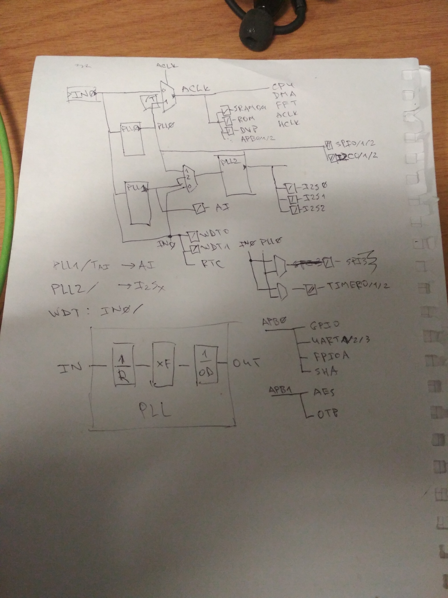
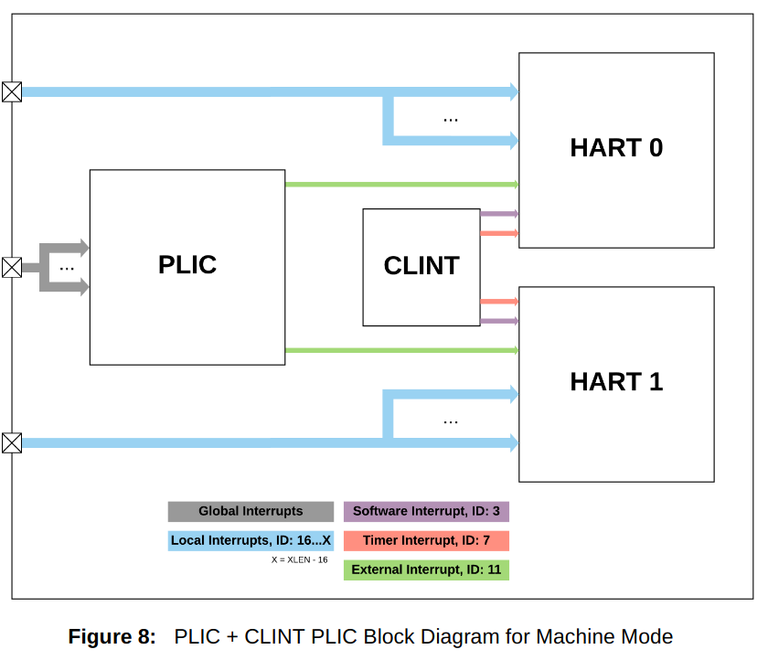
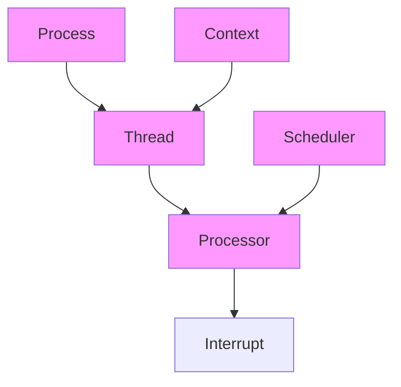

# rCore tutorial v3 阅读笔记

唉感觉学弟都很有想法，而且 Rust 都比我还熟练...真是太菜了，那我抱着初学者的心态来学习一下学弟的版本吧。

## logs

### 2020-07-14

今天能在 K210 上跑 lab0，而且实现了一条命令完成构建+烧写+终端连接。

明天继续搞下面的 lab，估计调试器也能到了，再搞一下硬件调试。

### 2020-07-15

@luojia65 提醒我在裸机环境下 Rust 并不依赖底层的 C 运行时，之前确实有些混淆了。

开始看接下来的章节。

### 2020-07-16

昨天一直忙着搭博客还有测试 Sipeed RV Debugger，结果还都不怎么满意...

今天回归正轨赶紧把 v3 看完...

### 2020-08-19

尝试把 rCore(Tutorial) 移植到 Ariane 平台，然后发现自己太过 naive 了，有很多问题根本不知道如何解决，最后果然直接卡住了...

所以现在继续回来做 K210 上的移植了（真香~）

但是，弄一套开源软核其实也是很有趣的...就是怕能力所限搞不了这么多东西。而且去读总线的规范文档也是一件麻烦事情。真期待有朝一日有大佬能做一套 RV64 tutorial，这样的话就可以学习一个了。

对于 K210 上面的一堆外设很好奇，于是专门去了解了一下。

SPI（Serial Peripheral Interface）也就是串行总线接口，跟我们常提到的串口，其实和 UART 也即通用异步收发器有着很多相似之处。UART 没有时钟，收发双方约定波特率以及起始、停止位还有校验位作为协议。从而收、发在时间上可以做到不同步，故而称为异步。而 SPI 是采用同步传输，有一根时钟线用来对数据线上的串行数据进行同步，仅在时钟的上升/下降沿数据有效。注意两个 SPI 设备进行通信时，时钟信号总是由一方传给另外一方，二者分别称为 Master 和 Slave。据说它是全双工的，也有一根 SS（Slave Select）线来使一个 Master 可以连接到多个 Slaves 并在同一时间只能选择其中一个与之通信。现在大抵能够理解到底什么叫“抢占总线”了。我是在[这里](https://learn.sparkfun.com/tutorials/serial-peripheral-interface-spi/all#:~:text=Serial%20Peripheral%20Interface%20(SPI)%20is,you%20wish%20to%20talk%20to.)学习 SPI 的。

K210 上的另外一种总线叫做 APB（Advanced Peripheral Bus）。事实上它属于 ARM 发明的一种总线架构 AMBA（Advanced Microcontroller Bus Architecture），其规范已经发布了多个版本。APB 是在第一版中被提出的，而 AXI3 和 AXI4 分别在该规范的第三、四版中被提出。

当然，还有我们最为熟知的一种总线 USB（Universial Serial Bus），在这里就不多提了。

那么在 K210 上总线又是个什么架构呢？似乎之前 @luojia65 在群里面给过一张国外老哥破解的图片：



这里面有几个 PLL（Phase-Locked Loop），也就是锁相环。但是我对于模电的知识实在是早就忘光了。稍微找了一点资料来看，PLL 的大概用法是输入一个稳定但是在传输过程中已经有损失的晶振信号，得到一个与之频率、相位相同的信号。应该不是这样的吧，如果有人看到了我的口胡请不要当真。谢谢！

现在启动的玩法是：基于 BIOS 或者 UEFI，寻找可启动的设备（光盘或者磁盘），内核代码/数据应该是和用户文件系统放在不同的分区里面，然后在启动的时候 bootloader 将启动分区里面的内核代码/数据复制到 RAM 的相应位置，内核启动之后再次读取分区表来加载文件系统。大概应该是这么回事来着。

视角回到 K210 上，如果不考虑修改 ISP 的话，那么 K210 上 bootloader 的功能比较固定，就是从 Flash 上拷贝一个镜像到 RAM 上，随后跳转到 0x80000000，也就是 OpenSBI 或者其他 SEE 的所在地。这样的话，受到 bootloader 的限制，分区表大概率是搞不起来的。除了将文件系统直接打包进内核里面，放在 Flash 的另一个位置需要一个传给内核的参数（如设备树），全盘放在 SD 卡中倒是可以。

那么块设备驱动到底是放在 M 态还是 S 态呢？这件事情暂时还没有定论。我忽然想起一点，从之前的实践经验来看最好将外设中断放在 M 态处理来规避一些奇怪的错误。最要命的是必须在 M 态完全处理完毕。这给设计带来了极大的困难。

大概可以给 SBI 增加一个拓展调用，比如 `register_irq`，参数分别是 IRQ ID，处理函数，需要被修改的数据结构指针...?

比如说串口的经典操作：当收到字符的时候，需要将字符放入一个队列并且唤醒当前被阻塞的进程，这显然不是在参数里面放一个指针就能解决的...其实总结起来就是一个问题，如何在启用 MMU 的情况下实现在 M 态调用 S 态函数？现在的情形还比较简单，因为虚拟地址与物理地址之间有着固定的偏移量。（我们得庆幸这不是用户态中断！）所以我们还真不一定要查页表。但是毫无疑问，感觉这个方向也是蛮有意思的嘿嘿。

这明显比直接在 sbi 里面处理要强多了。反正它们都不能有返回值。

### 2020-09-02

我觉得自己已经被时代抛弃了。

目前觉得不是很好的设计：

1. 中断和线程执行挂钩（虽然 Linux 里面大概也是这样？）
2. 对于 __restore 的过于残酷的复用，真的不能新增一个 switch 函数吗？

尚可接受的改动：

1. 疯狂的地址转换（不熟悉的同学真的知道具体是怎么回事吗，方便对于谁而言？）
2. 仅保存进入 trap 之前的上下文，扔掉内核态的相关内容

超棒的设计：

1. 物理页的自动回收

### 2020-09-04

意识到之前那种企图在极其受限的情况下重写框架近乎完全错误。因此开始不跟自己较真，直接阅读完整的代码，很快就全部搞懂了。

现在开始试图将 xwh 的工作合并到主分支上。感觉似乎有点困难...

## 写作要义

### 代码层次结构

* 无论是介绍设计，还是介绍代码具体实现，都应该按照一个结构体自然引用的顺序。

  似乎并不是绝对的，但是介绍代码具体实现的时候一定是这样。

  介绍设计的时候倒是可以用从总体功能反推接口这种做法。

### RISC-V + Rust + OS

* 本书想同时讲明白（对于不是很深入的细节，尽可能给出相对直观的解释）这三件事情，请问有可能做到吗？
* 那么就要尽可能寻找这三者之间的共同点，并给出类比；或者也要找出它们之间到底有什么不同，并进行区分。
* 比如，从内存管理这一层面来说，RISC-V 给出了调用规范与操作栈的相关指令，Rust 则是需要看到自己是一个用户程序，也有自己的内存管理模型，尤其是变量的生命周期与栈的关系；OS 则扮演了一个中间层，它并未跳出 Rust 的内存管理模型，然而它却要同时实现支持上层用户程序的运行，这正是 OS 的重要任务，看上去似乎也有点像是某种虚拟化？

## 测试框架

* 希望这次还能完善一下测试框架。
* 加入一点 special judge...?


## 勘误

* lab-0/guide/part-5: GNU 工具链那里，多了一个 [info]

* lab-0/guide/part-6: Qemu 模拟的 RISC-V 那里，应该改成"Qemu 提供的 RISC-V 虚拟机"

* 希望能将地址改成这种字体，看起来比较美观

  $\mathtt{0x8000\_0000}$，$\mathtt{0xFFFF\_FFFF\_C020\_0000}$

* lab-0/guide/part-6: 多了一个 `.stack`

* lab-0/guide/part-9: `os/src/sbi.rs` 那里，是不是给 `ret` 一个初始值比较好～

* lab-1/guide/part-2: sepc 中提到 Rust 指令不定长，应该**仅限于启用 C 拓展**的时候才会这样

* lab-1/guide/part-2: 最后 CSR set 那里，应该是 `csrs` 使用通用寄存器作为 mask

fork 下来，准备看着文档从头来一遍

## Rust 语法知识点总集编

* no_std/ 目标平台/ 链接脚本/ 等见于 lab0 最小化内核中

* 错误处理：Result<T, E>：在 lab2 中见于 MemoryResult 类型中

* Into/From: 在 lab3 中大量的 `PhysicalPageNumber, PhysicalAddress, VirtualPageNumber, VirtualAddress` 之间的转换（其实在 lab2 里面就已经出现了）
* crate `bitflags/bit_field`: 在 lab3 处理页表项的各字段、各标志位的时候用到。
* Deref/DerefMut: 在 lab3 中 `PageTableTracker` 自动解引用到 `PageTable` 时第一次出现；
* slice 类型：在 `Mapping::map` 拷贝数据时用到。

## RISC-V 知识点总集编


## lab0

* 之前有点忘了入口点相关的事情了。由于 Rust 是基于 C 的，在 Rust 程序启动之前首先要进入 C 运行时 crt0 进行相关初始化，然后 crt0 调用 Rust 运行时初始化函数 [lang_start](https://github.com/rust-lang/rust/blob/bb4d1491466d8239a7a5fd68bd605e3276e97afb/src/libstd/rt.rs#L32-L73)，Rust 运行环境初始化完毕后才能正式跳转到 `main` 函数。

  因此，在裸机环境下，我们只能通过重写 crt0 入口点来搞一套自己的运行时。

  事实上，我们将 crt0 的入口点 `_start` 函数覆盖掉。至于为啥要 `#[no_mangle]` 大家都清楚了。

* 通过 `rustc --version --verbose` 可以看到编译的默认目标平台是 ``x86_64-unknown-linux-gnu``，因此编译器在链接的时候一定会将引用它所依赖的那套 C 运行时，并产生链接错误如下：

  ```rust
    = note: /home/shinbokuow/rCoreTutorial/v3/me/rCore-Tutorial/os/target/debug/deps/os-ef03d122c249fc28.1mvlw0a96qxa6gs9.rcgu.o: In function `_start':
            /home/shinbokuow/rCoreTutorial/v3/me/rCore-Tutorial/os/src/main.rs:13: multiple definition of `_start'
            /usr/lib/gcc/x86_64-linux-gnu/7/../../../x86_64-linux-gnu/Scrt1.o:(.text+0x0): first defined here
            /usr/lib/gcc/x86_64-linux-gnu/7/../../../x86_64-linux-gnu/Scrt1.o: In function `_start':
            (.text+0x12): undefined reference to `__libc_csu_fini'
            (.text+0x19): undefined reference to `__libc_csu_init'
            (.text+0x20): undefined reference to `main'
            (.text+0x26): undefined reference to `__libc_start_main'
            collect2: error: ld returned 1 exit status
  ```

  事实上，我们看到编译器提示了 `_start` 的多重定义以及若干 C 运行时符号的缺失。因此，我们需要把目标平台替换成 RISC-V 裸机。

  > 这里可能有两个理由：
  >
  > 1. 我们需要让编译器移除掉默认依赖的 C 运行时，从而让编译通过；
  > 2. 我们本来就是要在 RISC-V 裸机上跑内核而不是默认的目标平台。

* 这里使用的裸机平台是 `riscv64imac-unknown-none-elf`，指令集拓展包括乘除指令、原子指令和指令压缩。随后使用 `cargo build --target ...` 得到裸机上的可执行文件。

  **看我** 这里要将配置保存在 `.cargo/config` 我也没啥印象了。

* 感谢 Rust 社区提供的 [cargo-binutils](https://github.com/rust-embedded/cargo-binutils) 工具，后端好象是 llvm 实现的，我们就只管用就行了，比如 `rust-objdump, rust-objcopy` 等等。

* 使用 `rust-objcopy` 工具去掉 elf 文件中的调试信息等变成镜像。参数 `--strip-all -O`。

* 使用链接脚本 `linker.ld` 配置内核的内存布局，**看我** 跟之前的不同在于将 `bss.stack` 合并到了 `bss` 段中。还去掉了 `.text.entry` 以及一些不必要的 4K 对齐。

  **看我** 注意`.text:` 是不对的，中间必须加一个空格，即 `.text :`。

  链接脚本的设置也是放在 `.cargo/config` 中的。

* 然后就要重写函数入口点（也就是自己的一套运行时）了。**感觉目前也仅仅是把整个流程说了一遍，而并没有去说为什么要这样干。现有的写法还有优化空间。**

* 注意 `entry.asm` 中的 `la sp, boot_stack_top` 伪指令，对于 RV32 来说，这是很经典的 LUI+ADDI 指令组合，但是不知道对于 RV64 而言，它是能将全部 64 位地址载入寄存器还是只能载入后 32 位，由于目前启动栈顶只有 32 位，所以这里是没有问题的。

  另一条伪指令 `call rust_main`，实际上是 AUIPC+JALR 的组合，它能跳转到内核入口点 `rust_main` 并将本来的下一条指令地址保存在 `x1(ra)` 中。当然，我们永远不会回来就是了。

  整段汇编代码的意义还是一样：设置启动栈并跳转到内核入口点。

* 尝试下自己写 Makefile，感觉还是没啥思路 QAQ

  自己写了下好像也不是很难...然后命令行可以输出 OK 了！

  等弄完格式化输出我就把它在 K210 上跑起来～

* 封装 sbi 接口，将 `sbi_call` 用 `#[inline(always)]` 强制性在调用每次出现的地方都把自己复制一份，感觉这个优化可有可无，又不是那种短小精悍又频繁被调用的函数。而且加不加都不影响正确性。**这里还是应该讲一下内联进去还是正常走函数调用的取舍，之前都没讲**。

* 到了实现格式化输出的地方了，看看相比之前自己能不能有点进步。

* `console.rs` 里面的要实现 `core::fmt::Write` 的 `Stdout` 类是一个 Zero-Sized Type，不过这好像并不是关键，**相比原版，学弟实现了将一个 UTF-8 编码字符串打印出来的功能，主要思路就是分解成字节依次调用 console_putchar 进行打印**。

* 看了一会宏相关的知识，感觉把脑子看关机了...先记录一下不错的学习资源吧

  [Rust 宏小册中文版](http://blog.luxlyu.com/tlborm-chinese/book/README.html)

  [Rust 过程宏教程](https://xr1s.me/2018/12/08/introduction-to-rust-proc-macro/)

  回过头来看 `print! println!` 的模式的实现，首先前面有一个作为字面量的 `fmt` 表示模式，然后后面套着两层重复，先看看外层的重复，其实就是 `$(inner)?`，也就是重复里层的模式 0 次或多次，中间没有分隔符；而里层的重复 `inner` 是 `, $($arg:tt)+`，可以理解为首先有一个逗号，然后后面有至少一个中间没有分隔符的标记树。

  这个宏的实现原理像是一个 Adapter，就是把输入直接接到下面的 `format_args!` 宏中，所以它至少能够解析输入并暂时将它存下来，因此需要能知道输入是啥格式的。**其实我感觉，如果不是一定要和 Rust 一致通过宏 print! 来输出，也许写一个函数 print 来输出会更简单些**。

  但不管怎么样，现在的逻辑是经过 print! 宏的中转，可以将输入通过 format_args! 宏变为 `fmt::Arguments` 类型。为了输出它，就得有一个实现了 `fmt::Write` 的类型 `Stdout` ，它再通过底层的 `console_putchar` 来实现 `fmt::Arguments` 作为输入的 `write_str` 函数。**原先的叙事逻辑似乎完全反了**。

* 在 `panic_handler` 中，用一些黑科技实现了带颜色输出，但是前提是终端要支持。**这提示我们，装一个优秀的终端作为前端，即使在 K210 上也能获得带颜色的输出，那就很爽了！**
  
  此外，可以通过启用 `panic_info_message` feature 来获得 `info.message()`。
  
* 按照学弟的方法实现格式化输出，结果经常出现什么都输出不出来的情况，只能换成我第二版的实现看看有什么不同了。目前还是这样，一旦使用宏就整个什么都输出不出来。
  
  解决掉了，我真是太蠢了，照抄链接脚本的时候忘了把 `.rodata` 段弄进去了，之前各模块都没有 `.rodata` 段的时候就能正常跑，加了宏之后编译器居然会把 `.rodata` 段弄到 `.text` 段前面去，自然就跑飞了...
  
  这里还需要注意一下**为什么链接脚本中需要将某些段进行 4K 对齐，大概是为了后续的内存分配？**
  
* 终于能在 K210 上跑 v3 的 lab0 啦！有图为证
  
  
  
  而这仅仅只需要一条 `make run-k210` 命令！算是做了一点微小的贡献。
  
  比较坑的地方也只有需要将各个段按照 4K 对齐。否则会报**内存读写不对齐**的错误。同时，需要注意的是 `. = ALIGN(4K)` 必须在花括号外面才有用，且修改完之后要 `clean` 之后再重新构建。（想想之前的对齐都是假的 QAQ，是运气好还是 Qemu 与 K210 的实现不一样？）
  
* 关于 `cu` 的使用方法的话，要输入 `~.` 才能退出，有时还要先按 `~<enter>` 才能进入输入模式~
  
## lab1

* 好家伙，上来就给我来了一个奇  妙  比  喻

* CSR 的所有相关操作有读写(或称交换 CSRRW)，只读(CSRR)，只写(CSRW)，指定某些位置0(CSRC[I])，指定某些位置1(CSRS[I])

  观察可以发现，相关寄存器在指令中出现的顺序是 rd1 先于 csr 先于 rs1

  据此推断所有指令的具体格式为

  ```
  CSRRW	rd1, csr, rs1
  CSRR	rd1, csr
  CSRW	csr, rs1
  CSRC	csr, rs1
  CSRS	csr, rs1
  CSRCI	csr, imm
  CSRSI	csr, imm
  ```
  
  在 CSRC[I]/CSRS[I] 中，输入的 `rs1/imm` 作为 mask 存在，意义是指定将哪些位置0/1。
  
  另外，这些指令都是**原子**的。

* 我们都知道，接下来就要保存/恢复中断现场了。
  
  *为了方便起见，以下关于中断的描述可能会有歧义，其中某些指的是一般意义上的 Trap，而另一些则特指外部中断。这个措辞之后再进行修改。*
  
* 当中断发生时，由于我们通过中断要进入 S 态，因此硬件会自动设置中断原因以及附加信息 `scause,stval`，进入中断之前正在执行的指令地址 `sepc`。当然，`pc` 也要按照 `stvec` 进行相应设置。
  
  然后就是 `sie/sip` 以及 `sstatus` 上面的 `sie/sip` 相关位，以及 PLIC/CLINT 如何处理它们。如果要说明的话，**感觉会非常复杂**。我们姑且不去解释背后的原理，只是从使用方法的角度去介绍一下。
  
  
  
  这里 SPP 会按照当前 hart 处于 U/S 态由硬件自动相应设置为 0/1 ，这是因为其他模式无法通过中断进入 S 态。后面还会提到，在通过 SRET 指令恢复到中断之前的特权级的时候也是根据这个标志位来恢复的。
  
  同时当 SIE 标志位 clear 的时候，处于 S 态时所有的中断都会被禁用，而 hart 处于 U 态时，即使 SIE clear，也依然能收到 S 级中断。**这里不是很懂，到底什么叫做 Supervisor Level Interrupt？ 而它又跟 hart 当前所处的特权级有什么关系？**
  
  > 好的我进入中断了，这里找到一篇[文档](https://sifive.cdn.prismic.io/sifive/0d163928-2128-42be-a75a-464df65e04e0_sifive-interrupt-cookbook.pdf)，来看一看。
  >
  > * 经典区分 exception/trap/interrupt
  >
  >   exception 是一条指令执行过程中发生的错误(unusual condition)
  >
  >   trap 指的是从原本的指令执行过程到 trap handler 过程中**同步的控制流转换过程**，感觉还是在特指 ECALL/EBREAK 吧...
  >
  >   interrupt 指的是对于一个 hart 而言**异步的外部事件**，使得它要在某条指令执行结束后进入 trap 继而进入 trap handler
  >
  > * PLIC/CLINT 整体结构图
  >
  >   
  >
  >   看起来，CLINT 负责产生时钟中断、收集其他 hart 传过来的软中断并交给自己的 hart 来进行处理；而 PLIC 负责收集全局中断，并将其按照一定的规则转发为某个或某些 hart。局部中断则是将中断源不经过 PLIC 直接连接到 hart 上。
  >
  >   那么至少有以下几个问题：
  >
  >   1. 什么是 global interrupt，什么又是 local interrupt?
  >   2. 是不是每个 hart 上都有一个自己的 clint，图示上仅仅是简化？
  >
  > * CLINT
  >
  >   * CLINT 对于软中断/时钟中断/外部中断设置了一套固定的优先级，通过一个不可修改 Interrupt ID 来表示
  >
  >   * 通过 CLINT 只能进行**跨特权级**的软件抢占(Software Preemption)。例如 M 态中断可以立即打断 S 态的代码执行。但是 S 态就做不到。（但是 S 态中断显然也可以打断 S 态的代码执行啊，可能实际的意思是 S 态中断之间不能抢占吧）
  >
  >   * 虽然位置不太对，但这里提到了很关键的一点，也就是说 `m[s]tvec` 在 Direct Mode 下必须 **4 字节对齐**；在 Vector Mode 下必须 64 字节对齐。
  >
  >     这个应该可以通过在汇编代码中 `.align` 来进行配置。
  >
  >   * 在 `mcause.exception_code` 中，0~3 表示 U/S/M 软中断；4~7 表示 U/S/M 时钟中断；8~11 表示 U/S/M 外部中断。其中 2/6/10 被保留。>=16 的被称为 local interrupt。
  >
  >     而在 `scause.exception_code` 中，0~1 表示 U/S 软中断；4~5 表示 U/S 时钟中断；8~9 表示 U/S 外部中断。同样，>=16 的被称为 local interrupt。
  >
  >     这应该还是因为中断服务例程所在的特权级不能比之前低，因此处于 S 态的中断服务例程看中断的原因的 `scause.exception_code` 的时候，当然就不必处理 M 态的中断。
  >
  >     那么，能否推断出究竟什么叫 S 态中断，而什么又叫 M 态中断呢？中断的代理又是怎么一回事呢？目前的理解，可以将 S 态中断定义为"**能在 S 态接收到并从 S 态进入中断处理的中断**"。究竟是否正确，接下来再继续看。
  >
  > * PLIC
  >
  >   * PLIC 一共可以分发 1024 种中断，它们的编号从 1～1024
  >   * 每个进入 PLIC 的中断有一个优先级，可以从 1~7 进行配置，7 代表最高优先级；而 0 的话表示禁用此中断
  >   * PLIC 中有一个全局的阈值寄存器，可以将优先级**不超过**该寄存器中设置的值的中断全部屏蔽
  >   * 如果两个有着相同优先级的全局中断**同时**进入 PLIC，则有着较小 Interrupt ID 的全局中断更优先
  >   * 当使用 PLIC+CLINT 组合的时候，外部中断直接从 PLIC 发布到 CPU ，中间不经过 CLINT。
  >   * 从定义上，当一个 hart 接受(claim)了一个中断但仍然处在中断处理过程中的时候(也即尚未 complete)，PLIC 不能向这个 hart 转发一个新的中断。因此，对于某一个确定的 hart，PLIC 不支持抢占式全局中断。
  
  总之，SIE 会被保存在 SPIE 中留待日后恢复，而 SIE 自己会被 clear 屏蔽所有中断。(所以原生不支持中断嵌套)
  
* 之前看了很多相关知识，但是最后还是没搞定 S 态串口终端，甚至换了电脑之后连 M 态中断都收不到了，而且之前的 `println!` 也不能正常工作了...

  所以，目前先在很有限的时间里把时钟中断、调试中断搞定吧
  
* 现在开始研究洛佳大佬自己定制的一套 SBI ，顺便学习一下开源社区里面的 Rust 都是怎么写的...

  然而他的 SBI 在 K210 上并不能跑，同时，我比较希望 SBI 不要调用太多的库，而最好是每一行代码都比较清晰，在教学意义上才更好...

  因此，我们暂时只能回到 OpenSBI 3.0+ 了

* 尝试通过读写 `mtime/mtimecmp` 寄存器（由于它们是 MMIO 的）来避免使用 `rdtime` 指令。然而，OpenSBI 对于 `set_timer` 的实现明显不仅是修改了 `mtime` 寄存器。因为我之前的尝试是收不到时钟中断的。就让我们来探索一下 OpenSBI 里面是怎么搞的。 

  首先在 `sbi_ecall.c` 中找到 `SBI_ECALL_SET_TIMER` 的分支中找到是调用了 `sbi_timer_event_start` 函数。这个函数可以在 `sbi_timer.c` 中找到，具体实现为：

  ```c
  void sbi_timer_event_start(struct sbi_scratch *scratch, u64 next_event)
  {
  	sbi_platform_timer_event_start(sbi_platform_ptr(scratch), next_event);
  	csr_clear(CSR_MIP, MIP_STIP);
  	csr_set(CSR_MIE, MIP_MTIP);
  }
  ```

  首先调用了平台的 `timer_event_start` 实现，随后：

  1. 在 `mip` 寄存器中手动清掉 STIP 标志位；
  2. 在 `mie` 寄存器中设置 MTIE 标志位，打开 M 态时钟中断使能。

  那么就得看看平台方都干了什么：

  找到 `platform/qemu/virt/platform.c` ，看到该平台的 `timer_event_start` 函数指针被设置为 `clint_timer_event_start`。而该函数又能够在 `platform/common/sys/clint.c` 中找到，可以发现在 64 位下也仅仅是将 `next_event` 调用 `writeq_relaxed` 函数写入 `mtimecmp` 所在的地址。该函数能在 `riscv_io.h` 中找到，貌似是原子的，但是应该也和 Rust 中的 `write_volatile` 没差～

  那么目前看来，问题就出在没有在修改 `mtimecmp` 之后设置标志位。没有收到时钟中断的关键就在于 `mie` 中的 M 态时钟中断使能没有打开。而这个也显然只能在 M 态去做(魔改 OpenSBI，或者是自己写的 M 态软件)。

  既然都看到这里，我们再来看一下基于 OpenSBI 的时钟中断的处理流程。暂且不管保存/恢复上下文以及 `mtvec` 初始化的这一步，实际的中断处理应该是在 `sbi_trap.c` 中的 `sbi_trap_handler` 函数中。原本的 OpenSBI 只负责处理 M 态时钟中断、IPI 以及若干种异常，所有的外部中断丢进去都会直接 panic，想想串口中断的处理就比较蛋痛，尤其是在知道 K210 上 `mideleg` 部分标志位被硬件连 0 没法进行代理的情况下......

  暂且不考虑 hart 为什么收到的是 M 态时钟中断而非 S 态，总之我们调用 `sbi_timer_process` 函数进行处理。这个函数当然也可在 `sbi_timer.c` 中找到，发现它作了一次很有趣的软件代理：

  ```c
  void sbi_timer_process(struct sbi_scratch *scratch)
  {
  	csr_clear(CSR_MIE, MIP_MTIP);
  	csr_set(CSR_MIP, MIP_STIP);
  }
  ```

  1. 将 `mie` 寄存器的 MTIE 标志位置 0，这里居然是把 M 态时钟中断使能关掉了；要在随后通过软件 `ecall` 来调用 `sbi_timer_event_start` 函数设置完新的 `mtimecmp` 之后才重新把这个使能打开。
  2. 之后，将 `mie` （实际上是 `sie`） 寄存器的 STIP 标志位置 1，这样，在 OpenSBI 中断处理回到 S 态之后，hart 惊奇的发现 STIP 标志位为 1，随后再检查一下 `sstatus/sie` 发现使能都已经打开，就可以进入 S 态时钟中断的处理了。这可谓是一次完全成功的“甩锅”。

  总结一下基于 OpenSBI 的时钟中断处理总流程：

  1. 初始化之前必须要把 `mie.mtie` 置 1，这样才能收到时钟中断；
  2. 内核运行在 S 态，但此时收到 M 态时钟中断，这个并没有被代理，只能在 M 态进行处理；
  3. M 态主要是在 `sbi_timer_process` 中处理时钟中断，关闭 M 态时钟中断使能，并软件代理到 S 态；
  4. M 态中断处理完毕通过 `mret` 回到 S 态，发现 STIP 位置 1，由于在 OpenSBI 初始化时设置了中断代理，因此可以在 S 态进行处理；
  5. S 态的处理主要就是通过 ECALL 调用 OpenSBI 提供的 `sbi_timer_event_start` 函数，回到 M 态修改 `mtimecmp` 并将 STIP 位清掉表示 S 态时钟中断处理结束；同时打开 M 态时钟中断使能。至此整个中断处理流程结束。转 2

  目前比较疑惑的是**MTIP 标志位用不用 clear，如果需要的话 OpenSBI 是在哪里 clear 的**。

  我们可以先魔改一下 OpenSBI，相比之前，仅仅在初始化的时候将 `mie.mtie` 打开。这样的话，总体上也就是 `mie.mtie` 常驻打开...后面先不分析了，等彻底跑通再说

* Rust nightly-2020-06-27 版本是有问题的...一开始发现 EBREAK 回来之后只要有非 panic 代码，在 K210 上都会卡死...那咋办嘛...现在改成 nightly-2020-06-04 之后至少后面的 hello world 能输出了...

  改了版本之后终于搞定了时钟中断了，说来滑稽，我所作的唯一一件事情就是在 OpenSBI 初始化的时候打开了 `mie.mtie`，然后在读 `mtime` 的时候不是通过 ECALL 而是通过 MMIO。
  
  我忽然觉得，也许串口中断也会比较顺利？
  
* 突发奇想把 PLIC 的寄存器都打印了一下，发现高速串口在 K210 上的 IRQID 是 33，而之前的设置仅仅设置到 0~31，于是实际上之前并没有通过修改 PLIC 的 IE 来正确禁止 hart1\_M 收到串口中断。了解了这个之后，我又尝试打印 hart0\_M 和 hart1\_M 的阈值以及高速串口中断的优先级，发现分别是 1,0,1。这样就能解释为啥只能在 hart1\_M 上收到外部中断了。猜测这个设置应该是在 OpenSBI 某个地方搞的。
  
  然而我们想解决的话非常简单，只需要将 hart0\_M 与 hart1\_M 在 PLIC 上的阈值交换一下就行了！现在终于能够在 hart0\_M 上收到串口中断了！接下来的问题就是怎么将它搞到 S 态上去。
  
* 题外话：C 语言在标签之后（包括 switch-case 的每个分支）之后第一条语句不能定义指针我是没想到的。目前解决方案是加一条空语句 `;` 过编译。

* 试试能不能在 M 态完成串口中断的正常处理...走了一个完整的 claim & complete 流程后很轻松搞定了这一切。

* 我试着沿用时钟中断的思路试图将 M 态外部中断软件代理到 S 态外部中断。但是发现设置了 `mip.seip` 之后 S 态也没有任何反应。那可能真的就是这样吧，S 态外部中断在 K210 就是不存在的，这也可以解释究竟为何相关的中断代理不工作。 

  好在我们大概可以通过软件中断来搞（之前尝试过 S 态软件中断可以正常收到），但是可能要对 OpenSBI 做更大的修改。

  我更期望是能够从这一章节开始，从零开始为 K210 自己实现一套特定的 SBI。由于并不是按照 SBI 标准提供接口可能也不能叫做 SBI 了，只是一段简单的 M 态软件，能够为上层的 K210 提供支持。
  
  这与洛佳大佬的看法一致，他也打算在自己的 SBI 实现中扔掉 K210 的支持。事实上还是单独为 K210 搞一套运行时会更好。如果我有时间的话会去尝试一下。
  
* 如果想走通过 S 态软件中断来代理这条路，为了日后对于 IPI 的支持，首先要解决的一点就是当进入 S 态软件中断之后应该如何区分这是其他 hart 发给它的中断，还是它自己上面产生的 M 态外部中断代理过来的。

  但还是应该把这条路跑通再去考虑之后的拓展...
  
* 目前算是走通了，但是无论在 M 态还是在 S 态软件中断中读 `uarths.rxdata` 都会发现其 `empty` 恒为 1，且一开始读数据会读出 7 个 0。后面的输入则分别有不同程度上的延迟...

  对于这个诡异的现象实属无能为力QAQ
  
  难道是 hart1 永远滴神，hart0 不行？
  
* 目前先不进行更多的尝试了，找到一个 [nommu Linux for K210](https://github.com/vowstar/k210-linux-nommu)，跑一下试试，看看人家是怎么搞串口中断的；此外，还找到了学长在 K210 M Mode 上跑 Linux0.11 的[记录](https://github.com/lizhirui/K210-Linux0.11)，都来试试看吧。rjgg 的 rCore on K210 在 Rust 的版本更新后好像编译不了了，万恶的 cargo-xbuild...事实上，硬改掉某些库的代码似乎可行...?
  
* 尝试了一下之后发现只有学长的 Linux0.11 能够复现，但是其功能过于简单，貌似对我目前参考价值不是很大...
  
* 这时，我又尝试跑了一下 K210 官方 SDK 基于 UART3 而非 UART0(也即 UARTHS) 的串口中断测试程序，发现它居然能够正常运转。于是接下来的任务也就是把 UART0 换成 UART1~3 了（它们三个之间除了 MMIO 地址不同之外没有任何不同）
  
  直接将 SDK 相关代码移植到 OpenSBI 中过于令人不爽，因此，我尝试直接跟踪官方 SDK 示例中初始化通用串口的全过程，这样之后在实现自己的 M 态软件的时候也可以稍微轻松一些。
  
  首先是常规的 `plic_init, sysctl_enable_irq` ，这两个功能比较简单我们之后再说...
  
  接下来调用了 `uart_init(UART_NUM)`，这个函数可以在 `uart.c` 中找到：
  
  ```c
  void uart_init(uart_device_number_t channel)
  {
      sysctl_clock_enable(SYSCTL_CLOCK_UART1 + channel);
      sysctl_reset(SYSCTL_RESET_UART1 + channel);
  }
  ```
  
  在 `sysctl.c` 中找到 `SYSCTL_CLOCK_UART1=25`。
  
  ```c
  int sysctl_clock_enable(sysctl_clock_t clock)
  {
      if(clock >= SYSCTL_CLOCK_MAX)
          return -1;
      sysctl_clock_bus_en(clock, 1);
      sysctl_clock_device_en(clock, 1);
      return 0;
  }
  ```
  
  观察 `sysctl_clock_bus_en` 函数，实际上根据传入的 `clock` 可知二者实际上分别做的就是
  
  ```c
  sysctl->clk_en_cent.apb0_clk_en = en;
  // 这里根据要启用的是 UART1/2/3 而不同
  sysctl->clk_en_peri.uart1_clk_en = en;
  ```
  
  再去找 `sysctl_reset` 函数：
  
  ```c
  void sysctl_reset(sysctl_reset_t reset)
  {
      sysctl_reset_ctl(reset, 1);
      usleep(10);
      sysctl_reset_ctl(reset, 0);
  }
  ```
  
  其中的 `sysctl_reset_ctl` 函数找到实际做的是下面的事情：
  
  ```c
  // 这里同样根据 UART1/2/3 而不同
  sysctl->peri_reset.uart1_reset = rst_value;
  ```
  
  而 `usleep` 函数则是能在 `sleep.c` 中找到：
  
  ```c
  int usleep(uint64_t usec)
  {
      uint64_t cycle = read_cycle();
      uint64_t nop_all = usec * sysctl_clock_get_freq(SYSCTL_CLOCK_CPU) / 1000000UL;
      while(1)
      {
          if(read_cycle() - cycle >= nop_all)
              break;
      }
      return 0;
  }
  ```
  
  功能很简单，就是休眠一段时间等待 sysctl 状态趋于稳定。
  
  这样 `uart_init` 代码就看完了。
  
  接下来调用的是 `uart_configure` 函数，它同样能在 `uart.c` 中找到，主要是修改了以下设备寄存器：
  
  ```c
  uart[channel]->LCR |= 1u << 7;
  uart[channel]->DLH = dlh;
  uart[channel]->DLL = dll;
  uart[channel]->DLF = dlf;
  uart[channel]->LCR = 0;
  uart[channel]->LCR = (data_width - 5) | (stopbit_val << 2) | (parity_val << 3);
  uart[channel]->LCR &= ~(1u << 7);
  uart[channel]->IER |= 0x80; /* THRE */
  uart[channel]->FCR = UART_RECEIVE_FIFO_1 << 6 | UART_SEND_FIFO_8 << 4 | 0x1 << 3 | 0x1;
  ```
  
  相关寄存器的说明可以在[这里](https://www.lammertbies.nl/comm/info/serial-uart)找到。从文档来看每个寄存器应该都是 8 位，但不知道为什么 SDK 里面都定义成了 `uint32_t` 了...
  
  
  
  我们首先设置 `LCR` 的 DLAB 位，它可以决定前两个寄存器是 `RBR/THR/IER` 还是 `DLL/DLM`。有意思的一点是，对于第一个寄存器而言，当读的时候它是 `RBR`，而写的时候它又变成了 `THR`。这里我们将 DLAB 设置为 1，于是前两个寄存器读写都是 `DLL/DLM` 了，它们两个分别表示 divisor latch 的高/低 8 位。
  
  可以看到，SDK 将上图中的 `DLM` 换成了 `DLH`，同时新增了一个 `DLF`。Google 了一下这个 DLF，发现海思公司近两年出的一款 uart 貌似有 `DLF` 寄存器，但是文档不让下载...其实我更倾向于这个串口可能是 Kendryte 自己魔改出来的，没有任何相关文档只提供给你接口，要是想写驱动的话就只能照着 SDK 一行一行的扒...毕竟他们上层的 Python 环境跑通之后可就不管作底层的人的死活了QAQ。但是应该还是有很大一部分是相同的...所以暂且耐着性子看下去吧2333。
  
  修改完 `DLL/DLM` 之后，我们将 DLAB 位置 0 开始修改 `RBR/THR/IER`。对于 `LCR` 而言，我们从低到高分别设置 data word length，停止位，校验位，后面一行不知道什么意思。
  
  接下来修改的 `IER` 是中断使能，`0x80` 什么含义就不知道了。而 `FCR` 是 FIFO 控制寄存器，分别设置了启用 FIFO、将 DMA Mode 设置为1、以及相应设置接收/传输触发中断所需的字节数量。
  
  虽然还不是很懂，但是初始化到这里就差不多了。
  
  后面的 `uart_set_receive_trigger, uart_irq_register` 都不难理解。接收和传输数据分别用的是 `uart_receive_data, uart_send_data`，分别来看看二者的实现：
  
   ```c
  int uart_receive_data(uart_device_number_t channel, char *buffer, size_t buf_len)
  {
      size_t i = 0;
      for(i = 0; i < buf_len; i++)
      {
          if(uart[channel]->LSR & 1)
              buffer[i] = (char)(uart[channel]->RBR & 0xff);
          else
              break;
      }
      return i;
  }
  
  // uart_send_data 主要是通过 uart_channel_putc 来实现
  static int uart_channel_putc(char c, uart_device_number_t channel)
  {
      while(uart[channel]->LSR & (1u << 5))
          continue;
      uart[channel]->THR = c;
      return c & 0xff;
  }
   ```
   可见，`LSR` 作为状态寄存器，其标志位 `0, 5` 功能类似于 empty 和 full；而可以读写的时候，就分别从 `RBR` 读和写入 `THR` 就好了。
  
  差不多懂了，但是自己移植起来太累，现在有一个[k210-pac](https://github.com/riscv-rust/k210-pac)就做的很好，直接用起来就行了。[这里](https://github.com/laanwj/k210-sdk-stuff/blob/master/rust/buffered-uart/src/lib.rs)是一个利用 k210-pac 与串口 UART1 通过中断进行输入的例子。
  
* 看了一下觉得还不如自己写一个，正好也可以重构一下整个项目目前有点混乱的代码。

  同时也尝试了一下，只要在 M 态处理外部中断转发给 S 之前将 `stval` 寄存器设置为 IRQID 就可以了，S 态不会修改它。
  
* 尝试了高速串口和通用串口的中断，都能够在 S 态收到并处理，然而都有问题...现在先放下去搞后面的 lab

* 清空完 `.bss` ，再加上一些黑科技发现又能跑了...具体内容参见 K210 移植报告吧

## lab2

* 内核堆大小从 $8\text{MiB}$ 改成 $1\text{MiB}$。

* 可以通过 `core::mem::drop` 直接将变量回收而无需通过构造一个无意义的作用域的方法。

* 发现 `buddy_system_allocator` 不能用...我人傻了，难道要重新写一个 `BitsetAllocator` 吗？但是分配的粒度就很有问题了。

* 尝试搞了一下把大二进制文件换成两个小文件打包成一个 `.kfpkg`，速度提高了不少，但我很怀疑它是不是真的写进去了，目前好像还有问题。

* 通过清掉 `.bss` 段成功把堆测试跑起来了，然而......删掉两条输出语句整体都没有输出了，这没道理啊......这也太玄学了吧QAQ

  尝试把逐字节清零改成逐 64 位清零，然后两条输出语句没有也行了...

  这是真的玄学

* 又尝试基于 `kfpkg` 加速烧写，但是好像完全烧不进去，不知道怎么才算是正确的姿势。

  最后我强行通过把 $\mathtt{0x8020\_0000}$ 改成 $\mathtt{0x8002\_0000}$ 来把烧写速度提高 16 倍:smile: 
  
* 找到了一个能够软件 reset 板子的[方法](https://github.com/kendryte/kflash.py/blob/master/kflash.py#L730)，来自 `kflash.py`

* `memory/address.rs` 仔细想想确实还是利用了宏的特性有效减少了代码量，不用物理地址和虚拟地址各搞一套

  **还是有些不懂 `#[repr(C)]` 以及 `#[derive]` 那么多意义何在？**

  实现了地址与页号互转，同类型之间各种加减
  
* 通过 `FrameTracker` 来给一块物理内存一个生命周期，在页表的接触映射的时候会自动回收内存，先看看它的好处吧

  实现了 `std::ops::Drop` Trait，在变量被 Drop 的时候通知 `FRAME_ALLOCATOR` 回收该物理页帧

  在 `FrameTracker` 中保存的实际上是物理页号

* 然后，`FrameAllocator` 及其静态实例 `FRAME_ALLOCATOR` 的结构是这样的：

  首先定义一个 `Allocator` Trait，其提供的接口 `alloc, dealloc` 应该是在 $[0,N)$ 的下标区间上做单下标的分配、回收

  接着 `FrameAllocator` 也就利用了 `Allocator` :

  ```rust
  pub struct FrameAllocator<T: Allocator> {
      start_ppn: PhysicalPageNumber,
      allocator: T,
  }
  ```

  这里把开头物理页号封装进去，从一个抽象分配器经过适配变成分配实际的物理页。分配`alloc`、回收`dealloc`的单位是 `FrameTracker`。当 `FrameTracker` 生命周期（退出作用域）结束后，就会在全局实例 `FRAME_ALLOCATOR` 中回收掉对应的物理页。

  分配会拿到一个 `FrameTracker`，但是不能当分配函数结束之后就直接把它回收。因此猜想需要使用引用计数 `Arc` 把它弄到 `PageTable` 里面去，等这个数据结构被 Drop 之后再进行回收。

* 才发现 `Range` 是自己定义的。里面和 `core::ops::Range` 一样都有 `start, end`，那么多了哪些功能呢？

  为 `Range<T>` 实现一个 `From<core::ops::Range<U>>` 的 Trait，可以将一个核心库中的 Range 转换成一个我们自己定义的 Range，其中 `T: From<usize> + Into<usize> + Copy` 表示可以和 `usize` 互相转换，其实就是指 `PhysicalPageNumber, PhysicalAddress` 这些东西。`U` 类型被包裹在核心库中的 Range 中，实现了 `Into<T>` ，也就是可以转换成 `T` 也就是 `PhysicalPageNumber, PhysicalAddress` 这些东西。

  总体来说：

  1. `std::ops::Range<U>` 可以转成 `Range<T>`，其中 `U` 可以转成 `T`，`T` 可以和 `usize` 互转，主要是指 `PhysicalAddress, PhysicalPageNumber` 这些类型。
  2. 那么 `Range<T>` 又提供哪些功能呢？主要有以下几种：
     * `overlap_with`，判断当前 Range 是否会和其他 Range 相交；
     * `iter`，生成一个遍历区间中所有元素的迭代器；
     * `len`，输出区间中元素的数量；
     * `into::<U>`，给定类型 `U` ，要求 `T` 可以转换成 `U`，将 `Range<T>` 转换成 `Range<U>`，主要用于虚拟页号区间与物理页号区间之间的互转；
     * `get`，指定区间中的一个位置取得一个元素；
     * `contains`，判断某个元素是否在当前区间中。

  确实对于这种 Rust 原生 Trait 是我比较头痛的地方，sadsad。强行自己写了一下好像稍微好点了。

* 另一个问题是到底如何来进行模块划分...现在我能够做到的程度仅限能编译。

* 将所有的抽象算法分离出来到 `algorithm` 模块里面，确实在模块化上是一个很大的进步。但是觉得弄成一个 crate 有点没必要，弄成一个 mod 似乎就行了。

* luojia65 一直在跟我讨论各种项目上的事情，一不小心就搞出了个死锁，后来发现并且跑通了，算是 lab2 完结撒花了吧。此外，顺便把 `TICKS` 改成 `spin::Mutex` 实现了，不然一直是心中的一个坎。

* 怀疑是之前的某些实现有点问题（没有清空 .bss 段，又或者是某些 unsafe 问题），决定重新尝试一下串口中断。

* 清空 `.bss` 段产生的奇妙 bug: 在 wsl1 Ubuntu20.04 上只能使用 rv64imac target；在 Ubuntu20.04 上只能使用 rv64gc target，否则会产生诡异的非法指令异常，怀疑是编译器 bug，后面会尝试把清空 `.bss` 段的代码改成汇编

* zhy 大佬帮我发现了清空 `.bss` 段顺便也会把启动栈清空的问题，现在看起来一切正常了

## lab3

* 尝试把 `.bss.stack` 换成 `.data.stack`，结果可执行文件的大小大了三倍...暂时还是改回去了

* 把 `.bss.stack` 独立到链接脚本中的 `.stack` 段中

* 把所有的段都进行 4K 对齐确实是之前忽略的点

* 按照 rjgg 之前的[MMU 移植经验](https://github.com/oscourse-tsinghua/rcore_plus/issues/34) 以及 [MMU 魔改版 OpenSBI](https://github.com/rcore-os/opensbi/commit/4400a1a7d40b5399b3e07b4bad9fd303885c8c16) 加上新一轮魔改，终于把内核初始映射跑通了，把大概经历的过程记录一下

* 在内核里面，首先将 `linker.ld` 中的 `BASE_ADDRESS = 0xffffffff80020000` 改过来，从此直接将内核弄到虚拟地址空间去（回忆一下，内核代码数据需要放到高地址空间，而用户代码数据放到低地址空间）

* 随后是 K210 基于的 1.9.1 版本导致的一系列改动，在 1.9.1 版本中，MMU 模式需要在 `mstatus.vm` 中设置

  

  将其设为 9 表示启用 sv39 分页。

  而在新版 spec 中我们所熟知的 `satp` CSR 在 1.9.1 中是另一个与之 CSR ID 相同但名字却不同的 `sptbr`：

  

  与 `satp` 相比，少了最开头的 10 位 Mode。

  这使得，与之前不同的一点，在于在 1.9.1 中使能页表机制需要分成两个阶段。而不像后续版本中只需一条指令修改 `satp` 即可。（这个改进实在很赞）

  我们必须将两阶段都放在 M 态（也即 OpenSBI ）中，也需要在 OpenSBI 中开 4KB 来存储初始三级页表。

  这只需要在 OpenSBI 中写一个初始化函数：

  ```c
  static void k210_paging_init()
  {
  	static uintptr_t BOOT_PAGE_TABLE[1 << RISCV_PGLEVEL_BITS]
  		__attribute__((aligned(RISCV_PGSIZE)));
  
  	BOOT_PAGE_TABLE[   2] = (0x80000000u >> 12 << 10) | PTE_V | PTE_R | PTE_W | PTE_X | PTE_A | PTE_D;
  	BOOT_PAGE_TABLE[0776] = (0x80000000u >> 12 << 10) | PTE_V | PTE_R | PTE_W | PTE_X | PTE_A | PTE_D;
  	csr_write(CSR_SATP, (uintptr_t)BOOT_PAGE_TABLE >> RISCV_PGSHIFT);
  
  	// enable Sv39
  	long mstatus = csr_read(CSR_MSTATUS);
  	mstatus |= 9 << 24;
  	csr_write(CSR_MSTATUS, mstatus);
  }
  ```

  一级页表每个页表项 $4\text{KiB}$，二级页表每个页表项 $2\text{MiB}$，三级页表每个页表项 $1\text{GiB}$ 即 $\mathtt{0x4000\_0000}$。

  首先，我们自然希望 $\mathtt{[0xFFFF\_FFFF\_8000\_0000,0xFFFF\_FFFF\_C000\_0000)}$ 能够映射到 $1\text{GiB}$ 的大物理页 $\mathtt{[0x8000\_0000,0xC000\_0000)}$（虽然实际上物理内存并没有那么大），大物理页号 $\mathtt{0x80000}$。

  此外，在 OpenSBI 结束后会通过 MRET 跳转到内核，但从代码中看到 MEPC 会被设置为 $\mathtt{0x8002\_0000}$，但在进入 S 态之后它会被视为虚拟地址，我们还是要保证它要能通过页表机制找到实际放在物理内存上的代码与数据（事实上，就是 `entry.asm` 初始化阶段的几行代码，在那里我们正式跳转进入高地址空间），因此，我们还需要一个从虚拟地址空间 $\mathtt{[0x8000\_0000,0xC000\_0000)}$ 等地址映射到物理地址空间 $\mathtt{[0x8000\_0000,0xC000\_0000)}$，这个页表项自然在初始三级页表中为第二项（下标从 0 开始）。

  rjgg 的记录中提到了这样一个盲点，在 `sbi_hart_switch_mode` 函数最终进入 S 态的内核之前，会将我们好不容易写好的 `satp` 清零，要将这行代码删除。

  这样，在 `entry.asm` 中就只需要设置栈和跳转到 `rust_main` 就行了。

* 接下来，就需要处理精细的内核映射了。

* 在 `address.rs` 里面加入了以下内容：

  1. raw pointer `*const T,*mut T` 到 `VirtualAddress` 的转换；

  2. 虚拟/物理地址、虚拟/物理页号**之间**的相互转换；**仅限于线性映射有效，会不会引起歧义？**

  3. 给定虚拟地址/物理地址与某类型，取得对应的可变引用

     这里有一个有趣的语法：``unsafe { &mut *(self.0 as *mut T) }``，注意只有对 raw pointer deref 是 unsafe 行为

  4. 给定虚拟页号/物理页号（要经过线性映射）拿到页面，也就是一个 u8 大数组

     抄代码抄到有点想吐了...

     发现我个人的思维方式还是比较喜欢 `into` ...不然的话岂不是 `Deref` 就不是唯一的隐式类型转换了...

     关于 `into` @luojia65 告诉我这样一些经验：

     * `into::<T>` 中的 `T` 只能是泛型，这说明这种写法只能使用在泛型函数中；
     * 在当前类型可能通过 `into` 转化为多种类型时（也就是多种类型都可以 from 它过来），需要开一个变量绑定它的结果，并显式指定该变量的类型（另一种情况是作为函数返回值），这样 `into` 才能知道转化成什么类型。然而，这样的话显然就不能在一行里面完成全部代码，很不爽
     * 因此，这种情况下还是用 `from` 吧！

  5. 给定虚拟页号将其转成三级页索引形成的一个数组

     `get_bits, get_bit` 貌似来自于 `bit_field` 这个 crate，看起来还是很方便的

* 开始在 `page_table_entry.rs` 里面写页表项。

  需要实现 `Default` trait 才能通过 `Default::default` 初始化。

  页表项里面的物理页号字段在 1.9.1 里面位于 10..48，而在新版本中位于 10..54，好像没啥区别，但还是暂且先改成 10..48。

  `bitflags` 提供的 `set` 和 `bit_field` 提供的对于各种整数类型都能用的 `get/set_bit(s)` 确实很好用。

  很奇怪的一点是：在 `&mut self` 里面调用同类型的 `&self` 会出现错误：
  
  ```
error[E0502]: cannot borrow `*self` as immutable because it is also borrowed as mutable
  ```

  但是我看第三版中的确也是这样写的。不知道为啥能通过。目前我将用到 `&self` 的函数独立到 `&mut self` 调用之外来通过编译。
  
  基于 `debug_struct` 可以有 `core::fmt::Debug` 的一个比较简单的实现。
  
* 开始在 `page_table.rs` 里面写页表。

  这里面 `PageTable` 保存的是一个 `PageTableEntry` 的一个大数组，而 `PageTableTracker` 里面包裹着一个 `FrameTracker`，这个 `FrameTracker` 管理的是 `PageTable` 所在的物理页面。
  
  且来分析页表的创建，假设是从三级页表创建一个新的二级页表：
  
  1. 在某个地方分配一页物理页帧拿到了一个 `FrameTracker`；
  
  2. ```rust
     impl PageTableTracker {
         pub fn new(frame: FrameTracker) -> Self {
             let mut page_table = Self(frame);
             page_table.zero_init();
             page_table
         }
     }
     ```
  
     可以看出，该 `FrameTracker` 最终会被转移到 `PageTableTracker` 中，待 `PageTableTracker` 生命周期结束被回收之后，页表所在的物理页帧才会被物理内存管理器回收。
  
     > 之前有点陷入思维误区，认为要通过 `Arc` 这种引用计数引用变量，它才不会被回收；但其实更方便的是直接把它的所有权转移到其他尚在生命周期之内的结构体之中。
  
  3. 至于 `PageTableTracker` 的生命周期又如何呢？那我们就来看映射算法的核心部分是如何使用 `PageTableTracker` 的。
  
* 开始实现内核重映射。

  加入了 `Segment` 类表示一段以同样方式映射到物理内存（线性映射或页分配映射）、权限相同的一段虚拟地址空间。自然，其中需要保存映射类型、以 `Range` 来描述的虚拟地址区间、以及权限。

  `Segment` 实现的功能有：通过 `page_range` 获得一个虚拟页号的 `Range`；以及通过 `mapper_iter` 获得一个映射到的物理页号的迭代器，这个只有 `Linear` 才有，`Framed` 仅在 `Segment` 内是不知道都映射到哪里去了的。现下倒是还不知道这两个接口是干什么的。

  `Mapping` 类代表一颗页表树（也即一个完整的映射，或者说一个虚拟地址空间的一个可以使用的子集），于是：

  1. 自然要有三级页表所在的物理页号，这样就可以找到所有页表了。

  2. 同时，我们还希望 `Mapping` 类能够管理所有相关页表的生命周期，当这个映射被销毁（这种情况可能仅限于用户进程生命周期结束，合理猜测 `Mapping` 作为用户进程内核对象的一个成员而存在）时，相关的所有的页表所在的物理页面亦会被回收。由此，我们将 `Vec<PageTableTracker>` 放到 `Mapping` 里面。

  3. 此外，还注意到 `Mapping` 中含有 `VecDeque<(VirtualPageNumber, FrameTracker)>`，这个也暂时不知道作甚么用。看起来是记录下从虚拟页到实际映射到的物理页的映射，这种做法以消耗一定内存空间为代价，...

     然而，这样做有必要吗？

  `Mapping` 实现的功能有：

  * `new`：建立一个新的映射；

  * `find_entry(&mut self, VirtualPageNumber) -> &mut PageTableEntry`：从虚拟地址找到对应的三级页表项，若有必要的话则依次新建次级页表。

    当然，它是为了映射的扩充操作而存在的，找到页表项之后，我们即可将其中的标志位进行修改。此时，需要刷新 TLB 吗？也许在映射的扩充过程中并不必这样做，因为相应的虚拟地址在 TLB 中并不存在。

    这样想来，单核环境下，需要通过 `sfence.vma` 刷新 TLB 的大致只有三个场景：

    1. 在内核初始映射结束之后，TLB 尚未被初始化，可能导致映射错误（然而，目前并未出错）
    2. 在进程切换的过程中，由于切换了页表，之前 TLB 中的内容错误，需要将 TLB 全部刷新
    3. 在某个映射仍然存在，但它通过系统调用被缩减，此时可能需要将被缩减的部分对应的 TLB 进行刷新

    **于此插一句，在文档写作时可能需要注意：究竟什么东西放在内核里面（内核数据结构），什么东西放到内核外（只是仅仅放到内存中，如用户进程的代码数据）；同时，究竟什么东西放到内存中，什么东西放到外存中，如此比对一下，或者给出清晰的图示，可能会更容易让人理解。**

    实现的话，首先依次取得各级索引，然后从 `root_ppn` 开始逐次向下查，将以下过程重复三次：

    待查的页表是以物理页号 `PhysicalPageNumber` 的形式给出的，首先要将其转换（`deref` 函数是一个非常自然的实现）为页表 `PageTable`，它是一个页表项 `PageTableEntry` 的大数组，从中自然可以根据各级索引查到对应的页表项。看到页表项之后，首先检查其合法标志位 `VALID`，如果合法的话就可以直接找到下一级页表所在的物理页号；否则需要分配一个物理页帧，将其物理页号写在当前的页表项相应字段中，这个物理页帧也将用来放置下一级页表，并修改页表项的标志位能够让它成为一个合格的中转站。

    这样，从一个物理页号起始，到下一个物理页号终止，整个过程完毕。该过程重复三次之后，输出的物理页号将是输入的虚拟页实际映射到的物理页帧的页号。

    但在这个函数中，需要实现的功能略为简单，我们只需返回最后一级页表项的可变引用即可。

    > 暴露出根本不会 Rust...
    >
    > `vec!` 宏要通过 `alloc::vec` 来引用，而 `Vec` 要通过 `alloc::vec::Vec` 来引用。
    >
    > 发现 `PhysicalAddress` 能够 `deref_kernel` 到任意类型，而 `PhysicalPageNumber` 只能 `deref_kernel` 到 `&static' mut [u8; 4096]`。所以 `PhysicalPageNumber` 的 `deref_kernel` 似乎并非用于页表。

    **恶心。我觉得现在已经有点想吐了。先去看一下 async Rust。**
    
    现在我们继续回来看代码...心态一定要放平。
  
* 注意 `Range<VirtualAddress>` 和 `Segment` 都不要求开始和结尾的 4K 对齐，这也就是为什么 map 里面要尝试对于非对齐数据的特殊处理。

* 内核重映射跑起来了。这次终于可以尝试从一个自顶向下的视角试图将代码中所有隐含的未尽之意加以解释。

* 简要地说，虚拟存储模块的实现分成以下几个层次：

  1. 地址、页号层，也即 :

     * `PhysicalAddress`
     * `PhysicalPageNumber`
     * `VirtualAddress`
     * `VirtualPageNumber`

     它们的里层都只是一个 `usize`，但却通过类型区分了它们的实际用途。

     我们首先给出一些代码中实现的转换关系：

     * 以上所有类型都可以与 `usize` 互相转换；

     * 将 `*const T/*mut T` 也就是 raw pointer 转换成 `VirtualAddress`；

     * 地址与页号的互相转换：

       页号通过左移可以直接转为唯一的地址；

       地址则有三种策略转为页号：对齐的时候可以使用 `into`，否则需要用 `floor/ceil` 取整

       从而 `PhysicalAddress` 和 `PhysicalPageNumber` 可以互相转换；

       `VirtualAddress` 和 `VirtualPageNumber` 也可以互相转换。

     * `VirtualPageNumber` 和 `PhysicalPageNumber` 之间的互相转换；

       `VirtualAddress` 和 `PhysicalAddress` 之间的互相转换；

       (注意：我们使用此类转换时默认是在通过虚拟地址访问物理内存)

     * `VirtualAddress` 通过 `deref`（与 `Deref` trait 无关的另一个方法）

       转换为 `&'static mut T`

       `VirtualPageNumber` 通过 `deref`

       转换为 `&'static mut [u8; PAGE_SIZE]`

     * `PhysicalAddress` 通过 `deref_kernel` 转换为 `&'static mut T`

       `PhysicalPageNumber` 通过 `deref_kernel` 

       转换为 `&'static mut [u8; PAGE_SIZE]`

       二者是通过 `VirtualAddress/VirtualPageNumber::deref` 来实现的

       （注意：我们使用此类转换时默认是在通过虚拟地址访问物理内存）

     我们可以用一张图来概括这种转换：

     
     
  2. 页表层
  
     这一层主要是描述页表、页表项在内存中的分布。
  
     比如页表项 `PageTableEntry` 就是对一个 `u8` 进行了封装，提供了更多功能。
  
     而页表 `PageTable` 则是将一块内存解释为 `[PageTableEntry; 512]` 的一个大数组。
  
     比较有技巧性的是，还设计了 `PageTableTracker` 来类比引用计数控制页表所在的物理页面的分配与回收。其具体的实现方法是：在里面包了一层 `FrameTracker`。注意，二者都没有实现 `Copy` trait，因此在传入参数或是作为赋值语句的右端时，都会直接转移所有权。
  
     由于 `FrameTracker` 在生命周期结束后会通过 `Drop` 直接回收掉对应的物理页帧，所以我们得在它分配出来之后通过转移所有权的方式把它移动到一个更长的生命周期下面，也就是挂在一个生命周期更长的结构体下面。比如 `FrameTracker` 就挂在 `PageTableTracker` 的下面；而 `PageTableTracker` 也是挂在后续的 `Mapping` 下面的。
  
     > 这里插一句题外话，其实可以认为 Rust 中任意一块被分配出的内存，都能够在栈上找到一个直接或间接的指针指向它。
     >
     > 回顾一下，从 RustOS 的视角来看，大概有下面这几个存数据的地方：
     >
     > 栈、内核堆、数据段 `.data`（实际上内核堆也被包含在内，但是从 Rust 的视角来看对于它的处理是与数据段的其他部分截然不同的，所以我们将其分成两个部分）。
     >
     > 尝试讨论一下变量的生命周期（无论是否是引用类型）。位于栈上的变量的生命周期自然是和当前栈帧对应的函数的生命周期一致的；内核堆中的变量的生命周期与位于某处指向它的指针变量的生命周期一致（如果未被回收的话必然能在当前可用的栈上找到某个指针）；数据段中的变量的生命周期则一直为 `'static`。
     >
     > 考虑一条函数调用链。此时这一系列函数的栈帧均有效，那么下层函数自然可以访问上层函数栈帧中尚存的变量。这样的话，想想结构体中出现一个指针会是什么情况？比较简单的情况是整个结构体被放在一个栈上，那么被引用的变量所在的位置只能是在本层或者上层函数的栈帧！事实上，这就会变成一幅十分容易理解的图景。从简化的意义来讲，我们可以从引用者、被引用者所在的函数调用链的深度来尝试理解生命周期。
     >
     > 结构体中的引用要提供生命周期。自然了，被引用的变量一定要在结构体当前所在栈帧的上层才不会出现悬垂指针；含有引用参数或者以引用作为返回值的函数也要提供生命周期泛型，因为它们相对也要弄清楚传进来的引用的相对层数。
     >
     > 很有趣，看起来我们能够直观理解生命周期参数到底是在干什么了。但是从编译器实现的角度来看，我揣测 Rust 编译器并不能检查所有可能的调用链，而仅仅基于一些简单的规则进行检查。
     >
     > 而所谓的静态生命周期可以有两种来源：一是通过声明成 `static` 来将一个变量丢到 `.data` 段中；另一种则是在一个不会返回（也即返回值类型为 !）的函数中声明的变量。当然，这两种情况是真实的与整个程序的生命周期相同。我们还可以用一些其他方法将引用的生命周期转成 `'static`。
     >
     > 啊，这个题外话好像有些太长了。
  
  3. 映射层
  
     首先是 `Segment` 描述一段要以相同的方式 `MapType` 以及相同的权限控制 `Flags` 映射到物理内存的一段虚拟地址空间 `Range<VirtualAddress>`。
  
     > iter_mapped 尝试返回一个映射到的 ppn 迭代器，注意即使 Frame 映射过去了也会直接返回 None, 只有 Linear 会返回直接算出来的 ppn，也不代表此时映射完成了，**所以这个函数看上去有些多余？**
  >
     > page_range 将自己的 `Range<VirtualAddress>` 的开头和结尾分别下、上取整转换成一个 `Range<VirtualPageNumber>`。
  >
     > 这两个函数语义尚算比较明确。
  
     随后是 `Mapping` 负责管理一个三级页表。它就是上一节中所提到的 `PageTableTracker` 需要挂靠到的地方，因此它里面有一个 `Vec<PageTableTracker>`，实际使用的时候并不会有任何遍历操作。这里我们可以尝试理解一下智能指针与引用之间的不同：智能指针是作为一个变量而存在，而引用就是一个引用。（现在只能理解到这种程度了，逃）

## lab4

### [置顶]可能的改动

- [x] 将 KernelStack 重命名为 TrapStack 并通过 Mutex 包装
- [ ] 将 ThreadInner 和 ProcessInner 里面的 Mutex 换成 RefCell
- [ ] 区分中断上下文 Context 和线程上下文 ThreadContext
- [x] 将 Scheduler Trait 中的 ThreadType 改成 ThreadIdentifier 会更好
- [ ] 根据平台的实际指令集版本调整 sstatus 里面的是 PUM 还是 SUM，应该是条件编译要做的事情之一
- [ ] 改动了 Range::overlap_with 的实现方法，变成两个 start 的 max 和两个 end 的 min 比较大小

### 被迫做出的改动

- [ ] 由于中断和进程挂钩（我个人非常不喜欢这个设计），只能将开头的 ebreak 测试删掉了；
- [ ] 学 xwh 把内核重映射去掉了才能跑，不然会 loadfault ，不知原因几何

### preview-stage

* 引用计数方面，需要强调强引用和弱引用的关系，以及如何用到数据结构上面去
* 比如 Thread 和 Process 互相保存 Arc 引用，是否不太对劲？
* 将 spin::Mutex 封装得到 Lock，加入了关闭中断的功能，这个看起来确实比较奇怪。
* 构造进程初始化上下文的时候，为何要处理 `ra` 呢？`ra` 确实会在最后结束的时候跳转到，中间的函数调用**不会影响**这一事实。猜想可能是为了回收内存？
* 将初始化时的 `sstatus::sie` 移除，在线程跑起来的时候再打开中断。
* 线程的切换那里，让我又有点恶心了，暂且跳过。
* 每个核搞一个内核栈用于处理中断。（通过设置，可以只让时钟中断和串口中断在 hart0 上触发）
* 若某个用户进程在系统调用的时候被阻塞...
* 为 LockGuard 实现 Drop 那里应该是或而不是与吧...但是暂时先按照它的来

### skeleton

* `Lock` 对于 `Mutex` 外面包装了一下，使用起来跟 `Mutex` 一样，只是在外面包裹了一层禁中断区域

  多核这个地方肯定（？）要动吧...

* 直接给 `__restore` 与一个传入的参数挂钩，这个真的让人超级不爽，使得语义不明...**先接受**

  现在 `__restore` 要接受一个 `*mut Context` 参数了

* 我现在觉得一种更好的读代码的方法可能是按照我认为的顺序去读源码，实在不懂在做什么的时候再去看文档。嗯，就这样试试！

* ThreadInner 有必要上锁吗？换成 RefCell 是不是会更好一些？ProcessInner 同理...

* `impl Eq for Thread` 有点厉害...

* 若是内核线程的话，勉强可以引入进程的概念，来将内核自身抽象成一个进程...

  我们现在希望把这一章最小化...

* 现在应该是每个线程都有一个运行栈（根据其属于内核进程还是用户进程决定运行栈是用户运行栈还是内核运行栈）。如果没有 Trap（时钟中断/系统调用/外设中断）的话它们就在这上面愉快的跑。

  之后肯定还要修改 interrupt.asm，如果是用户态线程肯定要换栈的。如果是内核态线程？现在看来的话也是需要换栈的。都统一换成中断栈。在哪里换的？
  
* 中断栈是一个被我重命名为 TrapStack 的东西，支持在上面压入一个 Context

  注意 Context 有两重含义：既可以作为中断上下文，也可以作为进程切换上下文。

  来看进程切换上下文的构造：现在我还不是很理解，看代码吧。

* 可以使用 `take` 把值从一个 `Option` 里面拿出来，相当于是一个 None 和原先的 Option 互换

  可以使用 `replace` 把 Option 里面的值换成另外一个并返回原来的

* 事实上，__restore 只能在 TrapStack 上进行，TrapStack 负责 trap 进来时候的上下文保存、以及 handler 时候的栈调用。

  设想几种场景：

  内核线程被中断的时候，运行栈并没有动，栈被换成 TrapStack，然后在上面保存中断上下文。

  然后在中断处理的时候想将当前的线程换出，那么应该是在 ThreadInner 里面的 context 里面保存它

### hierarchy

* 首先是一个相对独立的工具类 `Lock`，负责将 `Mutex` 外面包裹上一层关闭中断的临界区

* 最简单的应该是 `Process` ，里面只有一个 `is_user` 还有一个 `MemorySet`，表示一个资源管理单位

* 接下来是 `Context`，可谓重新诠释了中断上下文的含义，希望稍后对它们进行区分，它很明显是可以 Copy 的

  通过 `thread_init_context` 可以构造一个线程初始化上下文，设置为恢复过去跳到线程入口点，栈顶设置为对应的运行栈。还要对 sstatus 进行设置，控制它是否允许访问用户态内存（K210 是不是正好相反？）此外，还对 spie 进行设置，进入之后打开中断。

* 在当前的设计下 `Thread` 当属核心，用到了 `Process` 和 `Thread`  两个类。

  想想一个线程需要包含什么内容？首先有一个 `Arc` 指向它所属的进程来得到虚拟地址空间、其次是线程的运行栈、线程 ID、还有在被换出的时候要能够有一个地方保存进程上下文信息。

  线程状态被我们遗忘了，在 `ThreadInner` 里面有一个保存线程状态的 `sleeping` 和 `dead`。

  线程最核心的是三个功能：

  1. `new` ：在某个进程下面挂一个线程，要提供入口点和参数。实现的话，进程要给它分配一个运行栈；构造出来的上下文要保存在自身的 TCB 中。也就是这些了。

     这意味着：暂停运行的线程的线程上下文都被保存在 TCB 中。

  2. `park`：将传进来的上下文保存到 TCB 里面。

     这里的上下文到底是 Trap 进来的中断上下文还是线程上下文呢？我觉得线程上下文仅限最开始构造的那个时候，剩下的时候都是以中断上下文存在的。

     所以直接把中断上下文传进来可不太好。

     我们知道，等到要切换回它的时候，会从它的 TCB 上面把上下文弄到 TrapStack 上（固定从 TrapStack 的 bottom 开始），然后你会说 sp 虽然在 TrapStack 上，但是你弄得时候它也不会变啊？精彩的是 __restore 还传了个参数，强行修改当时的 sp 为 TrapStack 上的刚弄过去的上下文的位置。

     直接搞中断上下文意味着 Trap 的状态是无法保存的。但对于阻塞调用，也有可能是 syscall 进到内核发现串口没数据，就开始睡，睡醒之后（莫名滑稽）就直接回到 syscall 那条指令而非原来的下一条指令，也就是说它一定要再走一次 syscall 流程，这就是两个版本的区别之所在。

     这种做法虽然比较简单，但是有可能限制**系统调用的实现**。虽然现在看起来还是 replay 一遍就能解决问题。

  3. `prepare`：这个线程准备用 CPU 了，现在当然还是在 Trap 里面。那么需要做哪些事情呢？这个在上一条里面讲了。

     当然，别忘了可能要跨进程，所以需要换 satp。
  
  总结一下，线程的核心功能是在 TCB 里面的中断上下文和 TrapStack bottom 上的那个中断上下文之间反复横跳。
  
* 没想到吧！其实中断才是隐藏的大 boss！

  在刚进入中断的地方，会判断当前的线程是否已经退出。这是因为 `kernel_thread_exit` 会修改当前 Thread 的状态为 sleeping 并 ebreak 进到中断处理。如果发现退出的话，就会让 Processor 做一些事情。棒啊，太棒了，真是精巧的构造呢。



目前整体的图示如下，若存在 $A\rightarrow B$，则表示 $B$ 结构里面包含 $A$，且使用 $A$ 提供的功能。


## 外设驱动移植篇

### sdcard

* 发现 k210-sdk-stuff 里面的 sdtest 是可以跑的，但是看起来有一些复杂，如何最小化的移植进来呢？

  sdtest 里面用到了很多 k210-shared 本地库提供的功能。

  我们大概需要搬运的是：

  1. SPI 驱动；
  2. GPIO 引脚复用；
  3. PLL 频率设置；
  4. SDcard 本身。

  简单看一下。

  首先是 sdcard 类型的定义：

  ```rust
  pub struct SDCard<'a, SPI> {
      spi: SPI,
      spi_cs: u32,
      cs_gpionum: u8,
      //dmac: &'a DMAC,
      //channel: dma_channel,
  }
  ```

  当然，这里简单起见我们不考虑 DMA 支持。（那么怎么搞一种其他的外部中断呢？

  结构体里面存放 SPI 实例，sdcard 在该 SPI 上的 slave 编号，以及该 cs 被复用到哪个 GPIO 上。

  后面是几个要用到的结构体类型：

  ```rust
  /** SD commands */
  #[repr(u8)]
  #[derive(Debug, PartialEq, Eq, Copy, Clone)]
  pub enum CMD {
      /** Software reset */
      CMD0 = 0,
      ...
      /** Enable/disable CRC check */
      CMD59 = 59,
  }
  
  /* 不同的初始化错误类型 */
  #[derive(Debug, Copy, Clone)]
  pub enum InitError {
      CMDFailed(CMD, u8),
      CardCapacityStatusNotSet([u8; 4]),
      CannotGetCardInfo,
  }
  
  /**
   * Card Specific Data: CSD Register
   */
  #[derive(Debug, Copy, Clone)]
  pub struct SD_CSD {
      pub CSDStruct: u8,        /* CSD structure */
      ...
      pub Reserved4: u8,           /* always 1*/
  }
  
  /**
   * Card Identification Data: CID Register
   */
  #[derive(Debug, Copy, Clone)]
  pub struct SD_CID {
      pub ManufacturerID: u8, /* ManufacturerID */
      ...
      pub Reserved2: u8,      /* always 1 */
  }
  
  /**
   * Card information
   */
  #[derive(Debug, Copy, Clone)]
  pub struct SD_CardInfo {
      pub SD_csd: SD_CSD,
      pub SD_cid: SD_CID,
      pub CardCapacity: u64,  /* Card Capacity */
      pub CardBlockSize: u64, /* Card Block Size */
  }
  ```

  定义了 sdcard 支持的操作类型，声明了两个重要的大设备寄存器 CSD/CID 的内存布局，此外还给出了 sdcard 元数据的描述。

  sdcard 需要支持的操作是：

  ```rust
  // 将高速 GPIO 对应的 Pin 拉高或拉低
  // 相关方法 gpiohs::set_pin
  fn CS_HIGH(&self) { gpiohs::set_pin(self.cs_gpionum, true); }
  fn CS_LOW(&self) { gpiohs::set_pin(self.cs_gpionum, false); }
  // 用到了设置 SPI 的频率的方法 spi::set_clk_rate
  fn HIGH_SPEED_ENABLE(&self) { self.spi.set_clk_rate(10000000); }
  // 新增函数 gpiohs::set_direction
  fn lowlevel_init(&self) {
      gpiohs::set_direction(self.cs_gpionum, gpio::direction::OUTPUT);
      self.spi.set_clk_rate(200000);
  }
  // 向 SPI 总线上写一段数据
  // 新增函数 spi::configure, spi::send_data
  fn write_data(&self, data: &[u8]);
  // 从 SPI 总线上读一段数据
  // 新增函数 spi::recv_data
  fn read_data(&self, data: &mut [u8]);
  
  // 与 sdcard 的交互以 transaction 为单位，以 send_cmd 起始，以 end_cmd 为终。
  /*
   * Send 5 bytes command to the SD card.
   * @param  cmd: The user expected command to send to SD card.
   * @param  arg: The command argument.
   * @param  crc: The CRC.
   * @retval None
   */
  // 向 sdcard 发送命令
  // 其逻辑为：首先设置 GPIOHS Self::CS_LOW，随后写一段数据 Self::write_data
  fn send_cmd(&self, cmd: CMD, arg: u32, crc: u8);
  /* Send end-command sequence to SD card */
  // 结束命令的发送
  // 其逻辑为：首先设置 GPIOHS Self::CS_HIGH，随后发送单个字节 0xff Self:write_data
  fn end_cmd(&self);
  
  /*
  * Returns the SD response.
  * @param  None
  * @retval The SD Response:
  *         - 0xFF: Sequence failed
  *         - 0: Sequence succeed
  */
  // 获取 sdcard 的返回值
  // 逻辑为：调用 0x0fff 次 Self::read_data，每次读 1 字节，直到结果非 0xff，若次数用尽超时
  fn get_response(&self) -> u8;
  
  /*
  * Get SD card data response.
  * @param  None
  * @retval The SD status: Read data response xxx0<status>1
  *         - status 010: Data accecpted
  *         - status 101: Data rejected due to a crc error
  *         - status 110: Data rejected due to a Write error.
  *         - status 111: Data rejected due to other error.
  */
  // 暂时不太懂在干什么，总之只是在多次调用 Self::read_data
  fn get_dataresponse(&self) -> u8;
  
  /*
  * Read the CSD card register
  *         Reading the contents of the CSD register in SPI mode is a simple
  *         read-block transaction.
  * @param  SD_csd: pointer on an SCD register structure
  * @retval The SD Response:
  *         - `Err()`: Sequence failed
  *         - `Ok(info)`: Sequence succeed
  */
  // 逻辑：首先 Self::send_cmd(CMD9)，然后通过 Self::get_response 判断是否出错并终止 Self::end_cmd。如果正常的话就 Self::read_data 从 SPI 上读 18 字节并终止 Self::end_cmd。
  // 最后的返回值是对读到的 18 字节的封装。
  fn get_csdregister(&self) -> Result<SD_CSD, ()>;
  
  /*
  * Read the CID card register.
  *         Reading the contents of the CID register in SPI mode is a simple
  *         read-block transaction.
  * @param  SD_cid: pointer on an CID register structure
  * @retval The SD Response:
  *         - `Err()`: Sequence failed
  *         - `Ok(info)`: Sequence succeed
  */
  // 与 get_csdregister 逻辑相同，只是寄存器不同。
  fn get_cidregister(&self) -> Result<SD_CID, ()>;
  
  /*
  * Returns information about specific card.
  * @param  cardinfo: pointer to a SD_CardInfo structure that contains all SD
  *         card information.
  * @retval The SD Response:
  *         - `Err(())`: Sequence failed
  *         - `Ok(info)`: Sequence succeed
  */
  // 逻辑：通过 get_csd/cidregister 初始化结构体中的相应部分，CardBlockSize/CardCapacity 从 csd 中得到
  fn get_cardinfo(&self) -> Result<SD_CardInfo, ()>;
  
  /*
  * Initializes the SD/SD communication in SPI mode.
  * @param  None
  * @retval The SD Response info if succeeeded, otherwise Err
  */
  // 终于准备开始初始化啦！
  // 首先是一波调用 lowerlevel_init, CS_HIGH, write_data 的奇妙操作；
  // 然后依次进行若干次 transactions，调用的函数有 
  // send_cmd/end_cmd/get_response/read_data
  // 如果上面通过的话我们重新提高频率 HIGH_SPEED_ENABLE
  // 然后尝试调用 get_cardinfo，初始化完成
  pub fn init(&self) -> Result<SD_CardInfo, InitError>;
  
  /*
  * Reads a block of data from the SD.
  * @param  data_buf: slice that receives the data read from the SD.
  * @param  sector: SD's internal address to read from.
  * @retval The SD Response:
  *         - `Err(())`: Sequence failed
  *         - `Ok(())`: Sequence succeed
  */
  // 读一个 sector，块设备驱动的核心函数之一。
  // 发现里面用到了 read_data_dma，不用行不行啊
  // 看了一下官方 sdk，发现这个函数里面是没用 DMA 的，所以说不定可以？
  // 稍微试了一下，就改出了一个不用 DMA 通过 I/O 测试的原型
  // 所以用到的函数之后 send_cmd/end_cmd/get_response/read_data 这些东西
  pub fn read_sector(&self, data_buf: &mut [u8], sector: u32) -> Result<(), ()>;
  // 写一个 sector，块设备驱动的核心函数之一。
  // 同样也可以不依赖 write_data_dma
  /*
  * Writes a block to the SD
  * @param  data_buf: slice containing the data to be written to the SD.
  * @param  sector: address to write on.
  * @retval The SD Response:
  *         - `Err(())`: Sequence failed
  *         - `Ok(())`: Sequence succeed
  */
  pub fn write_sector(&self, data_buf: &[u8], sector: u32) -> Result<(), ()>
  ```

  所以只要把这些代码粘贴过去的话，`read_sector` 和 `write_sector` 就搞定了，和 BlockDriver 接口的契合度应该也会比较高。

  是时候看看 sdcard 依赖的其他 soc 了。根据刚才的总结，还需要以下函数：

  ```rust
  gpiohs::set_pin;
  gpiohs::set_direction;
  spi::set_clk_rate;
  spi::configure;
  spi::send_data;
  spi::recv_data;
  ```

  此外还有主函数中要使用到的

  ```rust
  sysctl::pll_set_freq;
  fpioa::set_function;
  fpioa::set_io_pull;
  ```

  当然，还有比较诡异的其他初始化：

  ```rust
  // 里面也许有 SPI0 初始化
  let spi = p.SPI0.constrain();
  // 也许 GPIOHS 和 FPIOA 也需要初始化？
  ```

  比较麻烦的事情是 `k210-hal` 是一个自动生成的巨大文件，而且里面很有可能用到 M 态的东西，很烦人。所以如果比较简单的话可以尝试绕开它。

  我们先不管初始化，看看剩下的东西好不好办。

  首先是 GPIOHS。相关的 `set_pin, set_direction` 看起来都是简单修改一下 MMIO 的事情。

  具体的映射地址就需要到 sdk 中去查阅了。

  接下来是 SPI。看起来好复杂，但是只用到了 sysctl 里面的若干方法，剩下的依然是 MMIO。已经有点害怕了。

  然后是 FPIOA。还是只要照着 sdk 搞定 MMIO 就行了。

* 后来发现直接将 k210-sdk-stuff 里面所有相关的文件按照原路径结构放进去就能编译通过了。

  然而运行的时候直接非法指令，原因是尝试在 S 态读 mstatus 寄存器。

  该行为来源于 k210-pac，在代码中体现为 Peripherals::take，它被 riscv::interrupt::free 包裹，代表一段临界区，因此需要读写 mstatus。但我们目前完全不需要它，因为根本没有中断会被触发。

  然后我重新弄了一个本地 k210-pac，将该死的 free 去掉了。

  但是现在改完 pll 频率之后发现串口出乱码了...

  我们需要适当修改 UARTHS 的 DIV 字段，改成它的频率除以 115200 再减 1。而它的频率与 SYSCTL_CLOCK_CPU 频率相同，而 CPU 的频率又取决于 In0 频率或是 PLL0 频率以及一个选择信号还有阈值。

  其实不用自己手动改的，就硬复制就行了。

  最后的问题是 Peripherals::take 第二次调用会返回 None 导致错误，看了一下又是 k210-pac 里面的奇妙设置，直接把它移除。现在看起来能工作了，而且提供了 `sdcard_sector_write/read` 这样好用的接口。接下来的事情暂且交给 xwh。
  
* 2020/8/21 中午，似乎可以跑 sd 上面的用户程序了！那么这里宣告成功。

## 主分支 merge 篇

从主分支继续开发的话，就需要知道之前都进行了哪些改动。

首先是在 bootloader 的地方，我们要换成 legacy opensbi 或是 rustsbi，而且镜像的包装也要变成两个家伙的拼接而不是只有 kernel 自己。这样 lab0/1 应该能跑起来了。

照顾到 K210 的烧写速度，还需要将内核起始物理地址改成 $\mathtt{0x8002\_0000}$，同理，后面的虚拟地址则要改成 $\mathtt{0xFFFF\_FFFF\_8020\_0000}$。

为了把 lab2 跑起来，我记得我们需要修改 TICKS 以及及时清空 .bss 段。

为了把 lab3 跑起来，我记得我们需要注意到RISC-V 规范 1.9.1 ver 的差异，则 SBI 需要做到：

1. 在 M 态完成虚存模式设置（mstatus）以及页表基址设置（sptbr）；
2. 将 sfence.vma 指令换成 sfence.vm，注意指令可能带有参数

内核的 entry.asm 需要将初始映射的部分去掉，会变得异常简单~

对了，照顾到 K210 的情况，还需要将物理内存终止地址设置为 $\mathtt{0x8060\_0000}$。

这里要挖一个坑，sstatus.sum 在 1.9.1 版本中是 sstatus.pum，与 sum 含义正好相反，用户进程的时候需要注意一下。总之我们需要将设置 sstatus.sum 标志位的代码去掉。也就是总体来说，在初始化 memory 的时候，加上清空 .bss 段的代码，再将 sstatus.sum 相关代码删掉即可。

好像还需要将 Range::overlap_with 这个方法 fix 一下。

在移植 lab4 的时候，好像只有 process.rs 里面发生了一些变化，不过并非很大。

此外，就是在 `__restore` 之前要记得刷新 icache。理论上应该是通过页表映射了会被取指取到的虚拟地址（也就是说映射中存在 X 权限），并向映射到的页面实际写了数据之后，就应该刷新 icache，这样才能保证 icache 不会有任何错误的缓存。但是啊，如果不刷新的话也并不是就不能跑了。

用户进程和内核进程基本无甚差别，只要把块设备驱动搞定即可。基本是沿用我的搞法，只不过是在 `driver.rs` 里面弄了一个 `Sd_card` 类，并为它实现了 `BlockDevice` 驱动。接着它就能够被 `SimpleFileSystem::Open` 转化为根 Inode。后面就都是一样了。

改动大概就是这些。但是如果想将整个项目重构成 rCore 的样子似乎就不太容易了。

rCore 的每个 board 下面都有一个 mod.rs，但是并没有向上提供统一的接口，不同的平台的情况似乎完全不同。

我又想起了一点，直接将编译后的 sbi.bin 丢到目录里面如何？当然，我们需要换成 RustSBI。

读了一下 luojia65 在 K210 上对于 MMU 的处理。他是在每次 sfence.vma 非法指令的时候，顺便将 satp 寄存器的内容重新解释到 sptbr 和 mstatus 中，进行实际的页表切换。这意味着我们一旦在软件中修改了 satp，谨慎起见就一定要调用 sfence.vma。这个做法真的超级赞。也很容易理解，这是一个专门为基于低版本规范的处理器设计的 M 层，并兼容新版本规范 S 态软件。

同时，RustSBI 结束后跳转到的位置目前是写死在对应平台的 main.rs 里面的。这个也许后续还可以改进一下。

### 实战操作...

*stage1*：首先要做的事情是在官方的 lab3 分支上同时支持 qemu 和 K210。

目前看上去已经可以工作了。

主要的改动大致可以分成以下几点：

* 全面切换成 RustSBI。将编译好的 RustSBI 镜像放在 `bootloader/rustsbi-<platform>.bin` 下面。若是 qemu 的话，作为 BIOS 参数传进去；若是 k210 ，则直接和编译好的 `kernel.bin` 打包到一起烧写到 k210 上面。

* 在 Makefile 中，支持通过传入环境变量 `BOARD` 来控制平台。若不传入的话默认为 qemu。因此目前 `make run` 可以直接基于 qemu 运行；`make run BOARD=k210` 则可以基于 K210 运行。

* 对于链接脚本进行了修改。qemu 和 k210 的链接脚本分别放在 `os/src/board/<platform>/linker.ld` 中，二者的区别主要体现在入口位置的不同（分别是 $\mathtt{0xFFFF\_FFFF\_8020\_0000}$ 和 $\mathtt{0xFFFF\_FFFF\_8002\_0000}$），为了能让 k210 烧写的速度提高 16 倍。

  在编译 kernel 的时候，会先将对应平台的 `linker.ld` 复制到 `os/src/linker.ld` 中，这样符合 `os/.cargo/config` 的要求，但是要编写 `os/build.rs` 在每次 `os/src/linker.ld` 发生变化的时候重新运行 Cargo，这个也很简单。

  此外，还对于对齐进行了一些调整。特别是将 `.bss.stack` 放在 `bss_start` 符号之后，但是却不在 `sbss_clear` 和 `ebss_clear` 区间之内。这样的话重映射的时候可以将栈映射进去，但清空 bss 段的时候不会将栈清空。

* 在 `memory/mod.rs` 新增 `clear_bss` 函数，并在 `rust_main` 中上来就调用它。

* 在 `memory/config.rs` 修改了物理内存结束地址为 $\mathtt{0x8060\_0000}$ 和内核堆的大小为 $\mathtt{0x20\_0000}$。

**截至 lab3 存在局限性的东西**:

* 不能根据平台自适应调整物理内存结束地址和内核堆的大小，目前根据兼容性先以 k210 为重。

*stage2:* 在官方的 lab-4 分支上同时支持 qemu 和 k210。

> 小技巧：通过 git 生成、打补丁。基本参考[这里](https://www.cnblogs.com/ArsenalfanInECNU/p/8931377.html)
>
> `git format-patch <commit-id>` 可以在当前目录下生成 `<commit-id>` 以来（不包括输入的那个 commit）的所有 patch，按照时间顺序从前往后排列，依次以 `0001,0002,...` 作为开头。
>
> 目前我们使用的是比较暴力的打 patch 方式。
>
> 首先 `git apply --check <patch-path>` 看看补丁有没有冲突。但是一般都是有的...
>
> 然后我们暴力打补丁 `git apply --reject <patch-path>` 无视冲突将补丁内所有的内容都打一遍，实在无法解决的有冲突的文件 git 会给我们生成一个 `.rej` 文件，表示原文件内存在冲突的块，这些块我们需要自己手动处理。
>
> 我们就可以通过 `find ./ -name *.rej` 找到所有这样的冲突，将它们手动处理，随后将 `.rej` 文件全部删除，这样一个补丁就打完了。可能会有一系列的补丁，我们每个都这样处理即可。

打完两个补丁之后，然后将内存大小和内核堆大小改回去，qemu 可以跑内核线程了。

如果 k210 想跑的话，运行栈和中断栈的大小也需要相应调整。

现在考虑一下能不能处理一下 cargo 条件编译，根据平台的不同，调整二者的大小。

目前我将 `board` 弄成了一个新的模块，里面的 `config` 子模块提供了对应平台上的内存大小、内核堆大小、以及运行栈和中断栈大小的设置。根据 cargo 时传入 features 的不同（多个不同 feature 可以用一个逗号隔开，但我们目前只有一个 feature），`board` 模块对外公开的 `crate::board::config` 用的是不同平台的设置。这个只需要在  `os/cargo.toml` 中的 `features` 里面加上两个 `board_qemu, board_k210` feature，然后在 `cargo build` 时通过 `--features "<feature>"` 进行指定即可。

现在 qemu 就能跑了，但是 k210 不行。因为 qemu 的 lab4 还包括了文件系统，是使用 virtio 驱动的那种。k210 显然就不行了。但是去掉文件系统的初始化应该可以跑。

因此，我们去掉了 `interrupt::init` 里面的串口中断相关初始化（针对 qemu 平台的 PLIC 和串口相关设置），设备树初始化（针对 qemu 平台找到设备树中的 virtio 块设备并将驱动程序初始化），以及文件系统初始化（针对 qemu 平台，读取 virtio 块设备并解析为 sfs 文件系统，并可以加载程序）。

最后，我们发现 k210 的内存过小导致分配 8 个运行栈都炸了。因此我们只能将 k210 上的运行栈和中断栈相比 qemu 缩小 16 倍，从 $\mathtt{0x8\_0000}$ 也即 $512\text{KiB}$ 变成 $\mathtt{0x8000}$ 也即 $\text{32KiB}$。这个足以跑简单的内核线程。

于是，现在无需 `make clean`，直接 `make run` 或者 `make run BOARD=k210` 就能跑 qemu 和 k210 了。

*stage3:* 接下来将弄好的 k210 sdcard 驱动弄过去，支持 k210 上的文件系统，至少 lab6 就能搞定了。

但是具体搞法的话好像并没有那么简单...需要仔细想一下才行。

目前官方仓库的状态是：lab5/lab6 都合并到 master 分支上去了，然后是从文件系统里面只有两个用户程序 `hello_world` 还有 `notebook`，其中 `notebook` 是基于串口中断在屏幕上打印字符。它是完全基于 qemu 的，所以看起来有一些硬编码...

而 xwh 那里的情况是：文件系统那里，将块设备驱动换成 sdcard 驱动即可。然后在插入 k210 之前，需要将用户镜像烧写到 sdcard 上面，感觉最好先格式化，不然会出现错误的数据。这样文件系统的一切都可以继承下来了。但是为了块设备驱动能够正常运行，需要添加一些新的 MMIO 区间，大概是 spi/gpio/sysctl 那些东西。

此外，xwh 完全没有考虑串口中断，因此它的标准输入系统调用预计做的会非常简单。

xwh 这里还不支持设备树。事实上，目前市面上并不能找到完整的：或者说基于它本身就能够驱动起 sdcard 的设备树，就算是嵌入式社区也都是采用 hal/pac 这种为平台单独编写的硬编码的形式。所以这一步预计只能够像之前一样硬编码了。若想实现整合的话便有一些困难。

我们先确定一下这一步的目标：至少要能够在 k210 上通过 shell 运行 sdcard 上的程序。那么我们可以先尝试将 xwh 做的用户程序移植过来。因此我们先看看它们的系统调用之间有什么区别吧！看了一下，在用户态应该并没有什么区别。那么内核态呢？看上去除了多了 `sys_exec` 之外都没什么区别。

但是我们简单起见，还是先让 hello_world 能在 k210 上跑起来，因为它们共享相同的系统调用。首先通过打补丁，qemu 仍能基于 rustsbi 正常运行 notebook/hello_world，我还加了一个通过 ctrl+] 来退出 notebook。那么现在终于可以开始弄 k210 的 sdcard 驱动了！这个主要的难点在于二者的兼容。

一步一步来做吧。首先是将整个 k210-hal, k210-pac 库通过路径引用的形式弄到 tools 目录下面，随后是将原 driver 目录下的 other 和 soc 两个目录弄到 drivers 目录下，这里我修改了一下，把 other/mod.rs 里面明显跟 fpioa 相关的部分弄到 soc/fpioa.rs 下面去了，在 other/sdcard.rs 中也做了相应的修改。接着的话，就是得将 xwh 的 fs/device.rs 弄过去了。其实我是想把它和 other/sdcard.rs 融合到一起直接放到 drivers/block 目录下，这样能够直接对标另一个块设备驱动 virtio_blk。我们先试试看看这样是否可行。就和 virtio_blk 一样，实现 rcore_fs::dev::BlockDevice 接口。接着是在 fs/mod.rs 里面加上条件编译。到此，在修复一些库引用的情况下，应该可以编译，而且 qemu 应当还可以正常运行。事实正如我所料。

但是如果想将 k210 跑起来的话，应该还需要在 entry.asm 和 MemorySet 里面做一下相关的映射。此外的话，注意到 main.rs 里面的 interrupt::init 中的 plic 和串口相关的 mmio 设置、还有调用 driver_init 是仅限于 qemu 的，这些部分我们需要和 k210 相隔离开始。但是简单起见，我们先将对应的部分注释掉。等到二者分别能够跑起来的时候，我们再进行合并。

于是我们先将以上提到的仅限 qemu 的注释掉。随后在 entry.asm 进行修改变成一共 6 个 1GB 大页。然后是 MemorySet 里面的部分，看看 xwh 的做法：在 segment.rs 里面新增了一种映射类型 Device，仔细想一下它跟 Linear 的确不一样，也不能把它们归为一类，是不是把 Linear 的名字换成 Physical 会好一点？但我们暂时不进行修改，只是加上新的 Device 类型了事。关于 MMIO 方面，我发现 xwh 过于暴力了，一共映射了 $80+256=336\text{MiB}$ 的地址空间，光是存储页表就需要花费 $1.31\text{MiB}$ 的内存。但是实际上从 sdk 中很容易看出，每种设备的 MMIO 都不超过 $4\text{KiB}$，直接映射一个页就行了...这个目前还是丢到 board::config 里面去，名为 `MMIO_INTERVALS`，作为一个 `&[(usize, usize)]` 的形式，分别是开始物理地址还有区间长度。随后，我们在 Memory::new 里面读取这个数组，附加上若干个不同的 Device 类型 Segment，映射就完事了。

一直隐藏的 fence.i 的坑的问题，目前只是在主函数 __restore 之前加上了，理论上来说其他地方也应该加上。但是这个实际上超级难办的吧...我们现在先只加上这个。

然后我们直接上，发现内存不够了...这是因为目前 sdcard 里面的程序光是堆就给了 4M，肯定是不够的。我们将堆缩小一点，然后重新烧到 sdcard 里面去。我们将其改成 64K，重新编译并烧写。搞完之后，分配内核堆直接报错，发现内核堆的起始地址有点问题。应该还是要 4K 对齐的吧。但是目前没啥好办法...?通过加上 `#[repr(align(4096))]` 的方法 4k 对齐了，但还是出错。打印一下当时分配的 layout 看一下。后来发现真的就是字面意义上的堆内存不足了...看了一下生成的用户程序，大部分都是调试信息的段，我们忘了把它返璞归真了...xwh 的做法是在 cargo build 后面加了个 --release，强行缩小了一点用户程序的体积，但绝大部分还是调试信息段。我记得我以前做过类似的事情，去找找。终于在极致优化之下，hello_world 只要 20KiB 啦！这才叫嵌入式嘛。

然后搞完之后发现 __restore 之后没输出了。我过了一段时间才想到忘了处理 sstatus::sum 的事情了...这没有报 Page fault 我是没想到。删掉试试。OK! 搞定！

下面是肯定能搞定但是不太容易的事情了...就是把两个东西整合在一起...

首先搞一下 RISC-V 版本对于 sum 的影响吧！这个应该可以用 `semver` 来搞定。待我去查一下。想搞一个高级的 `semver` ，结果发现居然需要 std。这是我没想到的...那我们就随便搞一个吧。现在弄得比较简单，但也算是搞定了。接下来是对 MMIO 的处理。其实之前已经通过 `MMIO_INTERVALS` 已经搞得差不多了。这次我们把 qemu 专属的 $\mathtt{0x1000\_0000}$ 也弄进去，其实我觉得没必要弄的。但是就先随他。最后我们必须要处理 qemu 会进行的 plic 和串口的初始化以及会调用设备树的东西了。我们将这两个东西封装到 board::device_init 函数里面。相对的，在 k210 上就什么都不做。那么看起来能够工作了？让我们试一下。

一开始 qemu __restore 之后就没输出了。过了一会发现我自己傻逼把 interrupt::init 删掉了，就有输出了QAQ。但是一开始我比较怂把原版的那段 device_mmio 又加上了，然而发现并没有什么用...那我决定还是先注释掉。因为理论上它确实没用。

接下来将串口中断搞定，由于我之前做过，且印象非常深刻，居然很快就搞完了~。由于在 k210 上我们被迫使用软中断代替外部中断，因此我把中断处理也按照平台分成两份，软中断和外部中断功能互补。然后在 k210 的初始化里面加上一大堆东西。最重要的是，我修改了 rustsbi，新增了之前研究好的串口中断处理。然后就跑通了哈哈哈。实在是太爽啦。

然后尝试搞一下 shell。把 sys_exec 系统调用加上之后，发现在 qemu 上 pagefault，原因就是因为删除了之前的那段 device_mmio。感觉那个跟设备没有关系，应该是跟栈有关。加上之后就能跑了，但是运行结束后终端就卡死了...因为把终端进程阻塞之后一直没有唤醒...这里 xwh 的做法是在 prepare_next_thread 中，如果发现调度器里面没有，且休眠里面有，就暴力把处于休眠的终端唤醒。这个做法实在太暴力了....我还是按照上一版的做法，给每个线程设置一个等待它的线程 ID？现在没时间搞了，现在就是验证一下 sys_exec 能用吧，就不唤醒了。

现在姑且就是 k210/qemu 都可以跑 shell 啦！

*stage4:* 使能虚存明显是 step 4 的事情了，在这之前我们先让 master 能在 k210 上跑起来。

lab-3+ 分支上就是一个内核线程，上面开了一个 $32\times 1024\times 8$ 字节即 $\text{256KiB}$ 的数组。只有运行栈是 Frame 方式映射的，它仍保持在 $\text{512KiB}$。但是 Mapping 里面设置了限额，每个进程只允许以 Frame 方式映射 16 个页。那我们就先把它跑起来。看起来打上补丁 qemu 还能直接跑。但是把 k210 的运行栈开大到 512KiB 还是跑不了...报出奇怪的 pagefault...感觉跟栈没关系，单纯是中断代理出了问题。发现 1.9.1 版本的另一个坑，尝试fix rustsbi。

### Summary

1. 将 board 抽象出来，涵盖不同的平台配置，包括中断处理（由于串口中断的不同）、堆与栈的大小、不同的链接脚本（只有入口点有区别）以及 MMIO 区间。通过条件编译，其他模块可以引用到当前平台的配置。

   条件编译：Cargo.toml 加上 features，随后 cargo build --features，目前 `board_qemu` 和 `board_k210` 分别代表两个平台。

   链接脚本是在 cargo build 之前预先复制的。

2. bootloader 完全换成 RustSBI，以预编译的形式提供。

3. 硬件相关的小修复：清空 .bss 段；__restore 之前刷新 icache；

4. RISC-V 指令集版本兼容性（%%%RustSBI）

   k210 版本的 RustSBI 目标为 1.9.1 版本，但同时也兼容后续版本。

   * sfence.vma 的模拟：根据 satp 修改 mstatus 和 sptbr，并 sfence.vm
   * rdtime 的模拟：应该是直接 clint MMIO?

   1.9.1 版本 sstatus 中只有 pum（protect user memory） ，默认情况下为0 允许内核访问用户内存，与新版的 sum 正好相反。加了一个简单的版本判断。

   异常的设置不同。1.9.1 版本中 LoadPageFault 被合并到 LoadFault 中（Store/Instruction 同理），LoadPageFault 本身处于待拓展部分。因此要进行相应修改。（RustSBI 异常代理、kernel 中异常处理）

5. 运用之前探索的黑科技搞定了 k210 串口中断。

6. 设备：每个平台实现不同 init_driver 函数。

7. 看起来没啥痕迹的 sdcard 驱动整合。

8. 用户终端。

### TODO

1. 终端只能执行一个程序，暂时还没想到更优雅的做法
2. 还不支持文件 I/O，也许有潜在的死锁问题需要解决

